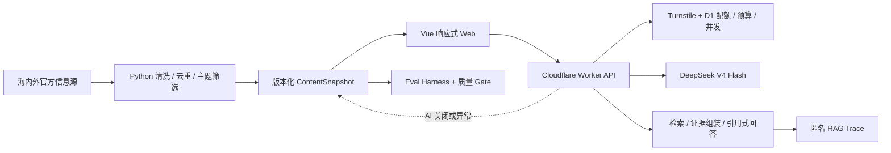

# NewsEviday

> 有证据、可追溯、可暂停的 AI 产品与技术情报站。

[在线体验](https://newseviday.dyjnewseviday-worker.workers.dev) · [产品说明](./docs/产品说明.md) · [技术架构](./docs/工程架构说明.md) · [RAG 与评测](./docs/RAG与评测体系.md)

NewsEviday 面向产品经理、AI 产品经理和数据产品从业者，整理海内外 AI、数据平台与产品情报。产品通过双语信息流、来源证据、关注偏好、趋势简报和引用式问答，降低跨语言阅读与信息核验成本。

## 产品能力

- 聚合 9 个官方或一手技术信息源，经过规则清洗、两级去重和主题筛选后生成版本化快照；
- 提供最新情报、详情、趋势简报、证据问答、关注偏好、质量评测和更新状态页面；
- 海外内容保留原始链接，并提供结构化中文标题、摘要、关键结论和推荐原因；
- 用户可以选择填写职业与关注方向，画像仅保存在浏览器本地，并支持 JSON 导入导出；
- AI、采集和问答可以独立关闭，停用后网站仍展示最后一份已发布快照。

## 技术特点

- Vue 3、Vite 与 TypeScript 构建响应式 Web；
- Cloudflare Workers Static Assets 承载同源静态站和 API，EdgeOne 保留静态备用构建；
- Python 管道负责来源采集、正文清洗、规则去重、主题筛选、AI 增强和原子发布；
- DeepSeek V4 Flash 通过服务端适配层调用，显式使用非思考模式；
- D1 实现匿名 IP 配额、全站限额、并发租约、幂等请求和月度预算台账；
- Turnstile、精确 CORS、安全响应头和服务端 Secret 降低公开 Demo 的滥用风险；
- 引用式 RAG 在证据不足时拒绝回答，并输出可点击来源和匿名 Trace；
- Eval Harness 管理版本化题集、检索指标、无答案测试、语料健康检查和发布 Gate。

## 架构



完整说明见 [工程架构说明](./docs/工程架构说明.md)。

## RAG 评测基线

当前仓库包含 30 题演示评测集和可复现的检索评测命令。最新演示结果如下：

| 指标 | 结果 |
| --- | ---: |
| Recall@5 | 0.9615 |
| Recall@10 | 1.0000 |
| MRR | 0.7577 |
| NDCG@10 | 0.8102 |
| Hit@5 | 1.0000 |
| 无答案识别准确率 | 0.5000 |

这些结果来自 6 篇文章、6 个短分块和字符特征 Hashing Baseline，评测集仍待人工复核，不能作为生产质量结论。线上文章级检索与离线分块评测也尚未完全对齐。指标、边界和下一轮评测设计见 [RAG 与评测体系](./docs/RAG与评测体系.md)。

## 本地运行

环境要求：Node.js 24、npm 10 或 11、Python 3.12、uv。

```powershell
git clone https://github.com/Dyj0926D/newseviday.git
cd newseviday
npm ci
python -m pip install uv
python -m uv sync --project pipeline --frozen
npm run dev
```

完整检查：

```powershell
npm run check
npm run test:e2e -w @newseviday/web
npm run pipeline:check
```

Python 离线评测：

```powershell
python -m uv run --project pipeline newseviday-pipeline eval-rag `
  apps/web/public/data/current.json pipeline/eval/rag-gold-demo-v1.json
```

## 安全默认值

真实密钥只允许放在 Cloudflare Secret、GitHub Actions Secret 或本地未跟踪的 `.dev.vars` 中。仓库默认保持：

```text
AI_ENABLED=false
INGESTION_ENABLED=false
RAG_ENABLED=false
TREND_BRIEF_ENABLED=false
DEEPSEEK_MODEL=deepseek-v4-flash
MONTHLY_BUDGET_CNY=5
HARD_BUDGET_CNY=10
```

内容批处理必须手动触发，付费增强默认关闭；即使显式开启，单次运行也最多调用模型 10 次，工作流默认限制为 5 次。更多配置见 [安全与成本控制](./docs/安全与成本控制.md)。

## 工程目录

```text
apps/web/               Vue 网站
apps/worker/            Cloudflare Worker API
packages/contracts/     TypeScript 契约与 JSON Schema
pipeline/               Python 内容管道与 Eval Harness
config/                 运行模式、主题和来源配置
design/                 Design Tokens 与视觉基准
docs/                   产品、架构、安全和 API 文档
migrations/             D1 数据库迁移
.github/workflows/      CI 与手动内容刷新
```

## 当前边界

- 当前公开内容是演示快照，真实来源刷新需要人工抽检后通过 Pull Request 发布；
- DeepSeek 已配置为 V4 Flash，但生产 AI 总开关保持关闭，受控试运行通过后再逐项开放；
- 当前实现属于引用式 RAG；有限步骤的 Agentic RAG 只作为后续 `eval-only` 实验方向；
- RAG Trace 当前输出到 Worker 可观测日志，尚未形成长期在线评测数据集；
- `workers.dev` 在部分中国大陆网络下可能无法直连；
- 开源许可证和信息源使用条款需在仓库转为公开前单独确认。

`package.json` 保持 `private: true`，防止误发布到 npm。
