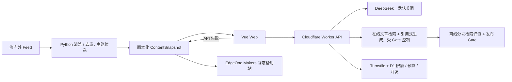

# NewsEviday

> 有证据、可追溯、可暂停的 AI 产品与技术情报站。

NewsEviday 面向产品经理、AI 产品经理和数据产品从业者，整理海内外 AI、数据平台与产品情报。它重点解决跨语言信息差、来源分散和 AI 结论难验证的问题。

当前已完成 P4–P7 的可执行工程基线：9 个真实官方来源采集、结构化 AI 摘要、关注偏好、引用式 RAG、30 题质量评测、手动内容发布流程，以及 D1 持久限额、预算熔断、并发租约和 Turnstile 防滥用保护已经建立。需要付费或外部资源的能力继续受发布 Gate 控制；安装或浏览页面不会自动产生模型费用。

## 当前能力

- Vue 3 + Vite + TypeScript 响应式前端和 8 个公开页面；
- 最新情报、情报详情、趋势简报、证据问答、本地关注偏好、质量评测、更新状态和产品与技术；
- 本地关注偏好、主题权重、推荐原因与版本化 JSON 导入导出；
- Cloudflare Workers Static Assets 主站同源部署；
- EdgeOne Makers 静态备用站构建、SPA 回退和安全头配置；
- `/api/health`、`/api/status`、`/api/runtime-config` 统一 API 契约；
- Worker 不可用时自动读取最后一份静态内容快照；
- DeepSeek 非流式/流式适配、超时、取消、错误分类和 Token/费用接口；
- D1 持久化单 IP/全站日额度、并发租约、月度预算预留与保守结算；
- Turnstile 前端验证与 Worker 服务端校验，生成请求支持幂等键；
- Python 9 个官方 Atom/RSS/HTML 来源、来源级标题解析、正文清洗、两级去重、8 主题筛选、Trace 和原子快照发布；
- 单篇一次结构化摘要、内容哈希缓存、术语检查和可确认的关注偏好整理；
- 版本化 chunk、hashing dense baseline、BGE-compatible adapter、Vectorize NDJSON 和 30 题 Eval Harness；
- TypeScript + JSON Schema + Pydantic 共享数据模型；
- Vitest、Playwright、pytest、Ruff、mypy、ESLint、CI 和密钥扫描；
- 默认归档模式：采集、AI、RAG、趋势简报全部关闭。

## 架构



完整说明见 [工程架构说明](./docs/工程架构说明.md)。

## 工程结构

```text
eviday/
├─ apps/web/                 Vue 网站
├─ apps/worker/              Cloudflare Worker API
├─ packages/contracts/       TS 契约与 JSON Schema
├─ pipeline/                 Python 内容流水线
├─ config/                   模式、主题、来源配置
├─ design/                   Design Tokens 与视觉基准
├─ prd/                      PRD、评审和变更记录
├─ docs/                     架构、API、安全、运行手册
├─ edgeone.json              EdgeOne Makers 备用站配置
└─ .github/workflows/        CI
```

## 环境

| 组件    | 版本                        |
| ------- | --------------------------- |
| Node.js | 24.11.0，见 `.node-version` |
| npm     | 10 或 11                    |
| Python  | 3.12                        |
| uv      | 兼容当前 `pipeline/uv.lock` |

## 安装与运行

```powershell
cd D:\workspace\eviday
npm ci
python -m pip install --user uv
python -m uv sync --project pipeline --frozen
npm run dev
```

- Web：`http://127.0.0.1:5173`
- Worker：`http://127.0.0.1:8787/api/status`

Python 离线验证：

```powershell
npm run pipeline:doctor
python -m uv run --project pipeline newseviday-pipeline run --dry-run
python -m uv run --project pipeline newseviday-pipeline eval-rag `
  apps/web/public/data/current.json pipeline/eval/rag-gold-demo-v1.json
```

## 质量检查

```powershell
npm run check
npm run test:e2e -w @newseviday/web
npm run pipeline:check
npm run audit:prod
```

`npm run check` 包含高信号密钥扫描、Lint、类型检查、单元测试、Web 构建和 Cloudflare dry-run。`npm audit` 依赖官方审计接口；本机网络无法访问时以 GitHub Actions 结果为准，不能把网络失败视为审计通过。

## 密钥和成本

真实 `.env`、`.dev.vars` 已被 Git 忽略。DeepSeek Key、Turnstile Secret 和 HMAC Secret 已保存为 Cloudflare Worker Secret，但 AI 总开关仍为关闭。Secret 只允许存在于 Worker Secret 或本地根目录 `.dev.vars`，不得写入 Vue、普通变量、截图、日志或 Git 历史。

```text
AI_ENABLED=false
INGESTION_ENABLED=false
RAG_ENABLED=false
TREND_BRIEF_ENABLED=false
MONTHLY_BUDGET_CNY=35
HARD_BUDGET_CNY=50
```

暂停后台能力后，网站仍读取 `/data/current.json` 展示历史快照。详见 [安全与成本控制](./docs/安全与成本控制.md) 和 [Cloudflare 运行手册](./docs/Cloudflare运行手册.md)。

## 核心文档

- [产品需求文档](./prd/NewsEviday-PRD.md)
- [工程架构说明](./docs/工程架构说明.md)
- [网站文案与技术架构审查报告](./docs/网站文案与技术架构审查报告.md)
- [API 契约](./docs/API契约.md)
- [数据模型与 Schema](./docs/数据模型与Schema.md)
- [安全与成本控制](./docs/安全与成本控制.md)
- [Cloudflare 运行手册](./docs/Cloudflare运行手册.md)
- [P7 验收与手动操作清单](./docs/P7验收与手动操作清单.md)
- [开发环境与迁移说明](./docs/开发环境与迁移说明.md)
- [项目实施计划与进度跟踪](./docs/项目实施计划与进度跟踪.md)

## 当前边界

- GitHub 私有远程、CI、Cloudflare 主站及 Git 自动发布已经建立；
- EdgeOne Makers 备用站已完成首次 Git 部署；无域名备案时仅作为有时效的大陆预览和备用验证入口；
- 真实来源网络采集已实现并连续运行验证，但只允许手动触发，当前公开站仍保留演示快照；
- DeepSeek Key 已保存为 Cloudflare Secret，但 AI 总开关关闭，当前不会调用模型；
- Worker 在线文章级 hashing 检索、RAG 生成路由和离线 Eval Runner 已实现；Cloudflare Vectorize 创建/绑定与 BGE-M3 实测仍待手动执行；
- D1 持久限流、并发和预算台账已接入生成请求；远程数据库迁移完成，生产 Worker binding 随 P7 分支发布后生效；
- Turnstile Widget 与服务端 Siteverify 已接入；AI、RAG 继续关闭，真实 DeepSeek 烟雾测试待用户单独确认；
- 8 个公开页面、内容预览、关键跳转链路和六档响应式回归已完成；
- 当前内容仍是显式标注的演示快照；真实快照需经过来源抽检和 PR 后发布；
- 质量评测页展示 30 题小规模验证集结果，题集尚待人工复核，暂不作为正式发布结论。

发布为公开源代码前需另行确认许可证与来源使用条款。当前 `package.json` 保持 `private: true`，避免误发 npm。
