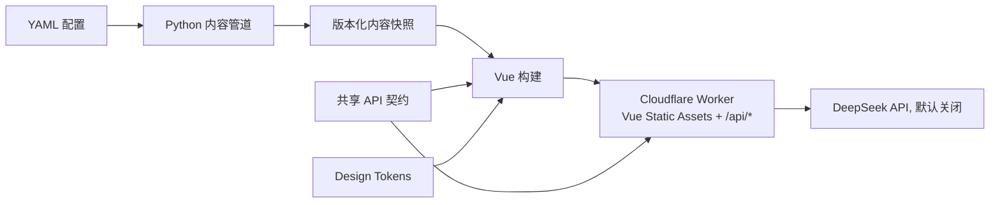

# NewsEviday

> 有证据的 AI 产品与技术情报。

NewsEviday 面向产品经理、AI 产品经理和数据产品从业者，整理海内外 AI、数据平台和产品情报。产品重点解决跨语言信息差、来源分散和 AI 结论难以验证的问题。

当前仓库处于工程骨架阶段。网站、Worker API、Python 内容管道、测试和 CI 已建立；内容采集、DeepSeek 调用和 RAG 默认关闭，不会在本地启动时自动产生费用。

## 当前能力

- Vue 3、Vite、TypeScript 响应式前端；
- 8 个公开页面路由和成本安全的归档空状态；
- Cloudflare Worker 同源承载 Vue 静态资源和 `/api/health`、`/api/status`；
- Python 3.12 配置校验和内容管道 CLI；
- npm workspaces 共享 API 契约和 Design Tokens；
- Vitest、Playwright、pytest、Ruff、Mypy；
- GitHub Actions CI；
- Cloudflare Workers Static Assets 安全头和 SPA 路由回退；
- DeepSeek、Cloudflare 和 EdgeOne 均通过个人环境变量或账户接入，仓库不保存密钥。

## 工程结构

```text
eviday/
├─ apps/
│  ├─ web/                 Vue 3 网站
│  └─ worker/              Cloudflare Worker API
├─ packages/
│  └─ contracts/           Web 与 Worker 共享的 TypeScript 契约
├─ pipeline/               Python 3.12 内容管道与测试
├─ config/                 运行模式、主题和来源配置
├─ design/                 视觉基准、Design Tokens 和 reference
├─ prd/                    PRD、评审和变更日志
├─ docs/                   实施计划、工程与迁移说明
└─ .github/workflows/      CI
```



生产部署使用仓库根目录的 `wrangler.jsonc`：静态资源优先从 `apps/web/dist` 返回，`/api/*` 进入 Worker 脚本。前端与 API 同源，归档模式不调用大模型。`apps/worker/wrangler.jsonc` 仅保留为 API 独立部署的回滚路径。

```powershell
npm run cloudflare:check
npm run deploy:cloudflare
```

## 环境要求

| 环境    | 固定版本                    |
| ------- | --------------------------- |
| Node.js | 24.16.0，见 `.node-version` |
| npm     | 11 或更高                   |
| Python  | 3.12，uv 自动安装           |
| uv      | 0.12 或兼容版本             |

## 首次安装

Windows PowerShell：

```powershell
cd D:\workspace\eviday
npm ci
python -m pip install --user uv
python -m uv sync --project pipeline --frozen
```

也可以使用：

```powershell
.\scripts\bootstrap.ps1
```

## 本地运行

同时启动 Web 和 Worker：

```powershell
npm run dev
```

- Web：`http://localhost:5173`
- Worker Health：`http://localhost:8787/api/health`
- Worker Status：`http://localhost:8787/api/status`

Python 配置检查和无网络 dry-run：

```powershell
npm run pipeline:doctor
python -m uv run --project pipeline newseviday-pipeline run --dry-run
```

## 质量检查

```powershell
npm run check
npm run test:e2e -w @newseviday/web
npm run pipeline:check
npm run audit:prod
```

检查范围：

- ESLint；
- Vue/Worker/Contracts TypeScript；
- Vue 与 Worker 单元测试；
- Web 生产构建和 Worker dry-run 构建；
- 8 个公开页面的桌面端和移动端浏览器测试；
- Python Ruff、Mypy 和 pytest。

`npm audit` 需要访问官方安全审计接口。本机网络策略无法访问时，以 GitHub Actions 的审计结果为准，不能将网络失败视为安全通过。

## 环境变量和密钥

示例文件：

- `apps/web/.env.example`
- `apps/worker/.dev.vars.example`
- `pipeline/.env.example`

真实 `.env`、`.dev.vars` 和本地虚拟环境已被 `.gitignore` 忽略。DeepSeek Key 只允许存在于 Worker Secret 或本地 `.dev.vars`，不得写入 Vue 代码、YAML 配置、截图、日志或 Git 历史。

## 默认成本安全策略

`config/runtime.yaml` 默认使用：

- `mode: archive`；
- 采集关闭；
- AI 摘要关闭；
- RAG 关闭；
- 趋势简报生成关闭；
- 来源配置默认 `enabled: false`。

因此停止后台任务后，网站仍能展示页面和往期快照；只有明确开启功能后才会访问来源或调用模型。

## 项目文档

- [产品需求文档](./prd/NewsEviday-PRD.md)
- [视觉设计基准](./design/视觉设计基准.md)
- [组件清单](./design/组件清单.md)
- [响应式重排方案](./design/响应式重排方案.md)
- [工程架构说明](./docs/工程架构说明.md)
- [开发环境与迁移说明](./docs/开发环境与迁移说明.md)
- [项目实施计划与进度跟踪](./docs/项目实施计划与进度跟踪.md)

## 当前边界

- 尚未创建 GitHub 远程仓库，也没有绑定公司或个人 Git 凭据；
- 尚未部署 Cloudflare 或 EdgeOne；
- 尚未启用任何真实内容来源；
- 尚未配置 DeepSeek API Key；
- 页面当前是工程骨架，详细信息流、文章、RAG 和产品介绍页面在后续阶段实现。

发布开源仓库前需要单独确认许可证。当前 `package.json` 保持 `private: true`，避免误发布到 npm。
