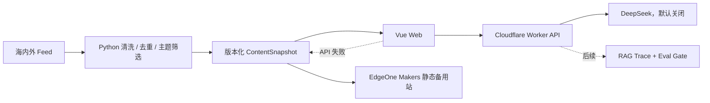

# NewsEviday

> 有证据、可追溯、可暂停的 AI 产品与技术情报站。

NewsEviday 面向产品经理、AI 产品经理和数据产品从业者，整理海内外 AI、数据平台与产品情报。它重点解决跨语言信息差、来源分散和 AI 结论难验证的问题。

当前已完成 P3 静态产品。8 个公开页面、Cloudflare Worker、Python 内容流水线地基、共享 Schema、静态降级和测试已经建立；真实采集、DeepSeek 调用和动态 RAG 默认关闭，不会因安装或浏览页面自动产生费用。

## 当前能力

- Vue 3 + Vite + TypeScript 响应式前端和 8 个公开页面；
- 情报流、文章证据、演示趋势简报、问答暂停态、本地画像、Eval、运行状态和产品介绍；
- 本地画像手动标签、权重、推荐原因与版本化 JSON 导入导出；
- Cloudflare Workers Static Assets 主站同源部署；
- EdgeOne Makers 静态备用站构建、SPA 回退和安全头配置；
- `/api/health`、`/api/status`、`/api/runtime-config` 统一 API 契约；
- Worker 不可用时自动读取最后一份静态内容快照；
- DeepSeek 非流式/流式适配、超时、取消、错误分类和 Token/费用接口；
- Python Atom/RSS 解析、URL 清洗、两级去重、主题筛选和原子快照发布；
- TypeScript + JSON Schema + Pydantic 共享数据模型；
- Vitest、Playwright、pytest、Ruff、mypy、ESLint、CI 和密钥扫描；
- 默认归档模式：采集、AI、RAG、趋势简报全部关闭。

## 架构



完整说明见 [工程架构说明](./docs/工程架构说明.md)。

## 工程结构

```text
eviday/
├─ apps/web/                 Vue 网站
├─ apps/worker/              Cloudflare Worker API
├─ packages/contracts/       TS 契约与 JSON Schema
├─ pipeline/                 Python 内容流水线
├─ config/                   模式、主题、来源配置
├─ design/                   Design Tokens 与视觉基准
├─ prd/                      PRD、评审和变更记录
├─ docs/                     架构、API、安全、运行手册
├─ edgeone.json              EdgeOne Makers 备用站配置
└─ .github/workflows/        CI
```

## 环境

| 组件    | 版本                        |
| ------- | --------------------------- |
| Node.js | 24.11.0，见 `.node-version` |
| npm     | 10 或 11                    |
| Python  | 3.12                        |
| uv      | 兼容当前 `pipeline/uv.lock` |

## 安装与运行

```powershell
cd D:\workspace\eviday
npm ci
python -m pip install --user uv
python -m uv sync --project pipeline --frozen
npm run dev
```

- Web：`http://127.0.0.1:5173`
- Worker：`http://127.0.0.1:8787/api/status`

Python 离线验证：

```powershell
npm run pipeline:doctor
python -m uv run --project pipeline newseviday-pipeline run --dry-run
```

## 质量检查

```powershell
npm run check
npm run test:e2e -w @newseviday/web
npm run pipeline:check
npm run audit:prod
```

`npm run check` 包含高信号密钥扫描、Lint、类型检查、单元测试、Web 构建和 Cloudflare dry-run。`npm audit` 依赖官方审计接口；本机网络无法访问时以 GitHub Actions 结果为准，不能把网络失败视为审计通过。

## 密钥和成本

真实 `.env`、`.dev.vars` 已被 Git 忽略。DeepSeek Key 已保存为 Cloudflare Worker Secret，但总开关仍为关闭。Key 只允许存在于 Worker Secret 或本地根目录 `.dev.vars`，不得写入 Vue、YAML、截图、日志或 Git 历史。

```text
AI_ENABLED=false
INGESTION_ENABLED=false
RAG_ENABLED=false
TREND_BRIEF_ENABLED=false
MONTHLY_BUDGET_CNY=35
HARD_BUDGET_CNY=50
```

暂停后台能力后，网站仍读取 `/data/current.json` 展示历史快照。详见 [安全与成本控制](./docs/安全与成本控制.md) 和 [Cloudflare 运行手册](./docs/Cloudflare运行手册.md)。

## 核心文档

- [产品需求文档](./prd/NewsEviday-PRD.md)
- [工程架构说明](./docs/工程架构说明.md)
- [API 契约](./docs/API契约.md)
- [数据模型与 Schema](./docs/数据模型与Schema.md)
- [安全与成本控制](./docs/安全与成本控制.md)
- [Cloudflare 运行手册](./docs/Cloudflare运行手册.md)
- [开发环境与迁移说明](./docs/开发环境与迁移说明.md)
- [项目实施计划与进度跟踪](./docs/项目实施计划与进度跟踪.md)

## 当前边界

- GitHub 私有远程、CI、Cloudflare 主站及 Git 自动发布已经建立；
- EdgeOne Makers 备用站已完成首次 Git 部署；无域名备案时仅作为有时效的大陆预览和备用验证入口；
- 没有开放真实来源网络采集；
- DeepSeek Key 已保存为 Cloudflare Secret，但 AI 总开关关闭，当前不会调用模型；
- 没有接入向量库、RAG 生成和 Eval Runner；
- IP 限流和预算台账只有接口，公开问答前必须接入持久存储；
- P3 全部静态页面、演示快照、关键跳转链路和六档响应式回归已完成；
- 当前内容仍是显式标注的演示快照，P4 才接入 6–8 个真实来源；
- Eval 页面仅展示方法和目标门槛，正式黄金集尚未运行。

发布为公开源代码前需另行确认许可证与来源使用条款。当前 `package.json` 保持 `private: true`，避免误发 npm。
