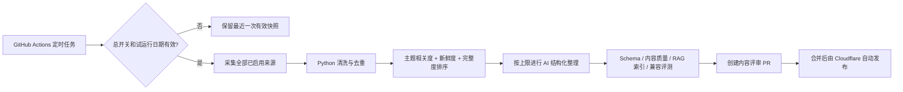

# NewsEviday 内容更新与存储策略

## 1. 当前结论

NewsEviday 采用“受控定时采集 + 评审发布 + 静态快照留存”。采集或模型暂停时，主站继续读取最近一次有效快照，不依赖在线数据库才能展示内容。

## 2. 每日更新链路

- 默认每天北京时间 09:17 检查一次；
- 每次仍会采集全部已启用来源，按内容价值筛选；“来源轮转”只用于控制有限的 AI 增强名额；
- 来源证据少于 120 字时不进入 AI 结构化整理，仍可按事实层展示标题与原文链接；
- `DAILY_REFRESH_ENABLED=false` 可立即暂停；
- `DAILY_REFRESH_END_DATE` 到期后自动停止；
- 失败、无变更或人工未合并时，不覆盖线上快照。

## 3. 当前存储分层

| 数据 | 当前载体 | 保留方式 | 用途 |
| --- | --- | --- | --- |
| 当前公开内容 | `apps/web/public/data/current.json` | Git 版本化 | 首页、详情、筛选和备用站 |
| 历史内容快照 | `apps/web/public/data/versions/{snapshotId}.json` | 不可变 Git 文件 | 回滚、复现评测、短期历史浏览基础 |
| 公开历史索引 | `apps/web/public/data/archive/manifest.json` | 随快照增量更新 | 旧链接回溯与历史标题检索 |
| 最新公开评测 | `apps/web/public/data/eval/latest.json` | 随代码发布 | 质量评测页 |
| 内容质量报告 | `apps/web/public/data/quality/latest.json` | 随快照发布 | 来源、摘要、主题缺口与潜在事件检查 |
| 采集过程、AI 缓存、RAG 索引 | GitHub Actions Artifact/Cache | 14 天或缓存命中期 | 复盘、避免重复付费、排错 |
| 生成限额和预算 | Cloudflare D1 | 按运行规则保留 | 单 IP/全站限额、并发和费用熔断 |

当前 D1 不保存文章正文。网站内容已经形成可检索的静态语料，但还不是独立的云端知识库。

## 4. 为什么先不用完整数据库

MVP 每日最多 40 条入选内容，静态 JSON 的读取成本低、可迁移、可回滚，也能在 AI 和采集关闭后继续访问。此阶段引入 Postgres/Supabase 会增加部署、权限和维护成本，暂时没有带来同等收益。

## 5. 后续扩展路径

当历史快照明显增多或开放在线 RAG 后，再按职责拆分：

1. Cloudflare R2：保存原始抓取结果、完整历史快照和大体积归档；
2. Cloudflare D1：保存文章目录、来源、时间、主题和快照索引，不放大段正文；
3. Cloudflare Vectorize：保存生产 Embedding，用于跨历史快照的向量检索；
4. Git 仓库只保留当前快照、少量评测固定语料和可审查配置。

触发升级的建议条件：Git 历史快照超过 100 MB、需要检索 30 天以上内容、或在线 RAG 通过人工复核和拒答 Gate。

## 6. 已知边界

- 当前公开生产评测集有 24 题，仍待人工逐题复核；
- 历史搜索当前只覆盖公开索引中的标题与来源，不是全文或语义搜索；
- 本地 `hashing-chargram-v1` 适合做可复现基线，不能等同于 BGE-M3/Vectorize 生产效果；
- 趋势简报至少需要连续多日快照，单日语料不生成趋势结论；
- 历史快照进入 Git 会增大仓库体积，因此它是试运行方案，R2 是规模化后的归档方向。
