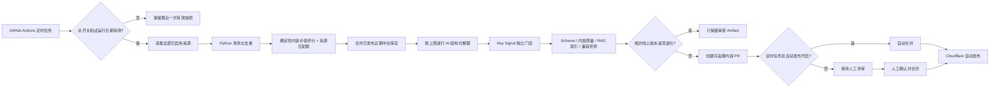

# NewsEviday 内容更新与存储策略

## 1. 当前结论

NewsEviday 采用“受控定时采集 + 质量门自动发布 + 静态快照留存”。采集或模型暂停时，主站继续读取最近一次有效快照，不依赖在线数据库才能展示内容。手动补跑仍保留评审发布，避免临时参数绕过人工确认。

## 2. 每日更新链路

- 默认每天北京时间 09:17 检查，11:47 提供一次防重复备用调度；
- 定时任务只有在采集、Schema、内容质量、相对线上退化检查、安全扫描、Python 回归、前端测试和构建全部通过后才允许自动合并；手动触发始终停在 PR，失败候选只保留 Artifact；
- 同一天存在内容 PR 时备用任务跳过；跨日仍未处理的内容 PR 会被下一轮候选自动关闭并替换，旧候选保留在 Actions Artifact，不再阻塞后续日期；
- 每次仍会采集全部已启用来源，按内容价值筛选；“来源轮转”只用于控制有限的 AI 增强名额；
- 新采集先与已发布近 30 天中文就绪内容合并，公开库存总量最多 40 条；新采集和历史补位共用同一 30 天硬截断，过期内容即使评分较高也不能回填库存；已发布中文内容不会仅因来源 Feed 分页而提前消失；
- 内容总分采用确定性规则：目标相关性 20%，事件显著性、决策影响和采用扩散合计 28%，技术改进、工程适用性和技术普适性合计 22%，产品/行业影响 10%，新鲜度 10%，证据成熟度 7%，内容完整度 3%；
- arXiv 每日最多入选 6 篇；首页前 8 条同一来源最多 3 篇，并避免同一来源连续出现 3 条；
- Key Signal 使用独立变化事件门禁和专用得分，覆盖政策、产品发布、能力更新、采用扩散、技术突破、市场结构和风险事件。普通内容总分与个性化相关性不再单独否决重大事件；没有内容同时满足中文导读、事件显著性、决策影响和证据要求时，首页不强行设置重点情报；
- 每日基础 AI 整理额度为 5 次。当天未使用的额度可结转，结转余额最多 10 次，单次任务最多调用 10 次；日报与周六周报采集共用同一翻译台账，已发布结果复用和缓存命中不消耗额度；
- “仅缺中文即可进入 Key Signal”的候选优先，其次处理高显著性变化事件、Data Agent/数据平台/统一语义/湖仓重点主题和可信来源的新鲜高价值内容，再处理达到普通付费门槛的外文内容；
- 中文原文同时具备中文标题和来源摘要时直接视为中文就绪，不为满足语言门禁重复调用模型；
- 首页“最新情报”默认只展示近 30 天中文就绪内容，并以发布时间倒序；来源多样性规则只在不破坏总体时序的前提下阻止连续三篇同源。用户可显式选择“不限时间（含待整理原文）”查看完整库存；
- 公共趋势简报在北京时间每周六 10:00 处理上周六 09:00 至本周六 09:00 的完整七天内容，单节至少引用两个不同来源，并包含一手来源或两个独立二手来源。观点来源只作观察和交叉验证。模型生成失败、证据不足或本期已经发布时不重复调用，并保留上一份成功简报；
- 来源证据少于 120 字时通常不进入 AI 结构化整理。3 天内的官方或研究机构重点主题内容可在证据不少于 50 字时进入严格短摘要通道；同一通道也允许一手学术来源，但要求内容总分不低于 0.35、目标相关度不低于 0.60，且技术改进或工程价值不低于 0.65。提示词统一禁止推断功能细节、效果、客户和结论；
- `DAILY_REFRESH_ENABLED=false` 可立即暂停；
- `DAILY_REFRESH_AUTO_MERGE` 和 `WEEKLY_REFRESH_AUTO_MERGE` 分别控制日报、周报的定时自动发布；两个开关代码默认值均为 `false`，需要仓库变量显式开启；
- `DAILY_REFRESH_END_DATE` 到期且任务仍保持启用时显式失败告警，要求续期或关闭，避免“成功但未更新”的误判；
- 失败、无变更或手动候选未合并时，不覆盖线上快照。
- 候选若未通过基础质量，或近期中文数量/占比、摘要完整度相对线上版本明显退化，只上传审查 Artifact，不创建会阻塞后续任务的内容 PR；候选仍保留同一内容哈希时，不允许已发布中文整理字段回退为空；
- 质量报告额外输出 24/48 小时中文可见数量、最新中文可见发布时间、中文可见主题缺口和新增文章 ID 数。短期无新内容只告警，不伪造新鲜度，也不单独阻断来源正常但当天无高价值新增的候选。
- 日报文章整理与周报生成分别写入私有 Usage 报告；周报 Actions Summary 合并展示两类请求数、Token 和估算费用，公开快照不包含费用明细。

## 3. 当前存储分层

| 数据 | 当前载体 | 保留方式 | 用途 |
| --- | --- | --- | --- |
| 当前公开内容 | `apps/web/public/data/current.json` | Git 版本化 | 首页、详情、筛选和备用站 |
| 历史内容快照 | `apps/web/public/data/versions/{snapshotId}.json` | 不可变 Git 文件 | 回滚、复现评测、短期历史浏览基础 |
| 公开历史索引 | `apps/web/public/data/archive/manifest.json` | 随快照增量更新 | 旧链接回溯与历史标题检索 |
| 最新公开评测 | `apps/web/public/data/eval/latest.json` | 随代码发布 | 质量评测页 |
| 内容质量报告 | `apps/web/public/data/quality/latest.json` | 随快照发布 | 来源、摘要、主题缺口与潜在事件检查 |
| 公共趋势简报 | `ContentSnapshot.briefs[0]` | 随快照版本化留存 | 上周六 09:00 至本周六 09:00 的证据约束趋势归纳 |
| 采集过程、AI 缓存、AI 结转台账、RAG 索引 | GitHub Actions Artifact/Cache | 14 天或缓存命中期 | 复盘、避免重复付费、额度结转、排错 |
| 生成限额和预算 | Cloudflare D1 | 按运行规则保留 | 单 IP/全站限额、并发和费用熔断 |

当前 D1 不保存文章正文。网站内容已经形成可检索的静态语料，但还不是独立的云端知识库。

## 4. 为什么先不用完整数据库

MVP 每日最多 40 条入选内容，静态 JSON 的读取成本低、可迁移、可回滚，也能在 AI 和采集关闭后继续访问。此阶段引入 Postgres/Supabase 会增加部署、权限和维护成本，暂时没有带来同等收益。

## 5. 后续扩展路径

当历史快照明显增多或开放在线 RAG 后，再按职责拆分：

1. Cloudflare R2：保存原始抓取结果、完整历史快照和大体积归档；
2. Cloudflare D1：保存文章目录、来源、时间、主题和快照索引，不放大段正文；
3. Cloudflare Vectorize：保存生产 Embedding，用于跨历史快照的向量检索；
4. Git 仓库只保留当前快照、少量评测固定语料和可审查配置。

触发升级的建议条件：Git 历史快照超过 100 MB、需要检索 30 天以上内容、或在线 RAG 通过人工复核和拒答 Gate。

## 6. 已知边界

- 当前公开生产评测集有 24 题，仍待人工逐题复核；
- 历史搜索当前只覆盖公开索引中的标题与来源，不是全文或语义搜索；
- 本地 `hashing-chargram-v1` 适合做可复现基线，不能等同于 BGE-M3/Vectorize 生产效果；
- 趋势简报只使用上周六 09:00 至本周六 09:00 内、已完成中文整理且具有证据 ID 的文章；候选少于 4 篇或不足 2 个来源时不生成新结论；每节还需通过“一手来源或两个独立二手来源”门禁；
- 历史快照进入 Git 会增大仓库体积，因此它是试运行方案，R2 是规模化后的归档方向。
