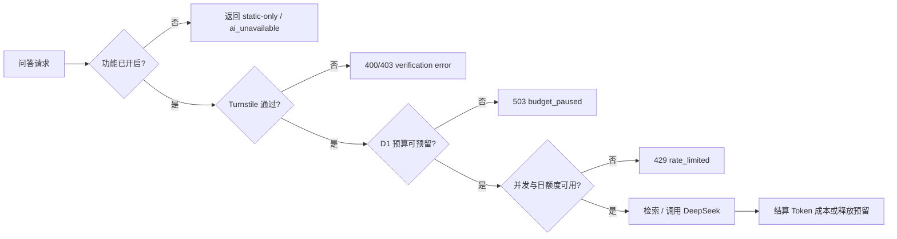

# NewsEviday 安全与成本控制

## 1. 控制目标

项目是公开 MVP，风险重点是三件事：密钥泄露、匿名滥用导致费用失控、外部内容污染 RAG。安全策略采用默认关闭、服务端隔离、硬上限和静态降级。

## 2. 威胁与低成本措施

| 风险             | 当前措施                                                                    | 后续触发条件                            |
| ---------------- | --------------------------------------------------------------------------- | --------------------------------------- |
| API Key 泄露     | Key 只放 Worker Secret/本地 `.dev.vars`；Git 扫描；Vue 无 Key 变量          | 发现历史泄露立即轮换并清理 Git 历史     |
| 匿名刷问答       | Turnstile；D1 单 IP/全站日额度；HMAC 每日匿名键；并发租约                   | 公开生成前完成一次受控端到端验证        |
| 模型费用超限     | `AI_ENABLED=false`；D1 预算预留/结算；月预算 5 元、硬上限 10 元；默认不重试 | 首次真实调用前确认模型 ID 与 Token 单价 |
| Prompt Injection | 外部内容包装为 untrusted evidence；系统提示声明其无指令权                   | 生产 Gate 前增加注入攻击黄金集          |
| XSS/恶意来源     | Vue 默认转义；CSP；不直接渲染来源 HTML                                      | 富文本需求出现时引入严格白名单清洗      |
| CORS 误配        | 精确 Origin 白名单，无通配符                                                | EdgeOne 域名确定后显式加入              |
| 日志泄露隐私     | 日志递归脱敏；不保存原始 IP/问题全文                                        | 引入账号体系后重新做数据最小化评审      |
| 依赖供应链       | lockfile、CI、生产依赖审计、仓库密钥扫描                                    | 高危漏洞且可达时优先升级                |
| API/采集停机     | 静态快照和版本回滚                                                          | 历史快照异常时切回上一版本              |

## 3. 开关与成本闸门

从外到内的调用顺序：

当前代码已经具备：功能开关、Turnstile 服务端校验、D1 持久限额、并发租约、预算预留/结算、DeepSeek 可用性检查、问题范围与证据充分性门禁、超时/取消、错误分类、匿名 RAG Trace 和 Token/估算成本接口。保护存储或配置不可用时直接返回 `guardrails_unavailable`，不会降级为无保护调用。远程 D1 已创建并完成迁移；AI 与 RAG 仍保持关闭，等待人工黄金集、引用质量和线上性能 Gate。

## 4. 运行参数

| 变量                              |                默认 |          边界 | 说明                                               |
| --------------------------------- | ------------------: | ------------: | -------------------------------------------------- |
| `AI_ENABLED`                      |             `false` |    true/false | AI 总开关                                          |
| `INGESTION_ENABLED`               |             `false` |    true/false | 定时采集总开关                                     |
| `RAG_ENABLED`                     |             `false` |    true/false | RAG 总开关                                         |
| `TREND_BRIEF_ENABLED`             |             `false` |    true/false | 趋势简报开关                                       |
| `DAILY_QUESTIONS_PER_IP`          |                   2 |         0–100 | 受控试运行单 IP 日上限                             |
| `GLOBAL_DAILY_GENERATIONS`        |                   5 |       0–10000 | 全站每日生成尝试上限                               |
| `SOFT_BUDGET_DAILY_GENERATIONS`   |                   3 |       0–10000 | 到达软预算后的全站日上限                           |
| `MAX_CONCURRENT_GENERATIONS`      |                   1 |          1–20 | 全站同时运行的生成请求                             |
| `MONTHLY_BUDGET_CNY`              |                   5 |          0–50 | 受控试运行软预算                                   |
| `HARD_BUDGET_CNY`                 |                  10 |          0–50 | 硬上限，不允许超出                                 |
| `ASK_RESERVE_CNY`                 |                0.10 |      0.001–10 | 单次问答保守预留金额                               |
| `PROFILE_RESERVE_CNY`             |                0.05 |      0.001–10 | 单次画像增强保守预留金额                           |
| `GUARDRAIL_LEASE_SECONDS`         |                 120 |        30–600 | 并发租约与预算预留有效期                           |
| `TURNSTILE_ENABLED`               |              `true` |    true/false | 生成请求人机验证开关                               |
| `REQUEST_BODY_BYTES`              |               32768 |   1024–131072 | API 请求体上限                                     |
| `UPSTREAM_TIMEOUT_MS`             |               20000 |    1000–60000 | 模型调用超时                                       |
| `DEEPSEEK_MAX_RETRIES`            |                   0 |           0–1 | 默认不重复计费                                     |
| `DEEPSEEK_MODEL`                  | `deepseek-v4-flash` | 官方 model ID | 2026-08-05 核对的 V4 Flash 标识；调用前仍需复核    |
| `DEEPSEEK_THINKING_ENABLED`       |             `false` |    true/false | MVP 默认非思考模式，控制延迟和输出 Token           |
| `DEEPSEEK_INPUT_CNY_PER_MILLION`  |                   2 |      0–100000 | 按计划峰时上限估算的缓存未命中输入价               |
| `DEEPSEEK_OUTPUT_CNY_PER_MILLION` |                   4 |      0–100000 | 按计划峰时上限估算的输出价                         |
| `RAG_MIN_SCORE`                   |                0.08 |           0–1 | 检索分数安全下限；还会检查问题范围、时间和必需证据 |
| `RAG_MAX_CONTEXT_CHARS`           |                8000 |    1000–20000 | 注入模型的证据字符预算                             |
| `TRACE_HASH_SECRET`               |                  无 |      ≥16 字符 | 只用于问题 HMAC 指纹，不进入前端                   |

`DEEPSEEK_MODEL` 必须使用供应商控制台当时给出的准确 model ID。2026-08-05 已按官方文档核对为 `deepseek-v4-flash`。基础缓存未命中输入价为 1 元/百万 Token、输出价为 2 元/百万 Token；考虑官方公布的峰时 2 倍计划，预算门禁暂按 2 元和 4 元保守估算。价格可能调整，真实调用前仍需复核。V4 默认开启思考模式，本项目对摘要、画像和证据问答显式使用非思考模式，避免无必要的思考 Token 和延迟。

## 5. 匿名 IP 限流

Worker 从 `CF-Connecting-IP` 读取当前请求 IP，只在内存中把 UTC 日期与 IP 组合，再使用 `IP_HASH_SECRET` 做 HMAC-SHA256。D1 只保存匿名键、日期窗口和次数；同一 IP 跨日不会形成同一业务键。

注意：

- 普通 SHA-256 IP 容易被穷举，因此必须带服务端 Secret；
- Secret 轮换会使匿名键变化，旧窗口可自然过期；
- 单 IP 与全站计数使用 D1 batch，任一额度失败时整批回滚；
- 并发额度使用带过期时间的 D1 lease，Worker 异常退出后可自动恢复；
- CORS 不能阻止脚本或服务端直接请求，不能替代限流。

## 6. D1 预算与结算

- `generation_requests` 以 `Idempotency-Key` 为主键，重复键返回 `409 request_conflict`；
- `monthly_budget_before_reserve` Trigger 在模型调用前检查本月已结算金额与未过期预留，超过硬上限则拒绝写入；
- 到达 5 元软预算后，全站日额度自动收紧为 3；到达 10 元硬上限后状态变为 `budget-paused`；
- 开启 AI 时必须显式配置当期输入/输出单价；系统按最大输入/输出 token 边界加 25% 缓冲计算最低预留，并与人工预留值取较大者；
- 模型返回 Usage 时按估算实耗结算；未返回 Usage 或上游结果不确定时按预留金额保守结算；
- RAG 证据不足、未调用模型时释放预留并返还本次日额度；
- D1 或 Turnstile 不可用时失败关闭，不调用 DeepSeek。

## 7. Turnstile 边界

- 前端只持有公开 Site Key；Secret 仅存在于 Worker Secret；
- Worker 调用 Siteverify，校验 `success`、`action=generate` 与 hostname 白名单；
- token 只用于当前生成请求，不写入业务日志；
- CSP 只额外允许 `https://challenges.cloudflare.com` 的脚本、连接和 iframe；
- Turnstile 只能降低自动化滥用，不能替代 D1 限额和预算熔断。

## 8. DeepSeek 调用边界

- 只从 Worker 访问 `POST /chat/completions`；
- 非流式和 SSE 流式调用共用同一适配器；
- 支持 `AbortSignal` 和 20 秒默认超时；
- 401/402/400/422 不重试；429/500/503 仅在显式开启时最多重试一次；
- Token 单价不写死，按当期价格配置后计算估算成本；
- 模型返回内容不作为事实层，必须关联 Evidence。
- 文章增强需要 `--allow-model`，单次模型调用硬上限为 10，手动工作流默认限制为 5；
- 定时任务每天发放 5 次基础额度；未使用额度写入日报与周六周报共用的私有结转台账，余额最多 10 次，单次任务最多调用 10 次。同一天重跑不会重复发放基础额度；手动任务不使用自动结转；
- 普通库存的新模型调用要求内容总分不低于 0.60。3 天内新内容可在总分不低于 0.42、目标主题相关度不低于 0.60，且工程、技术或产品价值至少一项不低于 0.55 时进入中文整理；可信专业媒体的新鲜高价值内容可进入补充通道；官方或研究机构的重点主题短证据通道最低 50 字，并使用禁止外推的短摘要提示词；其余调用仍要求证据不少于 120 字；所有候选发布日期不得超过 45 天，单来源单次最多新增 3 篇；
- 工作流通过 `--accepted-snapshot` 复用已发布 AI 字段。未发布候选即使进入缓存，也不能绕过质量和时效门禁；
- 文章增强使用 `--usage-report` 将调用数、基础额度、结转前后余额、补充通道调用数、缓存命中、输入/输出 Token、Usage 完整性和费用估算写入私有 Artifact；该报告和结转台账不进入公开快照；
- 私有 Pipeline Trace 按来源记录抓取、解析、原始条数、入选条数和错误码，不保存来源正文；
- GitHub Actions 文章增强与 Worker 在线生成分别计账：前者由单次调用上限、私有 Usage 报告和试运行截止日期控制，后者由 D1 日额度、并发租约和月度预算控制；

参考：[DeepSeek 模型与价格](https://api-docs.deepseek.com/zh-cn/quick_start/pricing/)、[DeepSeek Chat Completion](https://api-docs.deepseek.com/api/create-chat-completion)、[DeepSeek Error Codes](https://api-docs.deepseek.com/quick_start/error_codes/)、[Cloudflare Workers Secrets](https://developers.cloudflare.com/workers/configuration/secrets/)。

## 9. 发布前安全清单

- `npm run security:scan` 通过；
- `git ls-files` 不包含 `.env`、`.dev.vars`；
- Cloudflare Secret 中存在 Key，前端构建产物搜索不到 Key；
- `ALLOWED_ORIGINS` 只含实际主站与备用站；
- AI/采集/问答各自开关状态与页面文案一致；
- D1 本地与远程迁移成功，匿名限流和预算台账测试通过；
- Turnstile 错误 token、错误 action 和错误 hostname 会被拒绝；
- 静态快照可独立打开；
- 真实模型只做一次明确授权的最小烟雾测试。
