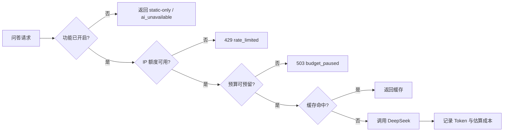

# NewsEviday 安全与成本控制

## 1. 控制目标

项目是公开 Demo，风险重点不是复杂权限系统，而是三件事：密钥泄露、匿名滥用导致费用失控、外部内容污染 RAG。安全策略采用默认关闭、服务端隔离、硬上限和静态降级。

## 2. 威胁与低成本措施

| 风险 | 当前措施 | 后续触发条件 |
|---|---|---|
| API Key 泄露 | Key 只放 Worker Secret/本地 `.dev.vars`；Git 扫描；Vue 无 Key 变量 | 发现历史泄露立即轮换并清理 Git 历史 |
| 匿名刷问答 | 每 IP 日额度配置；HMAC 匿名键接口；问答路由上线前接入持久计数 | 面试公开访问前必须实装 KV/D1 计数 |
| 模型费用超限 | `AI_ENABLED=false`；月预算 35 元、硬上限 50 元；默认不重试 | 首次真实调用前接入 UsageLedger/BudgetLedger |
| Prompt Injection | 外部内容包装为 untrusted evidence；系统提示声明其无指令权 | 生产 Gate 前增加注入攻击黄金集 |
| XSS/恶意来源 | Vue 默认转义；CSP；不直接渲染来源 HTML | 富文本需求出现时引入严格白名单清洗 |
| CORS 误配 | 精确 Origin 白名单，无通配符 | EdgeOne 域名确定后显式加入 |
| 日志泄露隐私 | 日志递归脱敏；不保存原始 IP/问题全文 | 引入账号体系后重新做数据最小化评审 |
| 依赖供应链 | lockfile、CI、生产依赖审计、仓库密钥扫描 | 高危漏洞且可达时优先升级 |
| API/采集停机 | 静态快照和版本回滚 | 历史快照异常时切回上一版本 |

## 3. 开关与成本闸门

从外到内的调用顺序：

当前代码已经具备：功能开关、公开限额、DeepSeek 可用性检查、检索阈值拒答、超时/取消、错误分类、匿名 RAG Trace 和 Token/估算成本接口。匿名计数与预算台账只有接口，尚未绑定 KV/D1，因此 `/api/ask` 虽已实现，部署配置仍保持关闭。

## 4. 运行参数

| 变量 | 默认 | 边界 | 说明 |
|---|---:|---:|---|
| `AI_ENABLED` | `false` | true/false | AI 总开关 |
| `INGESTION_ENABLED` | `false` | true/false | 定时采集总开关 |
| `RAG_ENABLED` | `false` | true/false | RAG 总开关 |
| `TREND_BRIEF_ENABLED` | `false` | true/false | 趋势简报开关 |
| `DAILY_QUESTIONS_PER_IP` | 3 | 0–100 | 可部署时调整 |
| `MONTHLY_BUDGET_CNY` | 35 | 0–50 | 软预算 |
| `HARD_BUDGET_CNY` | 50 | 0–50 | 硬上限，不允许超出 |
| `REQUEST_BODY_BYTES` | 32768 | 1024–131072 | API 请求体上限 |
| `UPSTREAM_TIMEOUT_MS` | 20000 | 1000–60000 | 模型调用超时 |
| `DEEPSEEK_MAX_RETRIES` | 0 | 0–1 | 默认不重复计费 |
| `RAG_MIN_SCORE` | 0.08 | 0–1 | 低于阈值直接拒答，不调用生成模型 |
| `RAG_MAX_CONTEXT_CHARS` | 8000 | 1000–20000 | 注入模型的证据字符预算 |
| `TRACE_HASH_SECRET` | 无 | ≥16 字符 | 只用于问题 HMAC 指纹，不进入前端 |

`DEEPSEEK_MODEL` 必须使用供应商控制台当时给出的准确 model ID。产品文案可写“DeepSeek V4 Pro”，代码不猜测或写死尚未确认的接口标识。

## 5. 匿名 IP 限流

Worker 从 `CF-Connecting-IP` 读取当前请求 IP，只在内存中使用 `IP_HASH_SECRET` 做 HMAC-SHA256，并截断为匿名键。计数存储只保存匿名键、窗口和次数。

注意：

- 普通 SHA-256 IP 容易被穷举，因此必须带服务端 Secret；
- Secret 轮换会使匿名键变化，旧窗口可自然过期；
- 单 Worker 内存计数不可靠，公开问答必须使用 KV、D1 或 Durable Object；
- CORS 不能阻止脚本或服务端直接请求，不能替代限流。

## 6. DeepSeek 调用边界

- 只从 Worker 访问 `POST /chat/completions`；
- 非流式和 SSE 流式调用共用同一适配器；
- 支持 `AbortSignal` 和 20 秒默认超时；
- 401/402/400/422 不重试；429/500/503 仅在显式开启时最多重试一次；
- Token 单价不写死，按当期价格配置后计算估算成本；
- 模型返回内容不作为事实层，必须关联 Evidence。

参考：[DeepSeek Chat Completion](https://api-docs.deepseek.com/api/create-chat-completion)、[DeepSeek Error Codes](https://api-docs.deepseek.com/quick_start/error_codes/)、[Cloudflare Workers Secrets](https://developers.cloudflare.com/workers/configuration/secrets/)。

## 7. 发布前安全清单

- `npm run security:scan` 通过；
- `git ls-files` 不包含 `.env`、`.dev.vars`；
- Cloudflare Secret 中存在 Key，前端构建产物搜索不到 Key；
- `ALLOWED_ORIGINS` 只含实际主站与备用站；
- AI/采集/问答各自开关状态与页面文案一致；
- 匿名限流和预算台账有集成测试；
- 静态快照可独立打开；
- 真实模型只做一次明确授权的最小烟雾测试。
