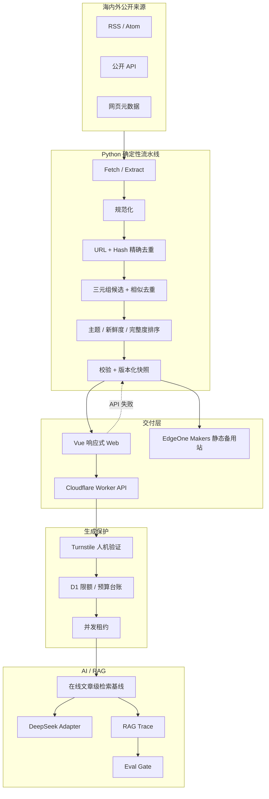

# NewsEviday 工程架构说明

| 项目     | 当前基线                                                           |
| -------- | ------------------------------------------------------------------ |
| 架构版本 | v0.8 / 受控生产内容闭环                                             |
| 日期     | 2026-08-05                                                         |
| 状态     | Day 1 生产快照与离线 Eval 已落地；在线 AI/RAG 继续受 Gate 约束       |
| 仓库     | npm workspaces 单仓 + Python 3.12 独立项目                         |
| 运行原则 | 内容与生成解耦、静态快照可用、AI 可拔插、全过程可追溯              |

## 1. 总体架构

## 2. 模块职责

| 模块            | 路径                                | 职责                                      | 状态                               |
| --------------- | ----------------------------------- | ----------------------------------------- | ---------------------------------- |
| Vue Web         | `apps/web`                          | 页面、路由、响应式布局、API/静态快照降级  | 8 个公开页面与六视口回归已实现     |
| Worker 主站     | 根 `wrangler.jsonc` + `apps/worker` | Static Assets、API、安全边界、模型适配    | 主站已发布，适配层已实现           |
| Worker 回滚     | `apps/worker/wrangler.jsonc`        | 必要时独立部署 API                        | 配置保留                           |
| EdgeOne Makers  | `edgeone.json`                      | Vue 静态备用站、SPA 回退和安全头          | 首次云端部署已通过                 |
| 共享契约        | `packages/contracts`                | TS 类型、运行时断言、JSON Schema          | v1 已建立                          |
| Python Pipeline | `pipeline`                          | Feed 解析、清洗、去重、价值排序、快照发布 | 9 个来源真实运行；Day 1 增强 3 篇  |
| 运行配置        | `config`                            | 模式、开关、预算、主题、来源              | Schema 与功能开关已建立            |
| D1 Guardrails   | `migrations` + `guardrails.ts`      | 匿名日额度、全站额度、并发、预算与幂等    | 本地/远程迁移完成，请求链路已接入  |
| Design Tokens   | `design/tokens`                     | 视觉变量与前端样式基线                    | 已接入 workspace                   |

## 3. 两条运行路径

### 静态内容路径

GitHub Actions 按总开关、日期窗口或手动操作运行 Python，产出 `ContentSnapshot`。快照通过 Schema 校验后才替换 `current.json`，并写入不可变的 `versions/{snapshotId}.json`。Vue 可直接读取该文件，因此关闭定时采集、AI 和 Worker 动态能力后，站点仍能显示页面与最近一次有效数据。

### 动态 AI 路径

浏览器只访问 Worker，不直接接触 DeepSeek Key。生成请求先经过 Turnstile 服务端校验、D1 月预算预留、并发租约、单 IP/全站日额度，再进入画像增强或 RAG。模型适配器配置为 DeepSeek V4 Flash 非思考模式。模型返回 Usage 时按配置单价结算；缺少 Usage 或上游失败时按预留额保守入账；证据不足且未调用模型时释放预算并返还日额度。AI 与 RAG 总开关仍关闭，因此当前不会产生模型费用。

## 4. 主备部署

Cloudflare Workers Static Assets 同源承载前端和 `/api/*`。根目录 `wrangler.jsonc` 指向 `apps/web/dist`；SPA 未命中路径返回 `index.html`，只有 `/api/*` 进入 Worker。

EdgeOne Pages 已更名为 EdgeOne Makers。根目录 `edgeone.json` 固定 Node 24.11.0、`npm ci`、Vue 输出目录、SPA 回退和基础安全头。备用站默认只读；需要访问 Cloudflare API 时，必须将其实际 Origin 精确加入 `ALLOWED_ORIGINS`。

无自定义域名时，EdgeOne 大陆加速区预览链接存在时效限制。因此当前把它定位为备用部署和大陆访问验证，不承诺永久公开入口。

## 5. RAG 设计边界

当前实现明确区分“在线链路”和“离线候选”，避免把规划能力写成已上线能力：

1. 在线 Worker 对每篇文章构造一个本地候选，使用字符 n-gram hashing 相似度排序，对外标识为 `article_dense`；
2. 在线链路已经具备证据阈值、上下文字符预算、SSE 引用元数据、证据不足拒答和匿名 Trace 日志；
3. Python 离线链路已实现版本化 Chunk、`chunk_dense` 评测基线和 `article_dense` fallback，可重复运行；
4. BGE-M3 适配器和 Vectorize NDJSON 只属于生产候选，外部索引、binding、维度与云端时延未验证前不替换在线默认值；
5. `hybrid_rerank` 与 Agentic RAG 留在增强实验范围，不计入 MVP 已实现能力；
6. 外部文本统一标记为不可信证据，不能改变系统指令；证据不足时明确拒答。

当前 Trace 写入 Cloudflare 日志，尚未进入持久评测库。返回引用表示“证据已注入回答上下文”，不能自动证明每个事实都正确使用了引用；引用覆盖率和忠实度需要正式人工评测后才形成发布结论。

## 6. Eval 的作用

RAG 的问题经常来自检索没找到、排序错了、上下文注入错了或响应太慢。Eval 用固定黄金集比较不同方案，控制上线与回滚。

| 层级 | 指标                                  | 用途                         |
| ---- | ------------------------------------- | ---------------------------- |
| 检索 | Recall@5/10、MRR、NDCG@10、Hit@5      | 判断证据能否被召回并排在前面 |
| 时延 | p50/p95                               | 防止高质量方案慢到不可用     |
| 回答 | 引用正确率、忠实度、拒答正确率        | 防止无证据结论               |
| 成本 | 输入/输出 Token、单问估算费用         | 保障月预算                   |
| 安全 | Prompt Injection 通过率、敏感日志检查 | 控制外部内容污染             |

任何检索策略升级都应带 `datasetVersion` 和 `EvalRun`，未过 gate 不替换生产默认值。Day 1 固定语料已建立 16 题生产试运行集；检索指标达到基线，但无答案识别为 0.25、黄金题仍待人工复核，因此 Gate 为 fail，在线 RAG 保持关闭。

## 7. 安全与成本结构

- 静态资源和 API 同源，减少跨域面；
- Secret 只存在于 Worker 环境；
- API 统一错误包，不回传堆栈和配置值；
- CORS 使用精确白名单；
- IP 与 UTC 日期组合后通过带 Secret 的 HMAC 匿名化，D1 不保存原始 IP；
- D1 Trigger 在写入时执行硬预算 Gate；D1 batch 原子更新单 IP 与全站额度；
- 并发使用短期租约，过期租约自动清理；Turnstile token 必须由服务端验证 action 与 hostname；
- 请求体、超时、幂等键格式和生成预留成本都有强制边界；
- 默认重试 0 次，避免生成请求重复计费；
- CI 检查高信号密钥、类型、测试、构建和生产依赖。

细节见 [安全与成本控制](./安全与成本控制.md)。

## 8. 数据与发布一致性

- JSON 外部字段 camelCase，Python 内部 snake_case；
- 持久对象携带 `schemaVersion=1.0.0`；
- `facts` 与 `ai` 分层，AI 关闭时 `ai=null`；
- 快照版本不可变，`versions/{snapshotId}.json` 留存，`current.json` 原子替换；
- Cloudflare 与 EdgeOne 共用同一静态格式；
- API 失败时前端进入 `static` 状态，不伪装动态服务可用。

## 9. 可迁移性

| 对象            | 固定方式                                                          |
| --------------- | ----------------------------------------------------------------- |
| Node            | `.node-version`、`.nvmrc`、`package-lock.json`                    |
| Python          | `.python-version`、`pipeline/.python-version`、`pipeline/uv.lock` |
| npm 依赖        | npm workspaces + lockfile                                         |
| Python 依赖     | `pyproject.toml` + uv lockfile                                    |
| 接口            | `@newseviday/contracts` + JSON Schema                             |
| 视觉            | `@newseviday/design-tokens`                                       |
| 本地配置        | `.env.example`、`.dev.vars.example`                               |
| 自动验证        | `.github/workflows/ci.yml`                                        |
| Cloudflare 部署 | 根 `wrangler.jsonc`                                               |
| EdgeOne 部署    | 根 `edgeone.json`                                                 |

## 10. 当前完成与未完成

已完成：

- 统一 API envelope、request ID、错误码和安全响应头；
- `/api/health`、`/api/status`、`/api/runtime-config`；
- `/api/profile/enhance` 结构化画像建议与 `/api/ask` 引用式 SSE；
- DeepSeek V4 Flash 非流式/流式适配、超时、取消、错误分类、Token 记录接口；
- Source/Article/Evidence/Chunk/Snapshot/RAG Trace/Eval 等共享模型；
- 9 个真实官方 Atom/RSS/HTML 来源、来源级标题解析、正文清洗、精确/模糊去重、8 主题筛选、确定性价值排序、内容配额、持久 Trace、原子快照；
- 单篇一次 AI 丰富、术语表、内容哈希缓存、单次最多 10 次模型调用的硬上限与画像确认流程；
- 离线 Chunking、hashing dense、article fallback、Vectorize 导出、30 题 Demo 集和 16 题生产试运行集；
- 可暂停定时采集、试运行截止日期、AI 调用上限、内容评审 PR 和不可变历史快照；
- 在线文章级 hashing 检索、证据阈值、SSE 引用元数据和匿名日志 Trace；
- Worker 失效时 Vue 自动读取静态快照；
- HMAC IP 匿名化、日志脱敏、Prompt Injection 内容边界；
- D1 持久日额度、全站额度、并发租约、预算预留/结算和幂等请求冲突保护；
- Turnstile Widget、服务端 Siteverify、CSP 允许清单和公开保护状态；
- Cloudflare 与 EdgeOne Makers 主备站 Git 部署；
- 单元测试与 CI 密钥扫描。

未完成：

- 一周受控试运行剩余天数、每日人工内容检查与最终费用复盘；
- 生产黄金集人工复核、无答案阈值调优和回答引用覆盖率；
- R2 历史归档、D1 内容目录和 Vectorize 跨历史检索（达到规模触发条件后再启用）；
- BGE-M3 实测、Cloudflare Vectorize 外部索引与生产 binding；
- 去重 100 对和 RAG 30 题人工复核、回答引用覆盖率评测；
- 大陆多网络长期稳定性验证。

## 11. 已处理的架构风险

| 项目            | 结论                                                 | 处理                                               |
| --------------- | ---------------------------------------------------- | -------------------------------------------------- |
| 在线检索标识    | 原 `chunk_dense` 与实际文章级候选不一致              | 已改为 `article_dense`                             |
| 来源统计        | `sourceCount` 表示成功解析来源，不能代表本期内容覆盖 | 前端改为按入选文章计算实际贡献来源                 |
| 海内外统计      | “中国大陆”曾被误判为海外                             | 改为识别所有包含“中国”的区域值                     |
| DeepSeek 更新页 | URL 规范化会删除标题锚点，导致多条更新合并           | 标题来源显式保留 fragment，并增加测试              |
| 关注偏好导入    | 原校验只检查字段类型，边界过宽                       | 增加字段长度、主题 ID、权重、数量和日期校验        |
| 持久限流与预算  | 需要跨实例一致并在模型调用前失败关闭                 | 已采用 D1 Trigger、batch、租约和预留/结算          |
| 引用质量        | 已返回候选引用，尚不能证明回答忠实使用               | 正式评测增加引用覆盖与人工复核                     |
| 多来源合并      | 精确去重会只保留一个主来源，旁证关系未建模           | 后续增加 `alternateEvidence`，不在本轮修改数据契约 |
| 生产拒答质量    | 16 题试运行集无答案识别仅 0.25                       | Gate 置为 fail，在线 RAG 不开放，先调阈值并人工复核 |
| Git 历史增长    | 每日完整快照会增加仓库体积                           | 短期留存；超过 100 MB 或需 30 天检索时迁移 R2       |
