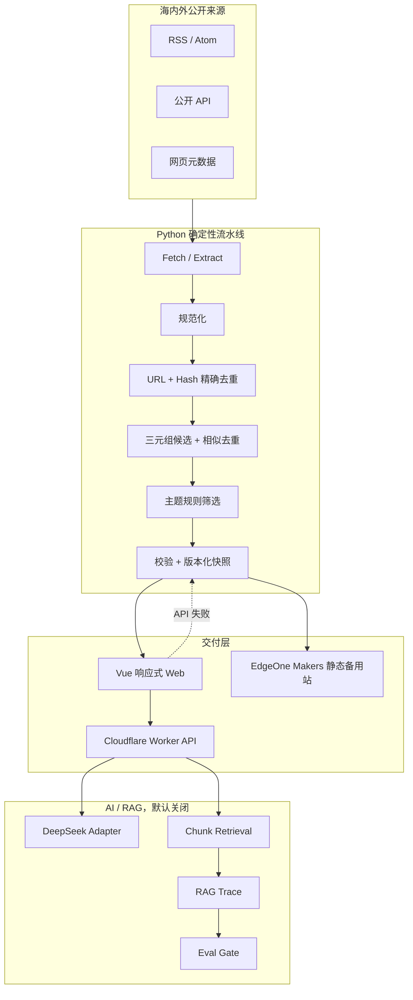

# NewsEviday 工程架构说明

| 项目 | 当前基线 |
|---|---|
| 架构版本 | v0.4 / P3 静态产品 |
| 日期 | 2026-08-02 |
| 状态 | P3 公开页面与静态快照链路完成，Cloudflare 主站与 EdgeOne Makers 备用站均已发布 |
| 仓库 | npm workspaces 单仓 + Python 3.12 独立项目 |
| 运行原则 | 默认归档、静态可用、AI 可拔插、全过程可追溯 |

## 1. 总体架构

## 2. 模块职责

| 模块 | 路径 | 职责 | 状态 |
|---|---|---|---|
| Vue Web | `apps/web` | 页面、路由、响应式布局、API/静态快照降级 | P3 首页与降级已实现 |
| Worker 主站 | 根 `wrangler.jsonc` + `apps/worker` | Static Assets、API、安全边界、模型适配 | 主站已发布，适配层已实现 |
| Worker 回滚 | `apps/worker/wrangler.jsonc` | 必要时独立部署 API | 配置保留 |
| EdgeOne Makers | `edgeone.json` | Vue 静态备用站、SPA 回退和安全头 | 首次云端部署已通过 |
| 共享契约 | `packages/contracts` | TS 类型、运行时断言、JSON Schema | v1 已建立 |
| Python Pipeline | `pipeline` | Feed 解析、清洗、去重、主题筛选、快照发布 | 离线 fixture 闭环已实现 |
| 运行配置 | `config` | 模式、开关、预算、主题、来源 | 默认全部关闭 |
| Design Tokens | `design/tokens` | 视觉变量与前端样式基线 | 已接入 workspace |

## 3. 两条运行路径

### 静态内容路径

Python 按需运行，产出 `ContentSnapshot`。快照通过 Schema 校验后才替换 `current.json`。Vue 可直接读取该文件，因此关闭定时采集、AI 和 Worker 动态能力后，站点仍能显示页面与历史数据。

### 动态 AI 路径

浏览器只访问 Worker，永远不直接接触 DeepSeek Key。Worker 负责开关、限流、预算、缓存、超时和错误语义，再调用模型适配器。Key 已保存为 Cloudflare Secret，但当前没有公开问答路由，AI 总开关保持关闭，不会产生真实 Token 费用。

## 4. 主备部署

Cloudflare Workers Static Assets 同源承载前端和 `/api/*`。根目录 `wrangler.jsonc` 指向 `apps/web/dist`；SPA 未命中路径返回 `index.html`，只有 `/api/*` 进入 Worker。

EdgeOne Pages 已更名为 EdgeOne Makers。根目录 `edgeone.json` 固定 Node 24.11.0、`npm ci`、Vue 输出目录、SPA 回退和基础安全头。备用站默认只读；需要访问 Cloudflare API 时，必须将其实际 Origin 精确加入 `ALLOWED_ORIGINS`。

无自定义域名时，EdgeOne 大陆加速区预览链接存在时效限制。因此当前把它定位为备用部署和大陆访问验证，不承诺永久公开入口。

## 5. RAG 设计边界

后续默认检索策略沿用参考项目的思路，并增加上线闸门：

1. 文章切成 `Chunk`，Embedding 与文章事实分开存；
2. `chunk_dense` 作为生产候选；
3. `article_dense` 作为 fallback；
4. `hybrid_rerank` 只作为 Eval 质量上限，时延达标后再考虑上线；
5. 每次问答记录候选排名、注入 Chunk、fallback 原因和时延；
6. 外部 Chunk 统一标成不可信证据，不能改变系统指令；
7. 回答必须引用 Evidence，找不到证据时明确拒答或降级。

当前仓库只定义 `Chunk`、`RagTrace`、`EvalRun` 契约和安全包装函数，尚未引入向量库或生成答案。

## 6. Eval 的作用

RAG 的问题经常来自检索没找到、排序错了、上下文注入错了或响应太慢。Eval 用固定黄金集比较不同方案，控制上线与回滚。

| 层级 | 指标 | 用途 |
|---|---|---|
| 检索 | Recall@5/10、MRR、NDCG@10、Hit@5 | 判断证据能否被召回并排在前面 |
| 时延 | p50/p95 | 防止高质量方案慢到不可用 |
| 回答 | 引用正确率、忠实度、拒答正确率 | 防止无证据结论 |
| 成本 | 输入/输出 Token、单问估算费用 | 保障月预算 |
| 安全 | Prompt Injection 通过率、敏感日志检查 | 控制外部内容污染 |

任何检索策略升级都应带 `datasetVersion` 和 `EvalRun`，未过 gate 不替换生产默认值。

## 7. 安全与成本结构

- 静态资源和 API 同源，减少跨域面；
- Secret 只存在于 Worker 环境；
- API 统一错误包，不回传堆栈和配置值；
- CORS 使用精确白名单；
- IP 通过带 Secret 的 HMAC 匿名化；
- 请求体、超时、每日次数、月预算和硬预算都有配置边界；
- 默认重试 0 次，避免生成请求重复计费；
- CI 检查高信号密钥、类型、测试、构建和生产依赖。

细节见 [安全与成本控制](./安全与成本控制.md)。

## 8. 数据与发布一致性

- JSON 外部字段 camelCase，Python 内部 snake_case；
- 持久对象携带 `schemaVersion=1.0.0`；
- `facts` 与 `ai` 分层，AI 关闭时 `ai=null`；
- 快照版本不可变，`current.json` 原子替换；
- Cloudflare 与 EdgeOne 共用同一静态格式；
- API 失败时前端进入 `static` 状态，不伪装动态服务可用。

## 9. 可迁移性

| 对象 | 固定方式 |
|---|---|
| Node | `.node-version`、`.nvmrc`、`package-lock.json` |
| Python | `.python-version`、`pipeline/.python-version`、`pipeline/uv.lock` |
| npm 依赖 | npm workspaces + lockfile |
| Python 依赖 | `pyproject.toml` + uv lockfile |
| 接口 | `@newseviday/contracts` + JSON Schema |
| 视觉 | `@newseviday/design-tokens` |
| 本地配置 | `.env.example`、`.dev.vars.example` |
| 自动验证 | `.github/workflows/ci.yml` |
| Cloudflare 部署 | 根 `wrangler.jsonc` |
| EdgeOne 部署 | 根 `edgeone.json` |

## 10. 当前完成与未完成

已完成：

- 统一 API envelope、request ID、错误码和安全响应头；
- `/api/health`、`/api/status`、`/api/runtime-config`；
- DeepSeek 非流式/流式适配、超时、取消、错误分类、Token 记录接口；
- Source/Article/Evidence/Chunk/Snapshot/RAG Trace/Eval 等共享模型；
- Atom/RSS fixture、精确/模糊去重、主题筛选、原子快照；
- Worker 失效时 Vue 自动读取静态快照；
- HMAC IP 匿名化、日志脱敏、Prompt Injection 内容边界；
- Cloudflare 与 EdgeOne Makers 主备站 Git 部署；
- 单元测试与 CI 密钥扫描。

未完成：

- 真实多来源网络采集和定时任务；
- KV/D1 匿名限流与预算台账；
- DeepSeek 真实烟雾测试；
- Chunking、Embedding、向量存储、RAG 和 Eval Runner；
- 文章详情、产品介绍和其他业务页面的详细前端实现；
- 大陆多网络长期稳定性验证。
