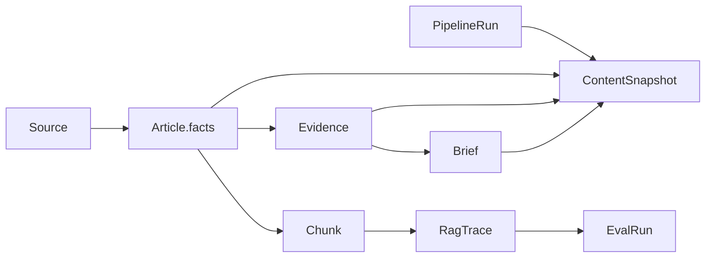

# NewsEviday 数据模型与 Schema

## 1. 目标

同一份内容会被 Python 采集、Vue 展示、Worker 查询，后续还会进入向量检索与 Eval。数据契约必须先统一，否则最容易出现三类问题：字段漂移、AI 结论冒充事实、无法追溯答案来源。

当前基线：

| 载体            | 路径                                               | 用途                                      |
| --------------- | -------------------------------------------------- | ----------------------------------------- |
| TypeScript      | `packages/contracts/src/index.ts`                  | Vue、Worker 编译期类型和轻量运行时断言    |
| JSON Schema     | `packages/contracts/schema/newseviday.schema.json` | 跨语言交换、快照和外部工具校验            |
| Python/Pydantic | `pipeline/src/newseviday_pipeline/models.py`       | 配置、流水线、发布前强校验                |
| 当前快照        | `apps/web/public/data/current.json`                | Cloudflare/EdgeOne 均可读取的生产降级快照 |
| 历史快照        | `apps/web/public/data/versions/{snapshotId}.json`  | 不可变回滚与固定评测语料                  |

Schema 版本为 `1.0.0`。JSON 字段统一使用 camelCase；Python 内部使用 snake_case，由 Pydantic 别名转换。

## 2. 核心模型

| 模型                  | 解决的问题                 | 关键字段                                                                                          | 当前实现                    |
| --------------------- | -------------------------- | ------------------------------------------------------------------------------------------------- | --------------------------- |
| `Source`              | 来源身份、类型和使用边界   | `kind`、`language`、`region`、`usageScope`                                                        | 契约已定义                  |
| `Article`             | 规范化文章主记录           | `facts`、`ai`、`contentHash`、`topicScores`、`contentScore`、`contentScoreBreakdown`、`keySignal` | Python 已生成               |
| `Evidence`            | 结论可回链的证据片段       | `articleId`、`sourceId`、`url`、`excerpt`                                                         | Python 已生成               |
| `Chunk`               | RAG 的最小检索单元         | `articleId`、`position`、`contentHash`                                                            | Python/Worker 基线已生成    |
| `PipelineRun`         | 每次采集处理的过程记录     | `stages`、计数、耗时、`sourceOutcomes`、`errorCode`                                               | JSON 持久化已实现           |
| `ContentSnapshot`     | 可发布、可回滚的只读内容包 | `snapshotKind`、来源/主题目录、文章/证据/简报                                                     | 已实现                      |
| `Brief`               | 趋势简报及引用关系         | `sections[].evidenceIds`、`generatedBy`                                                           | 契约预留                    |
| `RagTrace`            | 检索与上下文注入过程       | 路由、轮次、候选排名、注入 Chunk、停止原因                                                        | Worker 匿名日志已实现       |
| `EvalRun`             | 检索版本能否上线的证据     | 数据集版本、指标、时延、gate                                                                      | Demo 与生产试运行报告已实现 |
| `RuntimeConfig`       | 开关、限额和模型选择       | `features`、`limits`、`ai`                                                                        | Worker 公开子集已实现       |
| `generation_requests` | 生成预算预留、结算和幂等   | request、匿名日键、预留/实际微元、状态                                                            | D1 migration 已实现         |
| `quota_counters`      | 单 IP 与全站日额度         | scope、匿名键、UTC 日、count/limit                                                                | D1 migration 已实现         |
| `generation_leases`   | 跨 Worker 实例并发保护     | lease、request、过期秒数                                                                          | D1 migration 已实现         |

## 3. 事实与 AI 内容分离

`Article` 明确拆成两层：

- `facts`：来源直接给出的标题、作者和摘要；
- `ai`：翻译、中文摘要、为什么值得看、关键点、模型、提示词版本和生成时间。

`ai=null` 是合法状态。关闭模型后，文章事实层、证据层和历史快照仍然可用。页面展示 AI 内容时必须有视觉标识，并保留原文链接。

`contentScore`、`contentScoreBreakdown` 与 `selectionReasons` 由 Python 确定性计算，不是模型判断。评分拆成目标相关性、技术改进、工程适用性、技术普适性、产品/行业影响、新鲜度、证据成熟度和内容完整度八个可观察维度。工程与技术维度合计占总分 25%，摘要完整度只占 5%。

`keySignal` 保存独立的重点情报资格、专用分数、理由和未通过门槛。它要求中文标题与中文导读，并同时检查内容总分、目标相关性、工程/行业影响、证据成熟度；没有合格候选时前端不强行选取。旧快照缺少这些可选字段时，前端使用兼容排序且不展示 Key Signal，不修改不可变历史文件。

`snapshotKind=demo` 表示用于界面与信息结构验证的演示快照，页面必须显式提示，避免把样例内容误认为实时新闻。`sources` 和 `topics` 随快照发布，备用站无需额外 API 也能还原来源、区域和主题标签。

`snapshotKind=production` 表示来自真实采集管道的受控生产快照。它仍然需要展示整理时间、实际贡献来源、AI 增强篇数和原文核验提示，不能等同于实时新闻流。

## 4. ID、时间与哈希

| 对象            | 规则                                          |
| --------------- | --------------------------------------------- |
| Article ID      | 规范化 URL 的 SHA-256 截断值，前缀 `article-` |
| Evidence ID     | 内容哈希截断值，前缀 `evidence-`              |
| Snapshot ID     | UTC 生成时间 + 随机短 ID，前缀 `snapshot-`    |
| Pipeline Run ID | UUID，前缀 `pipeline-`                        |
| 时间            | ISO 8601 UTC；未知发布时间使用 `null`         |
| Content Hash    | 规范化标题 + 摘要的 SHA-256                   |

哈希用于去重和变更判断，不用于证明内容真实性。

## 5. 血缘关系



答案页面至少能从 Answer 追溯到 RagTrace，再到 Chunk、Article 和 Source URL。公开日志只存问题指纹，不存原始问题。

## 6. 快照发布与回滚

目录约定：

```text
data/
├─ current.json
├─ archive/manifest.json
├─ quality/latest.json
└─ versions/
   ├─ snapshot-....json
   └─ snapshot-....json
```

发布过程：

1. Pydantic 完整校验待发布对象；
2. 写入不可变版本文件；相同 `snapshotId` 不允许内容变化；
3. 写入同目录临时文件并 `fsync`；
4. 原子替换 `current.json`；
5. 任一步骤在校验前失败，现有 `current.json` 保持不变。

Vue 请求 Worker 失败时读取 `/data/current.json`。Cloudflare 和 EdgeOne 只需要同步同一份静态文件格式。

## 7. 兼容策略

- Patch：校验或文档修正，不改变字段；
- Minor：只新增可选字段或枚举值，旧消费者可继续工作；
- Major：字段删除、改名、类型或语义变化；
- 每个持久化对象带 `schemaVersion`；
- 前端只读取其理解的主版本；未知主版本进入安全空状态；
- 数据迁移脚本必须保留原始快照，禁止就地覆盖唯一副本。

## 8. 暂不存储的数据

- 原始 IP；
- DeepSeek Key、Cloudflare Token；
- 用户完整问题和完整个人画像日志；
- 模型内部提示词全文；
- 未确认授权的网页全文。

MVP 优先存元数据、摘要、证据摘录、来源 URL 和运行指标。来源的版权与使用范围由 `usageScope` 记录。

## 9. D1 生成保护内部模型

D1 表属于 Worker 内部保护模型，不进入公开 ContentSnapshot，也不返回给浏览器：

- 金额统一存人民币微元整数，避免浮点累计误差；
- `request_id` 来自受格式约束的幂等键，`trace_id` 关联公开 API Trace；二者均不包含问题正文；
- 已结算记录可保存 provider、model 与输入/输出/总 Token，供成本回溯；
- `client_hash` 使用 `HMAC(secret, UTC日期 + IP)`，不保存原始 IP，跨日键不同；
- `monthly_budget_before_reserve` 在 INSERT 时原子检查已结算费用和未过期预留；
- D1 batch 同时更新单 IP 与全站计数，任一额度失败则整批回滚；
- 未调用模型的 released 请求不计预算，并返还已占用日额度；
- 过期 reservation 与 lease 不计入当前预算或并发，占用记录可按运行手册定期清理。
