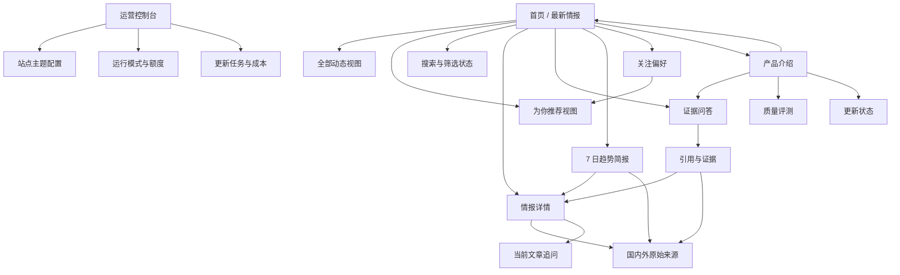
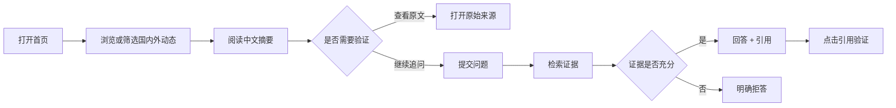
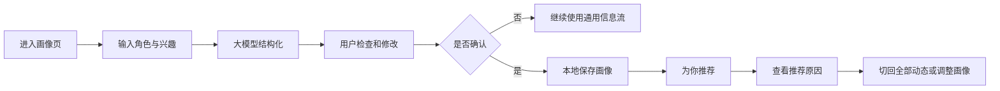
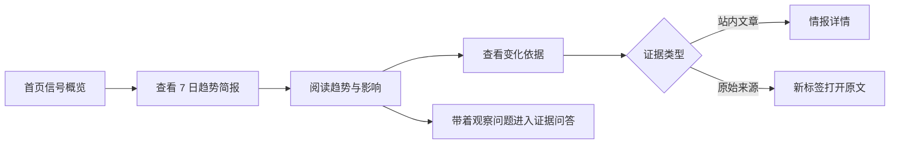
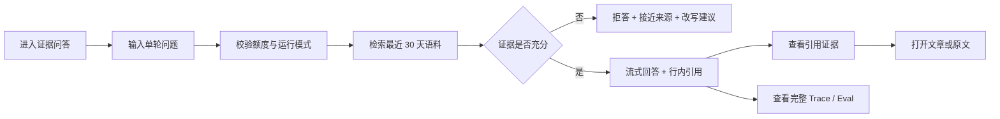
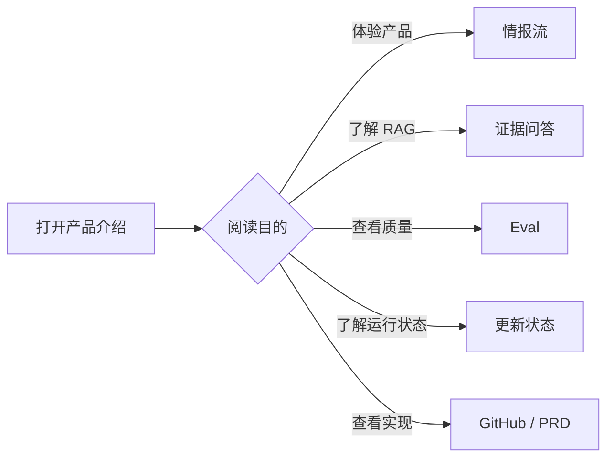
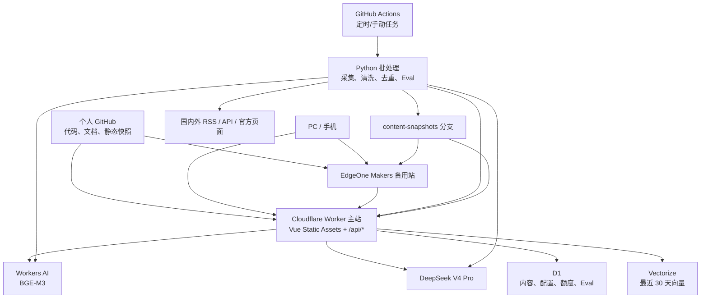

# NewsEviday 产品需求文档（PRD）

> **有证据的 AI 产品与技术情报**
> 每天看见信息背后的证据。

| 文档项     | 内容                                                                 |
| ---------- | -------------------------------------------------------------------- |
| 产品名称   | NewsEviday                                                           |
| 名称含义   | News + Evidence + Day                                                |
| 文档版本   | v1.3.1                                                               |
| 文档状态   | P7 工程与发布完成；P8 首页视觉与 Signal N 品牌标识完成                |
| 更新日期   | 2026-08-03                                                           |
| 目标岗位   | 产品经理 / AI 产品经理作品集                                         |
| 产品形态   | 响应式 Web 网站                                                      |
| 核心版周期 | 预计 4–5 周，按阶段门控                                              |
| 月度预算   | 正常不超过 35 元，硬上限 50 元                                       |

---

## 0. 产品介绍

### 0.1 产品是什么

NewsEviday 是一个面向 AI 产品经理、数据产品经理和 AI 从业者的个人情报网站。它持续整理国内外 AI 产品、基础模型、Agent、数据智能、开发工具和 GitHub 开源项目，将分散的信息转化为中文结构化摘要、可追溯证据、兴趣推荐和趋势判断。

产品帮助用户完成一条完整链路：

> 发现国内外动态 → 跨语言理解 → 根据兴趣筛选 → 继续追问 → 查看原始证据 → 形成趋势判断

NewsEviday 会重点追踪海外官方博客、产品发布页、GitHub、arXiv 和技术社区。海外内容保留原始标题、发布时间、原文链接和必要证据片段，同时生成中文标题、结构化摘要和术语解释，降低语言门槛，缩短海外信息传到国内后的时间差。

网站也覆盖国内模型厂商、数据平台、开源社区和技术产品，使用户可以在同一页面比较国内外产品方向、能力更新和行业趋势。

### 0.2 主要功能

| 功能               | 用户价值                                                 |
| ------------------ | -------------------------------------------------------- |
| 海内外每日情报     | 聚合国内外 AI、数据和开源技术动态                        |
| 跨语言结构化摘要   | 将海外原始信息整理为中文关键事实和产品影响               |
| 主题配置           | 由站点所有者调整近期重点关注方向                         |
| 可选关注偏好       | 用户可手动设置方向，也可用智能整理生成可编辑的结构化建议 |
| 个性化信息流       | 根据兴趣调整内容顺序，并解释推荐原因                     |
| 证据型 RAG 问答    | 对当前文章或最近 30 天内容追问，回答附原始来源           |
| 7 日趋势简报       | 从单条动态中归纳持续变化、弱信号和待观察方向             |
| 质量评测           | 公开检索质量、引用覆盖、延迟和失败案例                   |
| 产品介绍页         | 从产品和技术两个角度展示定位、能力、架构、RAG 与评测     |
| 运行模式与预算控制 | 可暂停更新和 AI，保留网站与往期内容                      |
| 主备站部署         | Cloudflare 主站，EdgeOne Makers 备用静态访问入口         |

### 0.3 产品亮点

#### 亮点一：整理国内外信息，降低跨语言信息差

- 同时覆盖国内与海外官方来源。
- 海外内容默认生成中文标题、摘要和术语解释。
- 保留原始英文标题、原文链接和发布时间，方便用户复核。
- 建立中英文术语映射，例如 Semantic Layer / 语义层、Lakehouse / 湖仓。
- 在面试运行模式下，每天自动更新；必要时可手动立即更新。
- 用“来源发布时间—入库时间”衡量信息时效，目标是在 24 小时内完成收录。

#### 亮点二：信息方向可调整

站点所有者可以随时修改重点主题，例如：

- 数据中台
- Data Agent
- 统一语义层
- 智能数据湖
- 湖仓一体
- 数据治理
- 元数据管理
- 企业级 AI

每日整理会按照主题权重选择内容，同时保留一定比例的重大通用动态。

#### 亮点三：个人画像可选、透明、可控制

用户可以用一句话描述自己的角色和关注方向。大模型将输入整理为结构化画像，用户确认后才生效。画像只调整已有内容的排序，不为每个用户单独抓取和生成内容。

不填写画像时，网站正常展示通用信息流。

#### 亮点四：回答能够回到证据

RAG 负责从最近 30 天内容中检索依据，DeepSeek 负责组织答案。每个主要事实关联来源；证据不足时系统明确拒答。

#### 亮点五：AI 质量和成本公开可控

网站展示检索指标、回答指标、延迟和失败案例。运营控制台可以设置每日更新、单 IP 次数、全站额度和月度预算，也可以一键进入低成本归档模式。

---

## 1. 背景与问题

### 1.1 用户问题

AI、数据智能和开源技术变化快，信息分散在：

- 海外厂商官方博客和产品更新页；
- 国内模型与云厂商发布渠道；
- GitHub Trending、Release 和项目文档；
- arXiv 论文；
- 技术社区和行业媒体。

目标用户面临五个问题：

1. 海外一手信息以英文为主，理解和整理成本高。
2. 国内二次传播存在时间差，标题和结论可能丢失上下文。
3. 用户关注方向差异大，通用资讯流噪声高。
4. 普通摘要难以核对，AI 问答也可能生成没有证据的结论。
5. 个人作品长期运行需要 API，持续更新可能产生不必要成本。

### 1.2 产品机会

NewsEviday 将信息聚合、跨语言处理、可解释推荐、证据型问答、趋势简报和评测组合成一个可演示的闭环。

该项目在简历中主要证明：

- 用户问题与产品定位能力；
- 国内外内容策略和信息架构能力；
- 用户画像与推荐策略设计能力；
- RAG、Eval、Trace 和降级机制理解；
- 成本、安全、部署和运营能力；
- MVP 范围控制能力。

---

## 2. 产品目标与边界

### 2.1 MVP 目标

1. 面试运行模式下，每天整理 20–30 条国内外有效情报。
2. 海外内容全部提供中文结构化摘要，并保留原始证据。
3. 用户可以配置站点重点方向，也可以自愿创建个人画像。
4. 用户在 3 分钟内完成“发现—理解—追问—验证”。
5. RAG 正常回答必须附来源，证据不足时拒答。
6. 公开一套可复现的 RAG 黄金测试集和 Eval 结果。
7. PC、平板和手机均可完成主要任务。
8. 网站暂停更新和 AI 后仍可浏览往期数据。
9. 正常面试运行成本不超过 35 元/月，硬上限 50 元。
10. 项目可从当前设备完整迁移到个人设备。

### 2.2 非目标

MVP 不实现：

- 全网实时搜索；
- 用户注册和账号体系；
- 多设备自动同步；
- 为每个用户单独采集和生成内容；
- 根据长期行为自动学习画像；
- 协同过滤和推荐模型训练；
- 每人一份独立趋势简报；
- 微信、邮件和 App 主动推送；
- 原生 App；
- 复杂 Agent 自主规划；
- GraphRAG 和知识图谱；
- 在线 rerank；
- 付费、订阅和商业化；
- 付费墙、登录内容及高风险页面抓取。

说明：PRD 中的“推荐”指网站内个性化信息流，不包含消息通知。

---

## 3. 目标用户与 JTBD

### 3.1 用户 A：AI / 数据产品经理

特征：

- 每天有 10–20 分钟了解行业变化；
- 关注产品能力、用户价值和落地案例；
- 需要跟踪国内外信息，但不希望逐篇阅读英文原文；
- 可能在某段时间重点研究数据中台、Data Agent 或语义层。

JTBD：

> 当 AI 与数据产品快速变化时，我想及时看到与当前工作相关的国内外动态，并检查原始依据，以便形成可用于产品方案、竞品研究和面试表达的判断。

### 3.2 用户 B：技术产品与数据从业者

特征：

- 关注开源项目、模型能力、数据平台和开发工具；
- 希望发现相关项目，但不需要传统大众科技新闻；
- 需要中文概括，也希望保留技术术语和原始链接。

JTBD：

> 当我研究一个技术方向时，我想快速获得相关产品、项目和论文的更新，并比较它们之间的联系。

### 3.3 用户 C：招聘方或面试官

特征：

- 通过公开网站判断候选人的 AI 产品能力；
- 通常只有 5–10 分钟体验；
- 关注产品逻辑、边界、数据、评测、成本和异常处理。

JTBD：

> 当我评估候选人时，我想快速看懂项目解决什么问题、为什么这样设计，以及 AI 能力是否可验证。

---

## 4. 产品原则

1. **原始来源优先**：所有结论尽可能回到官方页面、仓库或论文。
2. **海外内容中文可读**：降低语言成本，同时保留原文和关键术语。
3. **推荐可解释**：告诉用户为什么推荐，允许切回全部动态。
4. **画像由用户控制**：用户确认后生效，可编辑、导出和清除。
5. **证据不足则拒答**：避免模型用常识补齐语料中没有的事实。
6. **静态浏览优先**：动态能力暂停时，网站和历史数据仍可访问。
7. **成本先设上限**：所有高成本功能具备配额、缓存和开关。
8. **MVP 保持单一后端**：备用站优先解决静态访问，不复制整套 RAG。
9. **确定性能力优先使用代码**：抓取、清洗、去重、基础筛选、排序和指标计算优先由 Python 完成。
10. **AI 只处理语义任务**：翻译、摘要、画像增强、问答和趋势归纳使用模型，并保留可关闭路径。

---

## 5. 成功指标

### 5.1 北极星指标

**每周完成的有效情报闭环数**

一次有效闭环满足以下任一条件：

- 用户打开详情后点击原始来源；
- 用户获得 RAG 回答后点击至少一个引用；
- 用户查看趋势简报后打开相关来源。

### 5.2 内容与跨语言指标

| 指标                     |                    MVP 目标 |
| ------------------------ | --------------------------: |
| 面试模式每日新增         |                    20–30 条 |
| 来源采集成功率           |                       ≥ 95% |
| 重复条目率               |                        ≤ 5% |
| 海外来源占比             | 默认 60%，可在 50%–80% 调整 |
| 国内来源占比             | 默认 40%，可在 20%–50% 调整 |
| 海外条目中文摘要覆盖率   |                        100% |
| 原始标题与原文链接覆盖率 |                        100% |
| 来源发布到入库 p50       |                   ≤ 12 小时 |
| 来源发布到入库 p95       |                   ≤ 24 小时 |
| 术语一致性抽检           |                       ≥ 95% |
| 去重 Precision           |                      ≥ 0.95 |
| 去重 Recall              |                      ≥ 0.90 |
| 去重边界样本人工复核率   |                       ≤ 10% |

### 5.3 推荐指标

| 指标             |           MVP 目标 |
| ---------------- | -----------------: |
| 画像生成成功率   |              ≥ 95% |
| 画像确认完成率   |     上线后建立基线 |
| 推荐内容点击率   | 高于“全部动态”基线 |
| 推荐原因覆盖率   |               100% |
| 用户切回全部动态 |           始终可用 |
| 画像清除成功率   |               100% |

### 5.4 RAG 指标

| 指标             |                       发布目标 |
| ---------------- | -----------------------------: |
| Recall@5         |                         ≥ 0.75 |
| Hit@5            |                         ≥ 0.85 |
| MRR              |                         ≥ 0.55 |
| NDCG@10          |                         ≥ 0.65 |
| 引用覆盖率       |                          ≥ 95% |
| Faithfulness     |                         ≥ 0.85 |
| 无答案识别准确率 |                          ≥ 80% |
| 检索 p95         |                         ≤ 4 秒 |
| RAG 首字 p50     | ≤ 3.5 秒，不含极端跨境网络波动 |

### 5.5 技术与成本指标

| 指标                     |                  目标 |
| ------------------------ | --------------------: |
| 静态页面可用率           | ≥ 99%，以平台统计为准 |
| Lighthouse Accessibility |                  ≥ 90 |
| Lighthouse Performance   |  桌面 ≥ 85，移动 ≥ 75 |
| 面试模式月度成本         |          正常 ≤ 35 元 |
| 月度硬上限               |                 50 元 |
| 归档模式模型费用         |             接近 0 元 |

以上均为目标值，不能在项目介绍中写成已经实现的结果。

---

## 6. 产品范围与优先级

### 6.1 MoSCoW

| 优先级 | 功能                                                                        |
| ------ | --------------------------------------------------------------------------- |
| Must   | Python 海内外采集、清洗、分层去重、基础筛选和静态快照                       |
| Must   | DeepSeek 中文结构化摘要、跨语言表达和必要的模糊分类                         |
| Must   | 原始标题、来源语言、发布时间、原文链接和证据片段                            |
| Must   | 站点主题配置与内容比例控制                                                  |
| Must   | 通用信息流、个人画像、兴趣排序和推荐原因                                    |
| Must   | 情报详情、当前文章问答、最近 30 天跨文章问答                                |
| Must   | 流式回答、引用、拒答和 RAG Trace                                            |
| Must   | 7 日趋势简报、质量评测页、更新状态页                                        |
| Must   | 归档/预热/面试模式、独立开关和预算控制                                      |
| Must   | Cloudflare 主站、EdgeOne 备用静态站                                         |
| Must   | 产品介绍页，展示产品思路、亮点、技术架构、RAG 和评测                        |
| Must   | 响应式布局与跨设备迁移文档                                                  |
| Must   | YAML 配置文件和 GitHub Actions 手动工作流，供所有者调整主题、额度与运行模式 |
| Should | 搜索、来源筛选、国内/海外筛选、时间筛选                                     |
| Should | 中英文标题切换、术语提示、画像导入导出                                      |
| Should | 可视化 `/admin` 运营控制台                                                  |
| Could  | RSS 输出、PWA、浏览器本地收藏、深色模式                                     |
| Won't  | 账号、云同步、行为学习、主动推送、个性化简报、复杂推荐模型                  |

### 6.2 一级内容分类

1. AI Products
2. Models
3. Agents
4. Data Intelligence
5. Developer Tools
6. Open Source

Data Intelligence 包含数据中台、Data Agent、语义层、数据湖仓、数据治理、元数据和数据开发平台。

---

## 7. 信息架构



### 7.1 页面与路由

MVP 包含 8 个公开页面；`/admin` 为增强版页面，不计入核心版公开页面数量。

| 路由           | 页面            | 版本   | 核心职责                                         | 主要入口                       | 主要去向                           |
| -------------- | --------------- | ------ | ------------------------------------------------ | ------------------------------ | ---------------------------------- |
| `/`            | 首页 / 最新情报 | 核心版 | 全部动态、为你推荐、搜索和筛选                   | Logo、产品介绍 CTA、直接访问   | 情报详情、简报、问答、关注偏好     |
| `/article/:id` | 情报详情        | 核心版 | 中文整理、原始信息、证据、相关内容和当前文章追问 | 最新情报、简报、RAG 引用       | 原文、相关情报、问答               |
| `/ask`         | 证据问答        | 核心版 | 最近 30 天跨文章 RAG                             | 顶部导航、产品介绍             | 引用证据、情报详情、原文           |
| `/brief`       | 7 日趋势简报    | 核心版 | 趋势、变化依据、来源和观察问题                   | 顶部导航、首页信号概览         | 文章、原文、问答                   |
| `/profile`     | 关注偏好        | 核心版 | 输入、智能整理、确认、编辑、导入和导出           | “设置关注偏好”、头像菜单       | 为你推荐、首页                     |
| `/eval`        | 质量评测        | 核心版 | 指标、测试集、版本、门槛和失败案例               | 产品介绍、页脚、问答 Trace     | 问答、产品介绍                     |
| `/status`      | 更新状态        | 核心版 | 更新时间、来源状态、可用能力和已知问题           | 产品介绍、页脚、快照提示       | 首页、产品介绍                     |
| `/product`     | 产品介绍        | 核心版 | 产品思路、能力、架构、RAG、评测、成本和边界      | 顶部导航、页脚                 | 最新情报、问答、质量评测、更新状态 |
| `/admin`       | 运营控制台      | 增强版 | 主题、模式、配额、任务和费用                     | 直接地址 + 管理认证            | 配置结果、任务状态                 |

### 7.2 全局导航与入口规则

顶部导航固定为：

| 导航项                  | 目标                 | 规则                                                       |
| ----------------------- | -------------------- | ---------------------------------------------------------- |
| NewsEviday Logo         | `/`                  | 回到全部动态；首页内点击滚动到顶部                         |
| 最新情报                | `/` 或 `/?view=all`  | 默认视图                                                   |
| 为你推荐                | `/?view=recommended` | 无画像时按通用主题相关度排序并展示画像引导，不强制创建画像 |
| 趋势简报                | `/brief`             | 访客只查看公共简报，不直接触发生成                         |
| 证据问答                | `/ask`               | RAG 未开放时仍可查看示例、语料和能力边界                   |
| 产品介绍                | `/product`           | 同时服务普通用户和面试官                                   |
| 搜索                    | `/?q={keyword}`      | 从任意页面提交后进入首页搜索结果状态                       |
| 设置关注偏好 / 头像菜单 | `/profile`           | 未设置偏好时显示引导；已设置时显示编辑入口                 |

质量评测与更新状态不占用顶部主导航，通过产品介绍页、页脚和相关状态入口访问。私有 GitHub、PRD 和内部进度文档不进入公开导航。

`/admin` 不出现在公开导航和站点地图中。核心版未开发可视化管理台时，不提供该页面入口。

#### 7.2.1 对外文案边界

- 首屏先表达用户价值、信息范围和可信机制，不展示开发阶段、内部预算、求职场景或私有仓库状态。
- 运行限制只在对应功能入口说明一次，避免跨页面重复“关闭、暂停、演示”等状态。
- 工程术语使用中文产品名称承接；RAG、Embedding、Trace 等技术词只在产品介绍页和质量评测页解释。
- 样例内容、目标指标和实测结果必须明确区分；没有实时更新能力时不使用“实时”。
- 外部参考项目、内部进度、PRD 和未公开 GitHub 不作为公开产品模块。

### 7.3 首页视图与 URL 状态

“全部动态”和“为你推荐”是同一首页的两个视图，不是两个独立页面。

| 参数     | 示例                    | 说明                   |
| -------- | ----------------------- | ---------------------- |
| `view`   | `all` / `for-you`       | 首页视图，默认 `all`   |
| `q`      | `Data Agent`            | 搜索词                 |
| `topic`  | `data-agent`            | 主题筛选               |
| `region` | `overseas` / `domestic` | 海外或国内             |
| `source` | `github`                | 来源筛选               |
| `range`  | `24h` / `7d` / `30d`    | 时间范围               |
| `page`   | `2`                     | 分页；首版不用无限滚动 |

规则：

- 筛选和搜索状态写入 URL，支持复制、刷新和浏览器前进后退；
- 从信息流打开文章后，返回时恢复原 URL、滚动位置和已加载页码；
- 清空全部筛选回到 `/` 或 `/?view=recommended`；
- 无效参数忽略并回退到默认值，不展示技术错误；
- 外部原文和 GitHub 在新标签页打开；站内页面保持当前标签页。

---

## 8. 海内外内容策略

### 8.1 来源分层

| 级别 | 来源类型                                               | 使用方式                           |
| ---- | ------------------------------------------------------ | ---------------------------------- |
| S1   | 官方博客、产品页、Release、公开 API、GitHub 仓库、论文 | 优先收录，可进入 RAG               |
| S2   | 可信行业媒体和技术社区                                 | 用于发现信号，重要结论需回到 S1    |
| S3   | 社交平台和未验证转载                                   | MVP 不自动进入 RAG，只保留未来扩展 |

### 8.2 MVP 已启用来源

首批来源遵循“官方、一手、通用 AI 与数据方向兼顾、可稳定解析、低噪声”的选择原则。当前启用 9 个来源：

| 来源                 | 区域 | 获取方式             | 主要覆盖                                       |
| -------------------- | ---- | -------------------- | ---------------------------------------------- |
| OpenAI News          | 海外 | 官方 RSS             | 通用模型、AI 产品、Agent、安全与开发平台       |
| Anthropic Newsroom   | 海外 | 官方页面结构化解析   | Claude、Agent、AI 安全与研究                   |
| Hugging Face Blog    | 全球 | 官方 RSS             | 开源模型、数据集、评测与开发工具               |
| GitHub Blog AI & ML  | 海外 | 官方 RSS             | AI 开发工具、工程实践与开源生态                |
| Databricks Blog      | 海外 | 官方 RSS             | Data Intelligence、Lakehouse 与数据 Agent      |
| dbt Labs Blog        | 海外 | 官方 RSS             | Semantic Layer、Analytics Engineering 与 Agent |
| arXiv cs.AI          | 全球 | 官方 Atom API        | AI 论文元数据与摘要                            |
| Qwen Blog            | 国内 | 官方 RSS             | 通义千问、开源模型、多模态与 Agent             |
| DeepSeek API Updates | 国内 | 官方变更日志标题解析 | DeepSeek 模型和 API 发布动态                   |

AWS Machine Learning、Google DeepMind 和 Cloudflare Blog 不进入首批启用集。前两者按产品方向调整移出；Cloudflare 在真实抓取中出现 CDN、缓存规则等非 AI 内容，MVP 阶段优先控制信息噪声。后续可按主题质量和维护成本补充 Microsoft、Meta AI、ModelScope、DataHub、OpenMetadata、StarRocks 等官方来源。

### 8.3 默认内容比例

| 维度         | 默认比例 | 可配置范围 |
| ------------ | -------: | ---------: |
| 海外来源     |      60% |    50%–80% |
| 国内来源     |      40% |    20%–50% |
| 站点核心兴趣 |      70% |    50%–80% |
| 相邻主题     |      20% |    10%–30% |
| 重大通用动态 |      10% |    10%–20% |

比例是内容结果的目标区间，不按来源数量机械计算。当天没有足够高质量内容时，不用低质量信息凑数。

### 8.4 跨语言处理

海外内容进入以下流程：

1. 识别原始语言；
2. 保留原始标题和原始链接；
3. 生成中文标题；
4. 提取关键事实；
5. 说明产品或技术影响；
6. 标记核心实体和术语；
7. 使用术语表统一中英文表达；
8. 保留必要短证据片段；
9. 展示 AI 生成时间和模型版本。

页面默认展示中文信息，同时提供：

- 查看原始标题；
- 查看原文；
- 查看原始证据片段；
- 查看术语原文。

### 8.5 内容合规边界

- 不完整转载原文。
- 只展示必要短摘录、结构化摘要和跳转链接。
- 遵守来源 robots、API 和授权规则。
- 付费或登录内容不采集正文。
- 来源删除或明确要求移除时，从公开页面和 RAG 语料中删除。
- AI 摘要明确标记，以原始来源为准。

---

## 9. 内容整理与排序

### 9.1 每日整理流程

```mermaid
flowchart LR
    Sources["国内外来源"] --> PythonFetch["Python 异步采集与正文提取"]
    PythonFetch --> Normalize["URL、语言、时间、实体标准化"]
    Normalize --> ExactDedup["URL 与内容哈希去重"]
    ExactDedup --> NearDedup["RapidFuzz + TF-IDF 近重复"]
    NearDedup --> SemanticCheck["BGE-M3 复核跨语言临界样本"]
    SemanticCheck --> RuleFilter["关键词、来源和主题规则初筛"]
    RuleFilter --> Candidates["约 30–40 条候选"]
    Candidates --> AIProcess["DeepSeek 翻译、摘要、模糊分类"]
    AIProcess --> SiteScore["站点主题评分"]
    SiteScore --> Mix["核心 / 相邻 / 通用配额"]
    Mix --> Publish["发布 20–30 条"]
    Publish --> Snapshot["静态快照"]
    Publish --> RAG["分块与向量化"]
```



### 9.2 站点主题配置

运营者可配置：

- 核心主题；
- 主题权重；
- 中英文关键词；
- 排除主题；
- 重点来源；
- 国内/海外比例；
- 核心/相邻/通用比例；
- 每日目标数量。

示例：

```json
{
  "primary_topics": [
    { "topic": "Data Agent", "weight": 0.3 },
    { "topic": "统一语义层", "weight": 0.25 },
    { "topic": "智能数据湖", "weight": 0.2 },
    { "topic": "数据中台", "weight": 0.15 }
  ],
  "related_topics": ["元数据管理", "数据治理", "RAG"],
  "excluded_topics": ["游戏", "消费电子"],
  "source_mix": {
    "overseas": 0.6,
    "domestic": 0.4
  }
}
```

修改后从下一次更新生效，不自动重写历史内容。

### 9.3 内容选择分数

```text
站点选择分数 =
主题匹配 35%
+ 新鲜度 20%
+ 来源可靠度 15%
+ 影响力 15%
+ 新颖度 15%
- 排除项惩罚
```

评分用于排序和配额选择，不对用户展示虚假的精确分数。

### 9.4 Python 与 AI 分工

采用“Python 批处理 + 托管 Embedding + DeepSeek 生成”的混合方案。

| 任务                        | 实现                                     | 是否调用生成模型   |
| --------------------------- | ---------------------------------------- | ------------------ |
| RSS/API 采集                | Python `httpx` / `feedparser`            | 否                 |
| HTML 正文提取               | Python `trafilatura` + 来源规则 fallback | 否                 |
| URL、时间、语言、实体标准化 | Python                                   | 否                 |
| 精确重复                    | canonical URL + SHA-256                  | 否                 |
| 同语言近重复                | RapidFuzz + TF-IDF 字符 n-gram           | 否                 |
| 跨语言临界重复              | BGE-M3 余弦相似度                        | 否                 |
| 主题与来源初筛              | Python 关键词、权重、黑白名单            | 否                 |
| 中文标题、摘要、影响说明    | DeepSeek V4 Pro                          | 是                 |
| 模糊分类与标签              | 与摘要合并为一次 DeepSeek 调用           | 是                 |
| RAG embedding               | BGE-M3                                   | 否                 |
| RAG 回答、画像、简报        | DeepSeek V4 Pro                          | 是                 |
| Eval 指标与报表             | Python                                   | 否，LLM Judge 除外 |

性能原则：

- 每日原始候选控制在 100 条以内；
- 网络采集使用异步 I/O，并对单来源设置并发上限；
- 近重复比较先按语言、日期、来源和实体进行 blocking；
- TF-IDF 使用稀疏矩阵；
- BGE 只复核临界或跨语言样本；
- DeepSeek 只处理 Python 初筛后的 30–40 条内容；
- Python 仅承担离线批任务，在线问答继续由 Cloudflare Worker 提供。

不在 GitHub Actions 中下载和常驻本地 BGE-M3，以免增加模型下载、冷启动、内存和缓存风险。

### 9.5 分层去重与事件合并

去重顺序：

1. URL 级：移除 tracking 参数，统一协议、域名大小写、尾斜杠和 canonical URL。
2. 内容级：对规范化标题与正文摘要计算 SHA-256。
3. 近重复：RapidFuzz 标题相似度和 TF-IDF 字符 3–5 gram 余弦相似度。
4. 语义级：对临界样本调用 BGE-M3，识别中英文报道是否属于同一事件。
5. 事件合并：保留一个主条目，其他来源作为来源组展示。

阈值不预先写成固定通用值。开发阶段建立 100 对去重标注集：

- 40 对确定重复；
- 40 对确定非重复；
- 20 对跨语言或边界样本。

去重发布门槛：

| 指标             |   目标 |
| ---------------- | -----: |
| Precision        | ≥ 0.95 |
| Recall           | ≥ 0.90 |
| 人工复核率       |  ≤ 10% |
| 发布后重复条目率 |   ≤ 5% |

---

## 10. 可选个人画像与推荐

### 10.1 设计目标

- 用户可以快速表达自己是谁、在做什么、想关注什么。
- 大模型将自然语言整理为可编辑的结构化画像。
- 画像可选，不影响通用功能。
- 不建设账号体系和长期行为推荐。
- 推荐可以解释、撤销和清除。

### 10.2 输入字段

| 字段           | 必填 | 示例                                     |
| -------------- | ---- | ---------------------------------------- |
| 当前角色       | 否   | 数据产品经理                             |
| 工作或学习方向 | 否   | 数据中台、Data Agent                     |
| 最近关注的问题 | 否   | 语义层如何提高 Data Agent 准确率         |
| 希望少看的内容 | 否   | 消费硬件、游戏                           |
| 自由描述       | 否   | 我在做企业数据平台，希望关注相关开源产品 |

至少填写一项后才允许调用语义增强。

页面提示：

> 请勿输入公司机密、客户信息、账号、密码和未公开项目数据。

### 10.3 画像结构

```json
{
  "schema_version": "1.0",
  "role": "数据产品经理",
  "goals": ["了解企业级数据智能产品", "跟踪 Data Agent 技术进展"],
  "primary_interests": [
    { "topic": "Data Agent", "weight": 0.3 },
    { "topic": "统一语义层", "weight": 0.25 },
    { "topic": "智能数据湖", "weight": 0.2 }
  ],
  "related_interests": ["元数据管理", "数据治理", "RAG"],
  "keywords": ["Semantic Layer", "Lakehouse", "Data Catalog"],
  "excluded_topics": ["游戏", "消费电子"]
}
```

### 10.4 生成流程

1. 用户输入简单信息；
2. DeepSeek 按固定 JSON Schema 整理；
3. 服务端校验枚举、长度和权重；
4. 页面展示画像预览；
5. 用户编辑、删除或补充；
6. 用户确认后保存在浏览器；
7. 首页出现“为你推荐”视图。

模型不得推断用户没有表达的公司、级别、收入、身份和敏感属性。

### 10.5 推荐策略

MVP 使用标签加权，不训练推荐模型。

```text
个人推荐分数 =
核心兴趣匹配 40%
+ 相关兴趣匹配 20%
+ 关键词匹配 15%
+ 内容重要度 10%
+ 新鲜度 10%
+ 来源偏好 5%
- 排除主题惩罚
```

个性化只调整已发布内容的顺序。默认不隐藏其他内容。

每张推荐卡展示一个主要原因：

- 因为你关注 Data Agent；
- 与“统一语义层”相关；
- 适合数据产品经理；
- 来自你关注的开源项目。

### 10.6 画像数据规则

- 默认保存在浏览器 `localStorage`。
- 不需要登录。
- 不支持云端同步。
- 原始输入不写入服务器业务日志。
- 用户可以编辑、导出、导入和一键清除。
- 导出格式为版本化 JSON。
- AI 暂停时，用户仍可手动选择兴趣标签并使用本地推荐。
- EdgeOne 备用站可以使用本地画像对静态快照排序。

### 10.7 验收标准

- [x] 用户不创建画像时可以使用全部静态核心功能。
- [x] 画像输入前有敏感信息提示。
- [ ] AI 输出必须通过 JSON Schema 校验。
- [ ] 用户确认前画像不生效。
- [x] 用户可以修改主题和权重。
- [x] 用户可以切换“为你推荐”和“全部动态”。
- [x] 推荐卡显示推荐原因。
- [x] 清除画像后立即恢复通用排序。
- [x] 画像导出后可以在另一台设备导入。
- [x] AI 关闭时仍可使用手动兴趣标签。

---

## 11. 功能需求

### 11.0 页面规格通用规则

每个公开页面必须明确页面目标、入口、核心模块、主要操作、信息来源、去向、状态和验收标准。

活动视觉基准统一见[视觉设计基准](../design/视觉设计基准.md)。当前已确认的 PC reference：

| 页面       | Reference                                                   |
| ---------- | ----------------------------------------------------------- |
| 首页       | `design/reference/视觉基准/01-首页-PC-reference-v1.png`     |
| 情报详情   | `design/reference/视觉基准/02-文章详情-PC-reference-v1.png` |
| 证据问答   | `design/reference/视觉基准/03-情报问答-PC-reference-v1.png` |
| 产品介绍   | `design/reference/视觉基准/04-产品介绍-PC-reference-v1.png` |

P3 实际实现回归截图保存在 `design/reference/实现回归/P3-首页/` 与 `design/reference/实现回归/P3-完整页面/`。视觉 reference 用于确定方向，实现回归图用于验证真实 Vue 页面，不混用两类产物。

所有页面按能力需要覆盖以下状态：

| 状态     | 产品表现                                          |
| -------- | ------------------------------------------------- |
| 加载     | 使用与最终内容结构一致的 skeleton，不显示虚构内容 |
| 空数据   | 说明没有内容的原因，提供清除筛选或返回首页动作    |
| 部分失败 | 保留可用模块，失败模块单独提示，不让整页失效      |
| 历史快照 | 展示最后更新时间；超过 7 天标记“历史快照”         |
| AI 关闭  | 保留静态内容，禁用生成提交并解释当前模式          |
| 额度用完 | 保留浏览和已有结果，说明恢复时间                  |
| 网络失败 | 提供重试；备用站只读时明确说明                    |
| 不存在   | 使用站内 404，提供回到情报流的入口                |

页面不得用空白、无限 loading 或通用“系统错误”替代上述状态。

### F-01 首页与每日信息流

页面目标：让用户在进入网站后快速理解今天有哪些值得关注的国内外信号，并进入阅读、验证、追问或趋势判断。

主要入口：Logo、顶部“最新情报/为你推荐”、产品介绍页“浏览最新情报”、站外分享链接。

页面模块：

1. 顶部导航和全局搜索；
2. 完整大标题区；
3. 全部动态 / 为你推荐；
4. 主题、区域、来源和时间筛选；
5. 重点情报和连续信息流；
6. 信号概览与数据新鲜度；
7. 分页和历史快照提示。

主要去向：情报详情、7 日趋势简报、证据问答、关注偏好、原始来源。

页面信息来源：

| 内容                       | 来源                                                          |
| -------------------------- | ------------------------------------------------------------- |
| 信息流、标题、摘要、标签   | 静态 `/data/current.json` 内容快照                            |
| 原始标题、来源、语言、时间 | `Article` + `Source`                                          |
| 证据数                     | `Evidence` 聚合                                               |
| 推荐原因                   | 本地画像 + 文章标签的浏览器端加权结果                         |
| 信号概览                   | Python 对近 7 天主题、区域和来源的确定性聚合                  |
| 数据新鲜度                 | `/api/status`；API 失败时读取 `/data/current.json` 的快照时间 |

首页趋势按钮统一使用“查看趋势简报”，跳转 `/brief`。公开访客不能直接触发简报生成。

每张信息卡包含：

- 中文标题；
- 原始标题，可展开；
- 来源名称和国内/海外标识；
- 来源语言；
- 一级分类；
- 中文摘要，80–140 字；
- “为什么值得看”；
- 2–4 个主题标签；
- 原始发布时间；
- 入库时间；
- 推荐原因，可选；
- 详情和原文入口。

首页支持：

- 为你推荐 / 全部动态；
- 一级分类；
- 国内 / 海外；
- 来源；
- 时间范围；
- 关键词搜索；
- 加载更多。

状态设计：

- 没有画像：为你推荐仍可打开，显示通用排序和“定制我的关注”；
- 搜索无结果：保留筛选条件，提供清除关键词和查看全部动态；
- 快照过期：在大标题区下方展示历史快照提示，不遮挡信息流；
- 单个来源缺失：不影响其他内容，状态页记录来源异常；
- 无 JavaScript 推荐能力：回退到通用排序；
- 返回首页：恢复筛选、页码和滚动位置。

验收标准：

- [x] 每条演示内容都有原始来源、发布时间和来源语言。
- [x] 海外演示内容全部具有中文摘要。
- [x] 筛选状态通过 URL 参数保存。
- [x] 空结果、加载、失败和历史快照状态独立展示。
- [x] 无限滚动不作为首版方案。
- [x] 手机端可以完成筛选和打开详情。

### F-02 情报详情与跨语言阅读

页面目标：让用户理解一条情报的事实、影响和来源，并能够继续验证或追问。

主要入口：信息流条目、趋势简报证据、RAG 引用、相关内容。

主要去向：原始来源、相关文章、当前文章追问、跨文章问答。

页面信息来源：

| 内容                           | 来源                            |
| ------------------------------ | ------------------------------- |
| 原始标题、链接、发布时间、语言 | 原始来源标准化字段              |
| 中文标题、摘要、影响说明       | DeepSeek 结构化生成结果         |
| 核心事实和证据编号             | `Evidence` 与来源组             |
| 相关内容                       | Python 主题、实体和事件关联结果 |
| 模型和生成时间                 | `ContentVersion`                |

详情结构：

1. 发生了什么；
2. 关键事实；
3. 为什么重要；
4. 对哪些角色或产品有影响；
5. 原始证据与来源；
6. 相关内容；
7. 当前文章追问。

状态设计：

- 文章存在但来源已删除：保留合规范围内的元数据，移除片段和 RAG 语料，标明来源不可用；
- 摘要生成失败：展示原始标题、来源和必要元数据，不生成替代事实；
- 证据不足：不展示“核心判断”，改为“当前信息不足”；
- 当前文章问答关闭：保留示例问题和暂停说明，不能提交；
- 文章不存在：进入站内 404，不自动跳转到错误文章。

验收标准：

- [x] 中文标题与原始标题均可查看。
- [x] 关键事实至少关联一个来源编号。
- [x] 海外术语可以查看原文。
- [x] 原文在新标签页打开。
- [x] 显示摘要生成时间和模型版本。
- [x] 显示“AI 整理，请以原始来源为准”。
- [x] 不展示完整转载内容。

### F-03 当前文章问答

该能力嵌入 `/article/:id`，不是独立页面。用户提交后停留在情报详情，并可以点击引用定位右侧证据或打开原文。

信息来源仅限当前 `Article`、关联 `Evidence` 和来源组，不使用其他文章补充结论。

- 用户针对当前文章提出单轮问题。
- 只使用当前文章及关联来源。
- 问题最多 300 字符。
- 提供 3 个示例问题。
- 回答流式输出。
- 事实句使用 `[1]`、`[2]` 引用。
- 证据不足时拒答。
- MVP 不保留多轮记忆。

验收标准：

- [ ] 无引用的生成结果不得作为正常回答展示。
- [ ] 点击引用定位证据并可打开原文。
- [ ] 用户取消时中断服务端请求。
- [ ] 超时、限流、拒答和正常结果使用不同状态。
- [ ] 相同问题、范围和语料版本缓存 24 小时。

### F-04 最近 30 天跨文章 RAG

页面目标：让用户针对最近 30 天已收录内容提出单轮问题，并得到可回到证据的回答。

主要入口：顶部“证据问答”、首页、情报详情、产品介绍。

页面模块：

1. 大标题和能力说明；
2. 问题输入、示例问题和时间范围；
3. 流式回答；
4. 引用证据；
5. 检索过程摘要；
6. 复制、取消、重试和查看完整 Trace。

主要去向：引用对应的情报详情、原始来源、质量评测页。

页面信息来源：问题来自用户；候选和证据来自最近 30 天 `Chunk`、`Article` 和 `Evidence`；回答来自 DeepSeek；检索过程来自匿名 `RAG Trace`。

流程：

1. 输入校验；
2. Turnstile 和额度判断；
3. BGE-M3 生成问题向量；
4. Vectorize 检索 Top 8；
5. 去重后选择最多 5 个上下文；
6. 判断证据阈值；
7. DeepSeek V4 Pro 生成引用式回答；
8. 流式返回回答和来源；
9. 记录匿名 Trace。

边界：

- 只检索最近 30 天；
- 默认单轮；
- 不临时搜索全网；
- 不在线 rerank；
- 不回答高风险决策问题；
- 不保存原始问题正文和原始 IP。

状态设计：

- 初始状态：显示输入框、范围说明和示例问题；
- 检索中：展示阶段状态并允许取消；
- 生成中：流式显示回答，引用未返回前不把内容标记为完成；
- 无证据：明确拒答，展示最接近来源和调整问题建议；
- 超时或限流：保留原问题在浏览器内，允许稍后重试；
- RAG 关闭：显示已有示例和暂停原因，提交按钮不可用；
- 缓存命中：正常展示并标记语料版本和生成时间。

验收标准：

- [ ] 页面显示检索时间范围和语料更新时间。
- [ ] 来源展示标题、日期、语言、证据片段和链接。
- [ ] 相似度不足时拒答。
- [ ] 单 IP 和全站额度可以在运营台修改。
- [ ] `RAG_ENABLED=false` 后立即停止新生成。

### F-05 7 日趋势简报

页面目标：把近 7 天分散的内容组织为可验证的趋势、变化依据和后续观察问题。

主要入口：顶部“趋势简报”、首页“查看趋势简报”、产品介绍。

主要去向：趋势关联文章、原始来源、证据问答。

页面模块：

1. 覆盖时间、生成时间和语料状态；
2. 3–5 个主要趋势；
3. 国内外信号对比；
4. 变化依据与证据；
5. 对产品经理的影响；
6. 下一步观察清单；
7. 单一信号和证据不足说明。

页面信息来源：趋势候选和主题计数由 Python 聚合；趋势文本由 DeepSeek 基于候选证据生成；来源、时间和证据链接来自 `Article`、`Source` 与 `Evidence`；页面读取 `brief.json` 静态快照。

简报包含：

- 3–5 个主要趋势；
- 国内外信号对比；
- 变化依据；
- 对 AI / 数据产品经理的影响；
- 相关来源；
- 下一步观察问题；
- 证据不足或单一信号区域。

规则：

- 面试模式每天生成一次；
- 默认覆盖最近 7 天；
- 用户不能直接重复生成；
- 每个趋势至少关联两个来源；
- 单一来源标记为“单一信号”；
- 有效内容不足 10 条时保留上一版；
- 最多 1,200 个中文字；
- MVP 只生成站点公共简报，不按个人画像单独生成。

访客端只提供“查看趋势简报”，不提供“生成”按钮。生成操作只由定时任务、GitHub Actions 手动工作流或增强版管理台触发。

状态设计：

- 当期简报可用：展示本期内容和上一期入口；
- 内容不足：展示上一版并说明本期未生成原因；
- 生成失败：不覆盖上一版；
- 简报过期：标注覆盖时间和历史快照；
- 证据已删除：移除对应证据并提示该趋势的证据发生变化。

验收标准：

- [x] 演示简报展示覆盖时间、生成时间、来源数和整理模型。
- [ ] 趋势包含国内外来源时标明对比关系。
- [x] 每个演示趋势有可点击证据。
- [ ] 生成失败不覆盖上一版。

### F-06 Eval 评测页

页面目标：向用户和面试官说明 RAG 当前采用什么策略、质量达到什么水平、失败在哪里，以及新策略为何发布或回滚。

主要入口：产品介绍、页脚、证据问答“查看完整 Trace”。

主要去向：证据问答、失败案例对应文章、产品介绍的技术章节。

页面信息来源：`EvalRun`、黄金测试集摘要、版本化 Eval 报告和失败案例；只展示实际运行结果，未运行项仅显示明确标注的目标门槛。

页面状态：

- 尚未评测：展示方法、测试集设计和目标门槛，不显示虚构结果；
- 最新评测通过：展示实际指标、版本和时间；
- 未通过发布门槛：突出失败项、回滚结论和失败案例；
- 数据不完整：标记 corpus health 未通过，不执行横向比较。

页面展示：

- 检索策略；
- 语料范围；
- 分块策略；
- 黄金测试集；
- Recall@5、Hit@5、MRR、NDCG@10；
- 引用覆盖率、Faithfulness、无答案识别准确率；
- 检索和生成延迟；
- Eval 时间、代码版本和模型版本；
- 3–5 个失败案例。

首版黄金测试集 30 题：

| 类型         | 数量 |
| ------------ | ---: |
| 单一事实定位 |    7 |
| 多来源归纳   |    7 |
| 国内外对比   |    5 |
| 时间变化     |    4 |
| 兴趣主题筛选 |    3 |
| 无答案/越界  |    4 |

发布门槛：

- Recall@5 < 0.75：不切换新检索配置；
- 引用覆盖率 < 90%：关闭跨文章问答；
- 无答案问题出现严重编造：阻止发布；
- p95 比上一版本恶化超过 30%：保留旧策略。

### F-07 更新状态页

页面目标：公开说明网站当前使用实时数据还是历史快照、哪些来源异常、AI 能力是否开启。

主要入口：页脚、产品介绍、首页快照提示。

主要去向：首页、产品介绍、趋势简报。

页面信息来源：`/api/status`、`PipelineRun`、`RuntimeConfig` 和脱敏后的来源运行结果。

展示：

- 当前运行模式；
- 最近成功更新时间；
- 数据是否为历史快照；
- 今日新增数量；
- 国内/海外数量；
- 各来源成功、延迟或失败；
- 最近简报时间；
- RAG 是否开启；
- 语料覆盖时间；
- 已知问题。

不展示：

- 内部地址；
- 完整错误栈；
- 密钥名称和值；
- 用户输入；
- 原始 IP。

状态设计：

- 全部正常：显示最近成功更新时间和各能力状态；
- 部分来源异常：逐来源展示延迟或失败，不公开错误栈；
- 归档模式：说明自动更新和生成已暂停，静态历史数据仍可浏览；
- 备用站：说明当前为只读快照；
- 状态数据本身过期：显示最后可确认时间，不推断当前服务正常。

### F-08 运营配置与控制

该功能分为核心版配置流程和增强版页面。核心版不建设公开 `/admin` 页面，使用版本化 YAML 与 GitHub Actions；增强版才提供可视化管理台。

增强版管理台页面目标：让所有者调整主题、来源、运行模式和额度，并查看任务与费用。页面不出现在公开导航中。

管理台信息来源：`SiteProfile`、`RuntimeConfig`、`UsageDaily`、`PipelineRun` 和来源错误摘要。

页面状态必须覆盖登录失效、权限不足、配置校验失败、任务运行中、任务失败、预算硬阈值和旧配置回滚。

核心版先提供以下低成本控制方式：

- `config/site-profile.yaml`：主题、权重、关键词、来源和内容比例；
- `config/sources.yaml`：来源、类型、语言、区域和启停状态；
- `config/runtime.default.yaml`：默认运行模式和额度；
- GitHub Actions `workflow_dispatch`：选择归档/预热/面试模式、立即更新和生成简报；
- Cloudflare Secret：保存密钥，不进入配置文件。

增强版再提供可视化 `/admin`，用于：

- 修改站点主题和比例；
- 切换运行模式和 AI 开关；
- 修改单 IP、全站次数和并发；
- 手动运行更新与简报；
- 查看 Token、费用和来源错误。

验收标准：

- [ ] 不开发 `/admin` 时，所有核心设置仍可通过配置文件和手动工作流完成。
- [ ] 配置文件通过 Schema 校验后才能执行任务。
- [ ] 手动工作流显示模式、目标数量和预计 AI 调用量。
- [ ] 高成本操作需要确认。
- [ ] 所有任务具有幂等键，避免重复执行。
- [ ] 配置或管理操作失败不影响公开静态页面。

### F-09 产品介绍页

路由为 `/product`，导航名称为“产品介绍”。该页面同时服务普通用户和面试官。

页面目标：

- 让普通用户在 2 分钟内理解产品能解决什么问题；
- 让面试官在 5 分钟内理解产品设计、技术架构和关键取舍；
- 将产品能力、技术实现和真实边界放在同一页面。

主要入口：顶部“产品介绍”、页脚、简历项目链接。

主要去向：最新情报、证据问答、质量评测和更新状态。

页面信息来源：产品文案和架构来自版本化仓库文档；界面预览来自实际产品截图；评测结果来自最新 `EvalRun`；状态来自 `/api/status`。

页面状态：

- 产品尚未完整上线：只展示可准确说明的能力和边界，不用内部阶段标签占据首屏；
- 评测尚未运行：展示评测方法和目标门槛；
- 移动端：保持同一叙事顺序，架构图和长表转换为纵向模块。

页面结构：

1. 首屏：名称、定位、核心价值和“体验信息流”入口；
2. 用户问题：国内外信息分散、跨语言成本和可信度问题；
3. 产品闭环：发现、理解、推荐、追问、验证和趋势；
4. 核心能力：海内外情报、跨语言摘要、关注偏好、RAG、简报；
5. 证据演示：一条海外信息如何保留原文、中文摘要、证据和问答；
6. 产品取舍：为什么关注偏好可选、为什么保留通用流、为什么内容与生成解耦；
7. 整体架构：Python 批处理、版本化快照、Cloudflare Worker、Vue 和 EdgeOne Makers；
8. AI 能力：哪些使用模型，哪些使用 Python 和规则；
9. RAG：检索、上下文、生成、引用、拒答和 Trace；
10. 评测体系：去重、检索、回答、简报和性能指标；
11. 成本与安全：额度、开关、缓存、隐私和主备站；
12. 站内探索：最新情报、质量评测和更新状态。

交互：

- 产品视角 / 技术视角快速定位；
- 架构图支持点击模块查看简短说明；
- 评测指标只展示已实际运行的结果，未运行时显示目标值；
- 支持直接跳转到最新情报、问答、质量评测和更新状态。

验收标准：

- [x] 页面顶部不展示虚构指标和虚构客户。
- [x] 产品定位、技术架构、RAG 和评测均有独立内容区。
- [x] 用户能区分目标指标与实际结果。
- [x] 页面明确说明 Python、Embedding 和生成模型的能力边界。
- [x] 页面在 PC 和手机端均能完成主要浏览。
- [x] 首屏核心价值和主 CTA 在初始视口内。
- [x] 页面提供最新情报、质量评测和更新状态入口。

### F-10 关注偏好

页面目标：让用户以可选、透明和可撤销的方式表达关注方向，并把自然语言整理成可编辑的结构化画像。

主要入口：首页“定制我的关注”、为你推荐空状态、头像菜单。

主要去向：为你推荐、全部动态。

页面模块：

1. 画像可选和隐私说明；
2. 角色、方向、问题、少看内容和自由描述；
3. 手动标签模式；
4. AI 语义增强确认；
5. 结构化画像预览和权重编辑；
6. 保存、清除、导入和导出。

页面信息来源：用户输入保存在浏览器；AI 增强结果来自 `/api/profile/enhance`；主题候选来自站点公开主题配置；推荐预览由浏览器本地计算。

状态设计：

- 未设置：默认通用流，不弹窗强迫创建；
- 信息不足：至少填写一项后才允许 AI 增强；
- AI 关闭或失败：切换手动标签模式；
- 待确认：画像不生效；
- 已保存：提供编辑、导出和清除；
- 导入失败：说明 Schema 或版本问题，不覆盖现有画像；
- 清除画像：立即恢复通用排序。

验收标准沿用第 10.7 节，并补充：

- [ ] 页面关闭或返回时，未确认的 AI 结果不写入正式画像。
- [x] 从画像页保存后切换到 `/?view=recommended`，并展示推荐原因。
- [x] 不支持账号同步，不制造已登录假象。

---

## 12. 运行模式与暂停机制

### 12.1 三种模式

| 能力         | 归档模式           | 预热模式     | 面试模式       |
| ------------ | ------------------ | ------------ | -------------- |
| 自动采集     | 关闭               | 关闭         | 每日一次       |
| 手动采集     | 可用               | 可用         | 可用           |
| RAG          | 关闭               | 可设置低额度 | 开启           |
| 趋势简报     | 关闭               | 手动         | 每日一次       |
| 画像 AI 增强 | 关闭，可手动选标签 | 可选         | 开启           |
| 本地推荐     | 可用               | 可用         | 可用           |
| 静态历史数据 | 可用               | 可用         | 可用           |
| 预计模型成本 | 接近 0 元          | 少量         | 约 30–35 元/月 |

默认运行模式为归档模式。

### 12.2 独立开关

- `CONTENT_UPDATE_ENABLED`
- `RAG_ENABLED`
- `BRIEF_ENABLED`
- `PROFILE_AI_ENABLED`
- `AI_ENABLED`

`AI_ENABLED=false` 的优先级最高。

### 12.3 暂停后的表现

- 网站继续访问；
- 首页、详情、简报、Eval 和关于页面使用最后快照；
- 显示最后更新时间；
- 超过 7 天显示“历史快照”；
- RAG 保留入口但不可提交；
- 显示“AI 问答处于节能暂停状态”；
- 展示 2–3 个缓存问答案例；
- 本地画像和排序继续工作；
- 不调用 DeepSeek、Embedding 和动态生成接口。

### 12.4 恢复规则

- 切换面试模式后，从下一次定时任务开始更新；
- 支持“立即更新一次”；
- 默认最多补齐最近 7 天；
- 超过 7 天的历史不自动补抓；
- 恢复前显示预计新增条目和费用区间；
- 任务失败时保留旧快照。

---

## 13. 核心用户流程

### 13.1 页面跳转矩阵

| 当前页面/动作      | 目标                               | 状态传递与返回规则                                            |
| ------------------ | ---------------------------------- | ------------------------------------------------------------- |
| 顶部 Logo          | 首页全部动态                       | 首页内点击回到顶部；跨页点击进入 `/`                          |
| 顶部“为你推荐”     | 首页推荐视图                       | 使用 `/?view=recommended`；无画像时使用通用主题排序并显示引导 |
| 顶部搜索提交       | 首页搜索结果                       | 使用 `q` 参数；保留其他合法筛选                               |
| 最新情报条目       | 情报详情                           | 返回后恢复首页 URL、页码和滚动位置                            |
| 信息流“查看原文”   | 外部来源                           | 新标签页打开；原页面状态不变                                  |
| 首页“查看趋势简报” | `/brief`                           | 不触发生成                                                    |
| 趋势证据           | 情报详情或原文                     | 站内文章当前标签页；原文新标签页                              |
| 当前文章追问       | 文章内问答区                       | URL 可使用 `#ask` 定位                                        |
| RAG 引用           | 情报详情证据位置                   | 携带 `evidence` 参数或锚点；返回保留问题与回答                |
| “定制我的关注”     | `/profile`                         | 保存后进入 `/?view=recommended`                               |
| 产品介绍 CTA       | 最新情报、问答、质量评测、更新状态 | 站内当前标签                                                  |
| 历史快照提示       | `/status`                          | 返回后保持原页面位置                                          |

### 13.2 通用浏览与验证



补充规则：

- 用户从文章返回首页时恢复筛选和滚动位置；
- 原文始终新标签打开，站内详情保持当前标签；
- 文章摘要和问答引用使用同一来源编号体系；
- 查看原文不要求登录，不经过跳转广告页。

### 13.3 画像与推荐



### 13.4 趋势简报与证据



访客不触发简报生成。简报不存在或生成失败时展示上一版和明确时间范围。

### 13.5 跨文章问答与引用验证



用户返回问答页时，浏览器会话内保留问题、回答、引用和 Trace ID；刷新后是否恢复取决于缓存结果，不将原始问题写入业务日志。

### 13.6 产品介绍与技术透明



### 13.7 状态保持与返回规则

- 首页筛选、搜索、视图和页码由 URL 保存；
- 首页滚动位置保存在当前浏览器会话，进入文章后返回时恢复；
- RAG 问题和未提交画像只保存在页面内存，不写入 URL；
- 已确认画像保存在浏览器 `localStorage`；
- 外部来源使用新标签，避免丢失站内研究上下文；
- 页面刷新后不恢复未确认表单和未完成生成；
- 版本或 Schema 变化导致状态无法恢复时，清理不兼容状态并给出说明。

### 13.8 异常与降级

| 异常                  | 产品表现                                    |
| --------------------- | ------------------------------------------- |
| DeepSeek 超时         | 提示生成繁忙，不扣除成功次数                |
| 画像 JSON 不合法      | 自动重试一次，仍失败则进入手动标签模式      |
| 未找到 RAG 证据       | 拒答并展示最接近来源                        |
| 全站额度用完          | 浏览功能保留，提示次日恢复                  |
| 数据任务失败          | 展示上一版快照和过期提示                    |
| Cloudflare API 不可用 | EdgeOne 站点继续只读浏览                    |
| 预算达到硬阈值        | 自动进入归档模式                            |
| 页面静态快照损坏      | 保留上一版成功快照，不发布损坏版本          |
| 文章已下架            | 从信息流和 RAG 移除，旧链接显示合规下架说明 |
| Eval 语料不完整       | 标记 corpus health 失败，不发布新指标       |
| 浏览器不支持本地画像  | 使用通用流并说明个性化不可用                |

---

## 14. RAG 与 Eval 技术方案

### 14.1 首版检索

| 参数       | 建议                                     |
| ---------- | ---------------------------------------- |
| Embedding  | Cloudflare Workers AI `@cf/baai/bge-m3`  |
| 向量维度   | 1024，建索引前以实际 API 返回复核        |
| 分块大小   | 450–700 tokens                           |
| 重叠       | 约 80 tokens                             |
| 文章量     | 约 30 条/天                              |
| 平均分块   | 约 4 个/文章                             |
| 语料窗口   | 30 天                                    |
| 预计向量数 | 约 3,600                                 |
| 初始召回   | Top 8                                    |
| 注入上下文 | 去重后最多 5 条，每篇文章最多 2 个 chunk |
| rerank     | MVP 不启用，只做离线对比                 |
| 生产默认   | chunk-level dense retrieval              |
| fallback   | article-level dense retrieval            |

### 14.2 RAG Trace

记录：

- `trace_id`
- `query_hash`
- 检索策略版本
- 语料版本
- 候选 chunk ID 与相似度
- 注入上下文 ID
- 是否拒答
- fallback reason
- embedding、retrieval、TTFT 和 total latency
- input/output tokens
- 错误类别

不记录：

- 原始 IP；
- 用户问题正文；
- 完整 Prompt；
- 密钥；
- 可能含隐私的请求头。

### 14.3 Eval 方法

- 检索指标使用人工标注的相关文档 ID。
- 引用覆盖率使用规则检查事实句与引用。
- Faithfulness 使用 LLM Judge 初评，30 题全部人工抽查。
- 变更嵌入、分块、阈值或 Prompt 后手动回归。
- 线上用户请求不进入公开测试集。
- 每次结果关联 Git commit、模型版本和语料版本。

### 14.4 评测方法与独立实现原则

- 检索过程记录 retriever input、ranked candidates、injected context、fallback reason 和时延；
- Recall、MRR、NDCG、Hit、p50 和 p95 共同判断，不用单一指标替代产品结论；
- corpus health、质量、延迟和回滚条件分别设 Gate；
- 黄金测试集覆盖中英文、跨语言、国内外对比、时间变化和 hard negative；
- 去重、检索、回答、摘要翻译和趋势简报使用独立质量门槛；
- 所有实现、Prompt、数据模型、页面和素材均在 NewsEviday 仓库独立完成；外部案例只保留在内部调研与变更记录，不作为公开产品模块。

### 14.5 分层评测体系

| 评测面   | 核心指标                                             | 发布动作                     |
| -------- | ---------------------------------------------------- | ---------------------------- |
| 数据健康 | 来源成功率、新鲜度、正文提取率、embedding 覆盖       | 未通过则不运行正式 Eval      |
| 去重     | Precision、Recall、人工复核率、线上重复率            | 未通过则保留边界样本人工复核 |
| 检索     | Recall@5、Hit@5、MRR、NDCG@10、p50/p95               | 决定默认 retriever           |
| 回答     | 引用覆盖、Faithfulness、Answer Relevancy、拒答准确率 | 决定是否开放 RAG             |
| 摘要翻译 | 事实完整度、术语一致性、来源一致性                   | 不通过则回退原文摘录         |
| 趋势简报 | 来源覆盖、跨来源支持、时间窗口一致性、人工可用性     | 不通过则保留上一版           |
| 产品体验 | 首字时间、总耗时、错误率、引用点击                   | 决定限额与降级               |

Corpus health gate 至少检查：

- 语料覆盖窗口是否完整；
- 来源新鲜度是否达标；
- 黄金证据对应 chunk 是否存在；
- BGE embedding 覆盖率是否达到 99%；
- Eval 配置、语料和模型版本是否可追溯。

---

## 15. 响应式与视觉设计

### 15.1 视觉方向

后续设计和开发的唯一活动视觉基准为：**C 的大画布框架 + A 的信息流组件**。

详细规则见[视觉设计基准](../design/视觉设计基准.md)。四张已确认 reference 位于 `design/reference/视觉基准/`。开发阶段同时以[Design Tokens](../design/设计令牌-Design-Tokens.md)、[组件清单](../design/组件清单.md)和[响应式重排方案](../design/响应式重排方案.md)作为实现输入。

核心特征：

- 顶部水平导航；
- 雾紫色大画布和完整页面大标题；
- 灰白内容表面与石墨色正文；
- 紫色用于品牌焦点、选中态、引用和主要动作；
- 首页首条重点情报 + 连续信息列表；
- 有明确用途时使用右侧趋势、证据或 Trace 面板；
- 高可读中文排版；
- 证据问答采用研究工具结构，不使用聊天气泡。

首页首次进入时完整保留“发现变化，看见脉络”标题区域。用户向下滚动进入信息流后，大标题自然离开视口，顶部导航和筛选压缩为 56–64px 粘性工具栏。压缩过程不改变内容宽度，不产生列表跳动。

正式页面不得照搬 reference 中的示意数字、来源 Logo 和未确认文案。首页访客端使用“查看趋势简报”，不使用“生成趋势简报”。

2026-08-03 已确认首页采用“深空信号场 + 少量轨道线”，详见[首页视觉升级方案](../首页美观优化/首页视觉升级方案-v0.1.md)。实现包含深紫蓝首屏、稀疏信号粒子、低亮度轨道线、单条公开生态 Logo 带，以及进入浅色情报流的渐变过渡。整体仍沿用“C 的大画布框架 + A 的信息流组件”，信息流、路由、筛选、推荐、数据契约和 API 保持不变。

首屏交互使用原生 Canvas 与 CSS，桌面端支持克制的指针响应和点击波纹；移动端减少粒子数量；系统开启“减少动态效果”时停用持续动画和鼠标追踪。生态 Logo 全部本地打包，不在运行时请求第三方 CDN，也不暗示合作关系。

品牌标识已确认采用 A“Signal N”。图形由 N 形信号路径和圆形证据节点构成，分别表达变化追踪与证据回链。生产资产采用可确定性复现的 SVG，不直接使用概念 PNG；包含浅色、深色反白、favicon、Apple Touch Icon 和 Open Graph 分享图。顶部导航保留 `NewsEviday` 文字标识，移动端显示纯图形标。

### 15.2 响应式规则

| 设备     |          宽度 | 布局                                                                 |
| -------- | ------------: | -------------------------------------------------------------------- |
| 手机     |     `< 768px` | 单列；顶部导航收起；筛选横向滚动或底部抽屉；上下文面板移动到正文下方 |
| 平板     |  `768–1023px` | 单列为主；次要内容折叠；局部指标和短内容可使用两列                   |
| 紧凑桌面 | `1024–1199px` | 导航收紧；按页面保留 7:5 双栏或将右侧面板下移                        |
| PC       |    `≥ 1200px` | 顶部导航 + 大标题画布；首页约 68/32 分栏；其他页面按内容类型分栏     |

关键要求：

- 移动端使用与 PC 相同的颜色、字体、控件和信息层级；
- 页面采用响应式布局，模块宽度和比例随视口自动变化；
- 首页大标题在手机端仍完整展示，字号和留白按视口调整；
- 文章证据、RAG 引用、趋势面板在手机端移动到正文下方或可展开区域；
- 固定断点为 640、768、1024、1200 和 1440px；各页面重排按响应式方案执行；
- 触控目标至少 44 × 44 px；
- 正文建议不小于 16 px；
- 无非预期横向滚动；
- 鼠标悬停有触屏替代；
- Eval 图表在手机端转为纵向指标卡；
- 中英文长标题正确换行；
- 推荐原因和来源标识不抢占标题层级。

### 15.3 视觉生成流程

已完成：

1. 确认 C 的大画布框架 + A 的信息流组件；
2. 确认首页、情报详情、证据问答和产品介绍 PC reference；
3. 将其他视觉探索移入归档，不参与后续开发判断；
4. 固定浅色主题 Design Tokens，并输出 Markdown、CSS 和 JSON；
5. 固定 MVP 组件清单、共用状态契约和 8 个页面的组件映射；
6. 固定 5 个断点、8 个页面的响应式重排和 6 个验收视口。

后续工程实施阶段：

1. 使用固定 Tokens 和真实 Vue 组件实现页面；
2. 按响应式方案完成桌面、平板和手机重排；
3. 对 6 个固定视口进行截图回归；
4. 以实际页面截图逐步替换 Image 2 reference。

目标视口：

- 1440 × 900
- 1280 × 800
- 1024 × 768
- 768 × 1024
- 390 × 844
- 360 × 800

---

## 16. 技术架构

### 16.1 总体架构



### 16.2 技术选型

| 层                | 选型                                    | 说明                                            |
| ----------------- | --------------------------------------- | ----------------------------------------------- |
| 前端              | Vue 3 + Vite + TypeScript               | 响应式、组件化、易迁移                          |
| 路由              | Vue Router                              | 支持可分享页面                                  |
| 状态              | Pinia                                   | 管理筛选、运行状态和临时交互                    |
| 样式              | CSS Variables + 原生 CSS/轻量工具类     | 减少模板感                                      |
| 离线批处理        | Python 3.12                             | 采集、清洗、去重、静态快照和 Eval               |
| Python 网络与解析 | `httpx`、`feedparser`、`trafilatura`    | 异步采集和正文提取                              |
| Python 匹配       | `rapidfuzz`、`scikit-learn`             | 近重复与 TF-IDF                                 |
| 主站              | Cloudflare Workers Static Assets        | GitHub 自动构建；Vue 静态资源与 `/api/*` 同源   |
| 备用站            | EdgeOne Makers                          | Git 自动构建同一份 Vue 静态站，提供备用验证入口 |
| API               | Cloudflare Worker（与主站同一部署单元） | 密钥、限流、流式输出和统一错误                  |
| 数据              | Cloudflare D1                           | 内容、配置、额度和 Eval                         |
| 向量              | Cloudflare Vectorize                    | RAG 检索                                        |
| Embedding         | Workers AI BGE-M3                       | 中英文语义向量                                  |
| 生成              | DeepSeek V4 Pro                         | 摘要、画像增强、问答和简报                      |
| 调度              | GitHub Actions                          | 运行 Python，配置版本化，支持手动运行           |
| 测试              | Vitest + Playwright                     | 逻辑、页面和响应式流程                          |
| Python 测试       | Pytest                                  | 采集器、去重、指标和快照                        |

### 16.3 备用站能力边界

两个站点部署相同前端和最新静态快照。EdgeOne Pages 已于 2026 年 6 月更名为 EdgeOne Makers，账号、项目和域名行为不变。

EdgeOne 备用站可以：

- 浏览首页和往期内容；
- 使用本地画像排序；
- 查看详情、趋势简报、Eval 和关于页面；
- 显示动态 API 状态。

EdgeOne 备用站仍依赖 Cloudflare Worker 完成：

- 画像 AI 增强；
- RAG 问答；
- 管理操作；
- 动态状态查询。

Cloudflare API 不可用时，备用站自动进入只读模式。

### 16.4 中国大陆访问边界

MVP 使用平台默认域名，不买域名、不备案。

- Cloudflare 全球网络在中国大陆可能出现延迟和可靠性差异。
- EdgeOne Makers 选择中国大陆或全球含大陆加速区时，系统预览链接仅 3 小时有效，可用于临时演示和网络测试。
- EdgeOne Makers 选择全球不含大陆加速区时，默认项目域名在中国大陆会返回 401。
- 稳定大陆入口需要自定义域名；选择含大陆加速区时，自定义域名需要工信部备案。
- 无备案条件下不承诺运营级可用性。
- 2026-08-03 用户实测：当前中国大陆网络无法直连主站和接口，开启 VPN 后页面与接口均可正常访问；该结果作为已知边界接受，稳定大陆入口延期处理。
- 简历同时准备主站、备用站、录屏和截图。

### 16.5 批处理与快照发布

每日或手动工作流：

1. 读取 `config/sources.yaml`、`config/site-profile.yaml` 和运行模式；
2. `AI_ENABLED=false` 或 `CONTENT_UPDATE_ENABLED=false` 时直接结束，不产生模型调用；
3. Python 采集、清洗、分层去重和规则初筛；
4. 对筛选后的候选调用 DeepSeek 和 BGE；
5. 通过签名内部接口写入 D1 与 Vectorize；
6. 生成经过脱敏的 `/data/current.json`、详情 JSON、`brief.json` 和 Eval 摘要；Worker 通过 `/api/status` 提供运行状态；
7. 将快照写入独立 `content-snapshots` 分支；
8. 主站和备用站从该分支构建；
9. 任一步失败都不覆盖上一版成功快照。

定时工作流只监听 schedule 和 `workflow_dispatch`，快照分支 push 不再次触发采集，避免递归运行。

---

## 17. 数据与接口设计

### 17.1 核心数据对象

| 对象           | 核心字段                                              |
| -------------- | ----------------------------------------------------- |
| Article        | id、中文/原始标题、语言、区域、摘要、分类、标签、时间 |
| Source         | id、名称、URL、类型、可靠度、国家/地区                |
| Evidence       | article_id、source_id、短片段、位置、语言             |
| Chunk          | id、article_id、文本、语言、向量版本                  |
| PipelineRun    | run_id、模式、阶段、输入数、输出数、状态、耗时        |
| DedupDecision  | pair_id、规则分数、语义分数、决策、策略版本           |
| ContentVersion | article_id、内容哈希、摘要版本、模型版本              |
| Brief          | version、覆盖时间、内容、来源、模型版本               |
| SiteProfile    | 主题、权重、关键词、比例、版本                        |
| EvalRun        | 指标、策略版本、语料版本、commit                      |
| RuntimeConfig  | 模式、开关、额度、预算                                |
| UsageDaily     | 日期、请求、tokens、费用估算                          |

访客个人画像不作为服务器持久化对象。

`Source` 还必须记录获取方式、语言、区域、内容使用边界、RAG 是否可用、计划更新频率、最近成功时间和启停状态。首批来源在开发接入前逐项确认 RSS、API、robots 和使用条件。

### 17.2 页面信息来源与数据血缘

页面内容分为五类，并在 UI 中保持可区分：

1. 原始事实：来自国内外原始来源；
2. 确定性加工：Python 清洗、去重、关联、评分和聚合；
3. AI 生成：DeepSeek 翻译、摘要、判断和回答；
4. 用户本地数据：浏览器中的画像和临时交互状态；
5. 运行数据：任务、额度、Eval 和服务状态。

| 页面/模块    | 展示内容                         | 上游来源                                  | 加工与责任                              | 更新时机             | 失败或降级                         |
| ------------ | -------------------------------- | ----------------------------------------- | --------------------------------------- | -------------------- | ---------------------------------- |
| 首页信息流   | 标题、摘要、标签、来源、时间     | `Article`、`Source`、`ContentVersion`     | Python 采集；DeepSeek 生成中文内容      | 每次成功快照         | 保留上一版；摘要失败时显示原始信息 |
| 首页推荐原因 | 推荐排序与原因                   | 本地画像、文章标签、站点主题              | 浏览器标签加权，不调用生成模型          | 画像或筛选变化时     | 回退通用排序                       |
| 首页信号概览 | 今日新增、海外来源、7 日主题变化 | `Article`、`Source`、`PipelineRun`        | Python 按固定口径聚合                   | 每次内容更新         | 隐藏无完整数据的趋势，不补造数值   |
| 情报详情     | 中文整理、核心判断、影响说明     | 原文、`Evidence`、`ContentVersion`        | Python 提取证据；DeepSeek 结构化生成    | 内容入库时           | 展示原始信息并说明摘要不可用       |
| 文章证据     | 来源、短片段、编号和原文链接     | `Evidence`、`Source`                      | Python 定位和版本化                     | 内容入库或来源移除时 | 移除不可用片段并说明               |
| 当前文章问答 | 回答和引用                       | 当前 `Article` 与关联 `Evidence`          | BGE 检索可选；DeepSeek 生成             | 用户请求时           | 拒答、暂停或限流说明               |
| 跨文章问答   | 回答、引用、Trace                | 最近 30 天 `Chunk`、`Article`、`Evidence` | BGE-M3 检索；DeepSeek 生成；Worker 组装 | 用户请求时           | 无证据拒答；RAG 关闭时只读         |
| 趋势简报     | 趋势、依据、影响和观察问题       | 近 7 天内容与证据                         | Python 聚合候选；DeepSeek 基于证据生成  | 定时或手动任务       | 失败不覆盖上一版                   |
| 画像         | 用户输入和结构化画像             | 浏览器输入、站点主题                      | DeepSeek 可选增强；用户确认；本地保存   | 用户操作时           | 手动标签模式                       |
| Eval         | 指标、版本、失败案例             | `EvalRun`、黄金集、语料版本               | Python Eval Harness；LLM Judge 可选     | 每次评测             | 未运行只展示方法和目标门槛         |
| 更新状态     | 更新时间、来源和能力状态         | `PipelineRun`、`RuntimeConfig`            | Python/Worker 脱敏汇总                  | 任务结束或状态变化   | 标明状态本身的最后更新时间         |
| 产品介绍     | 产品文案、架构、截图、实际指标   | Git 仓库文档、实际页面、`EvalRun`         | 版本化静态内容                          | 发布时               | 目标与实际结果分开标注             |

页面展示规则：

- 原始信息显示来源、原始语言和原文入口；
- AI 生成内容显示生成时间、模型版本或统一 AI 标识；
- Python 计算的趋势和计数必须有固定口径，不使用无法解释的装饰数字；
- 用户本地画像不伪装成服务端账号数据；
- 实际指标、目标门槛和示意数据使用不同标签；
- 数据删除、来源失效和版本变化可以沿血缘定位并同步到公开页面与 RAG。

### 17.3 主要接口

| 方法 | 路径 | 用途 | MVP 状态 |
| --- | --- | --- | --- |
| GET | `/api/health` | Worker 存活检查 | 已实现 |
| GET | `/api/status` | 内容、生成能力和保护状态 | 已实现 |
| GET | `/api/runtime-config` | 公开开关、额度和 Turnstile Site Key | 已实现 |
| POST | `/api/profile/enhance` | 画像语义增强 | 已实现，默认关闭 |
| POST | `/api/ask` | 跨文章或指定 `articleId` 问答 | 已实现，默认关闭 |
| GET | `/data/eval/latest.json` | 最新版本化 Eval | 静态文件已实现 |
| GitHub Workflow | `content-refresh.yml` | 手动更新内容和可选创建 PR | 已实现，默认不调用模型 |
| `/api/admin/*` | 管理台与在线配置 | 增强版范围，MVP 不实现 |

公开信息流和详情优先读取静态 JSON，减少 API 依赖。

---

## 18. 安全与隐私

### 18.1 风险控制

| 风险              | 控制                                                    |
| ----------------- | ------------------------------------------------------- |
| DeepSeek Key 泄漏 | 仅保存于 Cloudflare/GitHub Secret                       |
| API 被刷          | Turnstile、单 IP/全站额度、并发和超时                   |
| 管理台暴露        | 密码哈希、安全 Cookie、登录限流、30 分钟过期            |
| CORS 滥用         | 只允许主站、备用站和本地开发域                          |
| Prompt Injection  | 系统规则与来源内容分层，来源作为不可信数据              |
| XSS               | Markdown 白名单，清理原始 HTML                          |
| 恶意输入          | 长度、Schema、枚举和 ID 校验                            |
| 画像隐私          | 默认本地保存，不记录原始输入                            |
| 第三方模型处理    | 画像提交前明确告知输入会发送至 DeepSeek，并要求用户确认 |
| 错误泄漏          | 统一错误码，生产不返回错误栈                            |
| 依赖漏洞          | 锁文件、Dependabot、secret scanning                     |
| 成本失控          | 总开关、配额、缓存、软硬预算                            |
| 内部任务重放      | 签名、时间戳、nonce 和幂等键                            |

### 18.2 管理会话

- 管理密码以哈希形式配置；
- 会话 Cookie 使用 `HttpOnly`、`Secure`、`SameSite=Strict`；
- 5 次连续失败后暂时锁定；
- 30 分钟无操作退出；
- 高成本操作二次确认；
- GitHub Actions 手动工作流作为备用操作入口。

### 18.3 HTTP 安全头

- `Content-Security-Policy`
- `X-Content-Type-Options: nosniff`
- `Referrer-Policy: strict-origin-when-cross-origin`
- `Permissions-Policy`
- `Strict-Transport-Security`
- `Cross-Origin-Opener-Policy: same-origin`
- `frame-ancestors 'none'`

### 18.4 数据保留

| 数据           | 保留                         |
| -------------- | ---------------------------- |
| 公开静态内容   | 最近 30 天 + 当前快照        |
| D1 文章元数据  | 90 天，之后可归档 JSON       |
| Vectorize 分块 | 滚动 30 天                   |
| RAG 匿名 Trace | 30 天                        |
| 用户问题正文   | 不保存                       |
| 原始 IP        | 不保存；仅生成当日不可逆哈希 |
| 个人画像       | 浏览器本地，用户控制         |
| Eval 结果      | 版本化长期保留               |

---

## 19. 限流与成本

### 19.1 默认额度

| 配置 | 默认值 |
| --- | ---: |
| 单 IP 每日计费尝试 | 3 次 |
| 全站每日计费尝试 | 20 次 |
| 达到软预算后的全站日额度 | 10 次 |
| 全站并发生成 | 2 个 |
| 问题长度 | 300 字符 |
| 单次问答预留 | 0.10 元 |
| 单次画像增强预留 | 0.05 元 |
| 月度软预算 | 35 元 |
| 月度硬预算 | 50 元 |

MVP 通过版本化 Wrangler 配置调整额度，不建设公网运营控制台。修改后必须经过 Git 评审和 dry-run；Secret 继续单独管理。

### 19.2 月度用量假设

| 项目         |                    假设 |
| ------------ | ----------------------: |
| 每日文章     |                   30 条 |
| 摘要输入     |       约 1.8M tokens/月 |
| 摘要输出     |     约 0.225M tokens/月 |
| 趋势简报输入 |      约 0.27M tokens/月 |
| 趋势简报输出 |      约 0.03M tokens/月 |
| RAG 上限     |               900 次/月 |
| RAG 输入     |       约 3.6M tokens/月 |
| RAG 输出     |      约 0.54M tokens/月 |
| 画像增强     | 100 次/月以内，影响很小 |

上表用于容量规划，不作为账单承诺。准确 model ID 与当期输入/输出单价必须在真实烟雾测试前从供应商控制台确认，并写入服务端配置；当前不使用未确认的“DeepSeek V4 Pro”价格推导费用结论。

该估算作为上限场景。Python 会在调用 DeepSeek 前完成去重、规则筛选和候选压缩，原始来源数量增加时，不允许模型调用量按相同比例直接增长。

### 19.3 预算策略

- 达到 35 元：全站问答降为 10 次/天。
- 达到 50 元：拒绝新的预算预留，在线生成进入 `budget-paused`，静态内容继续可用。
- 账户充值不超过单月预算。
- Eval 手动运行，运行前展示 Token 估算。
- 内容、画像、问答和简报使用哈希缓存。
- 每次生成先写入 D1 预留，完成后按 Usage 或保守预留额结算；未调用模型则释放。
- Turnstile、单 IP/全站额度和并发租约必须先于模型调用通过。

### 19.4 免费基础设施判断

| 服务           | MVP 预计使用                                                       |
| -------------- | ------------------------------------------------------------------ |
| Workers        | 远低于免费请求上限                                                 |
| D1             | 小型内容、配置和 Eval 数据                                         |
| Workers AI     | BGE-M3 嵌入量较小                                                  |
| Vectorize      | 约 3,600 × 1024 = 3.69M 存储维度                                   |
| Pages          | 小型作品集静态流量                                                 |
| EdgeOne Makers | 当前提供免费版；作为静态备用部署和临时预览验证，以平台当前政策为准 |

---

## 20. 产品分析事件

### 20.1 事件

| 事件                      | 属性                                       |
| ------------------------- | ------------------------------------------ |
| `feed_view`               | 视图、日期、设备、国内/海外                |
| `search_submit`           | 关键词长度、筛选数量，不记录原始关键词正文 |
| `filter_apply`            | 分类、来源、区域、时间                     |
| `article_open`            | article_id、入口、是否推荐                 |
| `source_click`            | article_id、source_id、语言                |
| `profile_start`           | 入口                                       |
| `profile_enhance_success` | 兴趣数量，不含正文                         |
| `profile_confirm`         | 主题数量                                   |
| `profile_clear`           | 无额外属性                                 |
| `ask_submit`              | scope、长度，不含正文                      |
| `ask_success`             | trace_id、缓存、引用数、延迟               |
| `ask_no_evidence`         | trace_id、候选数                           |
| `citation_click`          | trace_id、source_id                        |
| `brief_view`              | brief_version                              |
| `brief_evidence_click`    | brief_version、article_id、source_id       |
| `eval_view`               | eval_version                               |
| `status_view`             | 入口、运行模式、是否历史快照               |
| `product_cta_click`       | CTA 名称、目标页面                         |

### 20.2 关键漏斗

通用闭环：

`首页 → 情报详情 → 原文/问答 → 引用点击`

趋势闭环：

`首页信号概览 → 趋势简报 → 证据 → 文章/原文`

画像闭环：

`画像入口 → 完成输入 → AI 增强 → 用户确认 → 推荐内容点击`

MVP 流量较小，数据用于建立基线和发现问题，不进行统计显著性 A/B 测试。

---

## 21. 可迁移性

### 21.1 账户

必须使用个人账号和个人邮箱：

- GitHub；
- Cloudflare；
- EdgeOne；
- DeepSeek；
- 其他部署和监控服务。

不得使用公司组织、公司邮箱、公司云账号、公司 Key 和公司内部数据。

### 21.2 仓库内容

必须包含：

- `README.md`
- `.env.example`
- `.gitignore`
- Node 版本文件
- 锁文件
- Cloudflare 配置
- D1 migrations
- Vectorize 初始化脚本
- 示例数据
- Eval 测试集
- GitHub Actions
- `prd/NewsEviday-PRD.md`
- `prd/CHANGELOG.md`
- `docs/SETUP.md`
- `docs/DEPLOYMENT.md`
- `docs/MIGRATION.md`
- `docs/SECURITY.md`

不得包含：

- 本机绝对路径；
- API Key、Cookie 和 Token；
- 公司文件、代码和数据；
- 只能在当前电脑运行的脚本。

### 21.3 迁移验收

1. 在第二台设备克隆个人仓库；
2. 安装指定 Node 版本；
3. 根据 `.env.example` 配置；
4. 一条命令启动本地开发；
5. 一条命令运行测试；
6. 根据文档重新绑定主备站；
7. 从 JSON/SQL 恢复数据；
8. 导入本地个人画像；
9. 撤销旧设备凭据。

---

## 22. 实施计划

详细计划和实时进度统一记录在 `docs/项目实施计划与进度跟踪.md`。

### 22.1 核心版

| 阶段           | 目标                                               | 产物                                                 |
| -------------- | -------------------------------------------------- | ---------------------------------------------------- |
| P0 需求与架构  | 完成 PRD 评审、页面流转、数据血缘与 Python/AI 分工 | PRD v1.2.1、评审报告                                 |
| P1 视觉        | 维护唯一活动视觉基准并完成前端设计准备             | 四张活动 reference、Tokens、组件清单、响应式重排方案 |
| P2 工程骨架    | 建立 Vue、Worker、Python 和测试结构                | 可迁移仓库                                           |
| P3 静态产品    | 完成最新情报、详情和产品介绍页                     | 响应式前端                                           |
| P4 内容管道    | 接入 8–10 个来源和 Python 分层去重                 | 可重复每日快照                                       |
| P5 AI 与画像   | 摘要、画像增强和本地推荐                           | 个性化信息流                                         |
| P6 RAG 与 Eval | 离线分块检索、在线文章检索、引用、拒答和 30 题回归 | 可复现质量评测                                       |
| P7 部署        | 模式、额度、主备站和安全                           | 可访问网站                                           |
| P8 包装        | README、录屏、复盘和简历表述                       | 完整作品集                                           |

### 22.2 增强版

- 可视化 `/admin`；
- 扩展来源；
- hybrid/rerank 离线对比；
- 趋势简报独立 Eval；
- 更完整的数据分析。

若核心版进度延期，先暂缓 `/admin`、更多来源和复杂离线策略，保留配置文件与手动工作流。

---

## 23. MVP 上线验收

### 23.1 内容与跨语言

- [ ] 国内和海外均有真实来源。
- [ ] Python 采集、清洗和去重可以在不调用 DeepSeek 时单独运行。
- [ ] 去重标注集达到 Precision/Recall 门槛。
- [ ] 海外来源比例达到配置目标区间。
- [ ] 海外条目具有中文标题和结构化摘要。
- [ ] 每条内容保留原始标题、语言、时间和链接。
- [ ] 术语表覆盖首批核心方向。
- [ ] 相同事件不会重复占据信息流。
- [ ] 暂停后旧快照继续访问。

### 23.2 主题与画像

- [ ] 运营者可以修改站点主题和权重。
- [ ] 下一次整理按照新配置生效。
- [x] 用户可以跳过画像。
- [ ] AI 可以输出合法结构化画像。
- [ ] 用户确认前画像不生效。
- [x] 用户可以编辑、清除、导入和导出。
- [x] 推荐卡显示原因。
- [x] “全部动态”始终可访问。
- [x] 归档模式仍可进行本地排序。

### 23.3 RAG 与 Eval

- [ ] 30 题黄金测试集人工复核。
- [ ] corpus health gate 通过后才生成正式指标。
- [ ] 检索指标达到发布门槛。
- [ ] 正常回答全部包含引用。
- [ ] 无答案问题不生成确定性事实。
- [ ] Eval 显示版本、时间和失败案例。
- [ ] RAG 关闭后无新模型调用。
- [ ] Q&A、摘要和趋势简报指标不会互相借用。

### 23.4 产品介绍页

- [x] 产品和技术两个视角内容完整。
- [x] 展示海内外情报、关注偏好、RAG、质量评测和能力边界。
- [x] 目标指标与实际结果明确区分。
- [x] 当前能力、候选方案和未完成 Gate 明确区分。
- [x] PC 和手机端均可阅读。

### 23.5 响应式

- [x] 1440 × 900 通过。
- [x] 1024 × 768 通过。
- [x] 390 × 844 通过。
- [x] 360 × 800 通过。
- [x] 手机端无横向滚动。
- [x] 长英文标题和术语正确换行。
- [x] 键盘、鼠标和触屏均可完成静态核心流程。

### 23.6 页面、流转与信息来源

- [x] 8 个核心公开页面均可通过定义入口访问。
- [x] 顶部导航、画像入口、Eval/状态入口符合第 7.2 节。
- [x] 首页全部动态、为你推荐、搜索和筛选状态可通过 URL 恢复。
- [x] 从文章返回首页时恢复筛选和滚动位置。
- [ ] 趋势简报、RAG 引用可以进入对应文章或原始来源。
- [x] 页面加载、空、失败、历史快照和 AI 关闭状态完整。
- [x] 页面字段可以对应到第 17.2 节的数据来源和降级策略。
- [x] 访客端不出现“生成趋势简报”操作。
- [x] 四张活动 reference 是前端视觉验收基准，历史方案不参与判断。

### 23.7 部署、成本与安全

- [x] GitHub push 触发 Cloudflare 部署。
- [x] 同一版本部署至 EdgeOne 临时预览并完成访问验证。
- [x] 大陆网络完成一次实际验证：直连失败，VPN 下页面与接口正常；稳定直连延期。
- [x] 备用站可浏览最后快照。
- [x] 前端不含 DeepSeek Key。
- [x] Turnstile、额度、并发和总开关生效。
- [x] 软硬预算自动降级。
- [x] CSP 等安全头生效。
- [x] 日志不保存原始 IP、问题和画像正文。

### 23.8 迁移

- [ ] 第二台设备可根据文档启动（已延期，不阻塞当前作品集完善）。
- [x] 配置和 migration 已版本化。
- [ ] 数据恢复演练一次。
- [x] 仓库不依赖公司内部数据、账号和制品源；退出旧设备凭据待迁移时执行。

---

## 24. 主要风险

| 风险                       | 影响               | 应对                                   |
| -------------------------- | ------------------ | -------------------------------------- |
| 无备案默认域名在大陆不稳定 | 简历链接可能打不开 | 主备站、实测、录屏和截图               |
| 海外页面结构变化           | 情报更新失败       | 优先 RSS/API，采集器按来源隔离         |
| Python 去重阈值不合理      | 合并错误或重复残留 | 100 对标注集、边界人工复核和版本化阈值 |
| 海外翻译偏差               | 用户误解原意       | 原始标题、术语、证据和原文入口         |
| 国内外比例机械执行         | 低质量内容凑数     | 比例作为目标区间，质量优先             |
| 画像输入公司敏感信息       | 隐私风险           | 明确提示、本地保存、不记原文           |
| 画像增强产生错误推断       | 推荐失真           | Schema 限制、用户确认、可编辑          |
| 推荐造成信息茧房           | 用户错过重大动态   | 保留相邻与通用内容，随时切全部         |
| RAG 证据不足               | 回答编造           | 阈值、拒答、引用门槛、Eval             |
| Vectorize 容量不足         | 无法长期保留语料   | 只保留 30 天向量                       |
| 匿名接口被刷               | 成本超限           | Turnstile、额度、缓存和熔断            |
| 暂停后内容显得过时         | 面试体验下降       | 历史快照标识、预热模式、立即更新       |
| MVP 范围膨胀               | 无法按期上线       | 不做账号、行为学习和个性化生成         |
| 公司设备合规               | 项目无法带走       | 个人账号、公开数据、迁移验收           |

---

## 25. 关键决策记录

| 决策         | 结论                                              | 原因                                                          |
| ------------ | ------------------------------------------------- | ------------------------------------------------------------- |
| 产品名称     | NewsEviday                                        | 简历场景下功能识别更直接                                      |
| 海内外内容   | 默认海外 60%、国内 40%                            | 突出跨语言信息价值，同时保留国内对照                          |
| 主题策略     | 站点主题 + 个人画像两层                           | 兼顾采集方向和访客体验                                        |
| 画像存储     | 浏览器本地                                        | 不建设账号，降低隐私和开发成本                                |
| 推荐算法     | 标签权重                                          | 可解释、低成本、适合 MVP                                      |
| 内容处理     | Python 确定性管道优先                             | 降低模型费用，提高可测试性                                    |
| 语义去重     | 规则/TF-IDF 初筛 + BGE 临界复核                   | 兼顾成本、跨语言效果和性能                                    |
| 运营配置     | 核心版 YAML + GitHub Actions                      | 降低后台开发和认证成本                                        |
| 产品介绍     | 独立 `/product` 页面                              | 同时展示产品能力和技术深度                                    |
| RAG 语料     | 最近 30 天                                        | 符合情报定位并控制免费容量                                    |
| 趋势简报     | 公共 7 日简报                                     | 避免每用户生成带来的成本                                      |
| 默认运行     | 归档模式                                          | 长期接近零模型费用                                            |
| 主备部署     | Cloudflare Workers Static Assets + EdgeOne Makers | 提供主站和备用部署；无域名备案时不承诺永久大陆入口            |
| 备用站       | 静态只读优先                                      | 不维护第二套 RAG 后端                                         |
| 视觉基准     | C 的大画布框架 + A 的信息流组件                   | 兼顾公开产品的品牌感和情报阅读效率                            |
| 首页大标题   | 初始完整保留，滚动后压缩导航与筛选                | 保持首屏大气，同时支持后续高效浏览                            |
| 为你推荐     | 首页 `view=recommended` 子视图                    | 保留同一信息流和 URL 状态管理                                 |
| 趋势简报入口 | 访客只查看，生成仅属于任务和管理流程              | 避免公开重复生成和成本失控                                    |
| 移动端视觉   | 与 PC 同一风格，按 5 个断点和页面级方案重排       | 保持产品一致性，并将正文、证据和 Trace 的移动端优先级固定下来 |
| MVP 主题     | 仅实现浅色主题，保留 token 扩展能力               | 控制作品集项目规模，避免双主题增加设计和测试成本              |

---

## 26. 外部依赖依据

以下资料需在正式开发和上线前复核：

- [Cloudflare Workers Static Assets](https://developers.cloudflare.com/workers/static-assets/)
- [Cloudflare Workers Builds](https://developers.cloudflare.com/workers/ci-cd/builds/)
- [Cloudflare Workers pricing](https://developers.cloudflare.com/workers/platform/pricing/)
- [Cloudflare D1 pricing](https://developers.cloudflare.com/d1/platform/pricing/)
- [Cloudflare Vectorize pricing](https://developers.cloudflare.com/vectorize/platform/pricing/)
- [Cloudflare Workers AI pricing](https://developers.cloudflare.com/workers-ai/platform/pricing/)
- [Cloudflare BGE-M3](https://developers.cloudflare.com/workers-ai/models/bge-m3/)
- [Cloudflare Turnstile](https://developers.cloudflare.com/turnstile/plans/)
- [Cloudflare Secrets](https://developers.cloudflare.com/workers/configuration/secrets/)
- [Cloudflare China Network](https://developers.cloudflare.com/china-network/)
- [EdgeOne Makers 快速部署](https://cloud.tencent.com/document/product/1552/119338)
- [EdgeOne Makers 构建指南](https://cloud.tencent.com/document/product/1552/127392)
- [EdgeOne Makers edgeone.json](https://cloud.tencent.com/document/product/1552/127389)
- [EdgeOne Makers 域名与大陆访问规则](https://edgeone.cloud.tencent.com/pages/document/175191784523485184)
- [DeepSeek V4 Pro pricing](https://api-docs.deepseek.com/quick_start/pricing)
- [Vue Quick Start](https://vuejs.org/guide/quick-start.html)
- [本项目 PRD 评审报告](./PRD评审报告-v1.0.md)

---

## 27. 下一步

1. 免费精简公开网址，并同步分享图绝对地址和 Turnstile 允许的 hostname；
2. 按[AI 一周试运行评估](../docs/AI一周试运行评估.md)补齐批处理调用上限、GitHub Actions 配置和安全上限；
3. 完成前述安全配置后，再开始一周受控试运行；
4. 在生产语料和人工复核黄金集上重新运行检索与引用质量评测，动态趋势生成继续关闭；
5. 稳定大陆直连、自定义域名和备案延期处理；
6. 第二设备迁移演练延期，后续在个人设备按迁移文档执行；
7. 按[项目实施计划与进度跟踪](../docs/项目实施计划与进度跟踪.md)持续更新状态。
