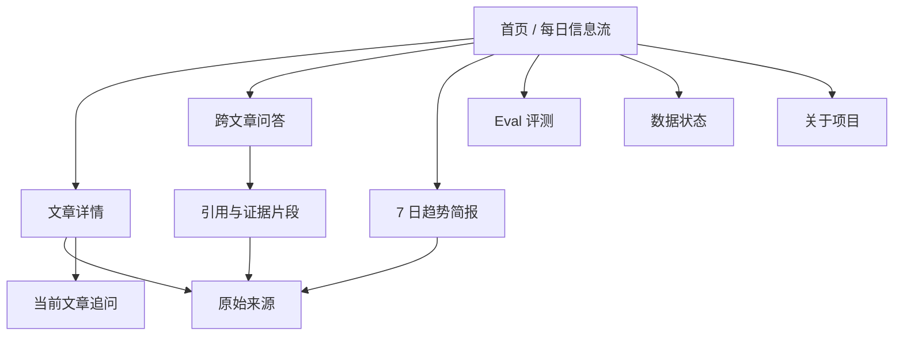
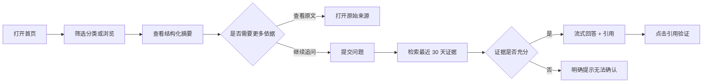
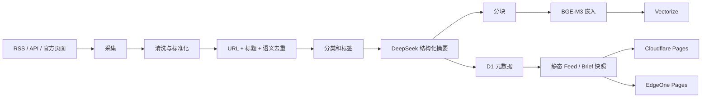
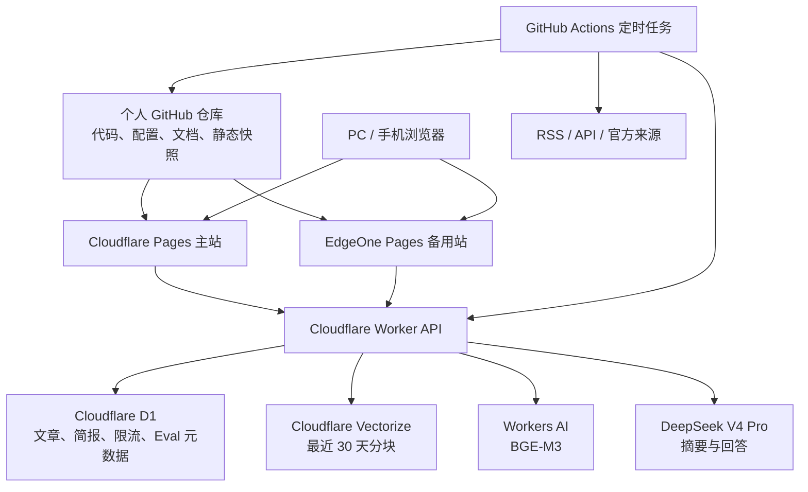

# Eviday 产品需求文档（PRD）

> 工作品牌名：**Eviday**
> 备选名称：NewsEviday
> 名称含义：Evidence + Everyday，表达“每天基于证据理解 AI 变化”。

| 文档项 | 内容 |
|---|---|
| 文档版本 | v0.1 |
| 文档状态 | 待需求确认 |
| 更新日期 | 2026-07-31 |
| 产品类型 | AI 产品与开源技术情报网站 |
| 目标岗位 | 产品经理 / AI 产品经理 |
| 产品范围 | B：AI 产品、GitHub 项目、模型、Agent、开发工具 |
| 技术方向 | Vue 3 响应式前端 + Cloudflare 主站 + EdgeOne 备用站 |
| AI 模型 | DeepSeek V4 Pro |
| 月度预算 | 理想为 0 元，正常运行不超过 50 元 |

---

## 0. 结论与待确认项

### 0.1 产品结论

Eviday 是一个面向 AI 产品经理的“可追溯 AI 情报站”。它每天整理 AI 产品、模型、Agent、开发工具和开源项目，提供中文结构化摘要、带来源引用的 RAG 问答、7 日趋势简报和公开评测结果。

它在简历上的展示重点有四项：

1. 能定义明确的用户问题和产品边界。
2. 能把信息采集、AI 生成、RAG、评测和成本控制组成完整闭环。
3. 能公开展示 AI 输出依据，避免把“接了一个聊天 API”包装成 AI 产品。
4. 能考虑匿名产品的安全、限流、降级、双站部署和跨设备迁移。

### 0.2 已确认决策

| 决策项 | 当前结论 |
|---|---|
| 主品牌 | 暂定 Eviday |
| 备选品牌 | NewsEviday |
| 目标用户 | AI 产品经理、关注 AI 产品和开源技术的从业者 |
| 产品范围 | AI 产品、GitHub 项目、模型、Agent、开发工具 |
| 前端 | Vue 3 + Vite + TypeScript |
| 布局 | 响应式布局，适配 PC、平板、手机 |
| 主站 | Cloudflare Pages 默认域名 |
| 备用站 | EdgeOne Pages 默认域名 |
| 域名与备案 | MVP 不买域名，不做 ICP 备案 |
| 生成模型 | DeepSeek V4 Pro |
| 嵌入模型 | Cloudflare Workers AI 的 BGE-M3 |
| 向量检索 | Cloudflare Vectorize |
| 结构化数据 | Cloudflare D1 |
| 月度硬预算 | 50 元以内 |
| 登录体系 | MVP 不做登录 |

### 0.3 本版建议，请确认

| 编号 | 建议 | 产品原因 |
|---|---|---|
| Q1 | 正式名称使用 Eviday，NewsEviday 仅作备选 | Eviday 更短，品牌感更强，也能覆盖未来不局限于新闻的内容 |
| Q2 | 每天更新 1 次，每次收录 20–30 条 | 满足作品集展示，同时控制生成成本和部署复杂度 |
| Q3 | RAG 只检索最近 30 天内容 | 符合“近期情报”定位，也能控制 Vectorize 免费容量 |
| Q4 | 每个 IP 每天最多提问 3 次，全站每天最多生成 30 次 | 防止 API 被刷，按最坏情况仍能守住月预算 |
| Q5 | 7 日趋势简报每天生成 1 次，用户不能手动重新生成 | 避免重复消耗 Token，保证所有用户看到同一基准版本 |
| Q6 | EdgeOne 备用站优先保障浏览和查看简报；RAG 仍调用 Cloudflare API | 免费条件下避免维护两套数据库和向量库 |

---

## 1. 产品概述

### 1.1 一句话定位

一个用证据链帮助 AI 产品经理发现信息、理解变化、追问验证和查看趋势的每日情报网站。

### 1.2 产品口号

**每天看见证据，读懂 AI 变化。**

英文备选：**See the evidence behind every AI update.**

### 1.3 背景

AI 产品和技术信息分散在官方博客、GitHub、arXiv、产品发布页和技术社区中。普通资讯聚合产品可以降低“发现信息”的成本，但仍存在四个问题：

- 原始内容以英文为主，阅读成本高。
- 摘要只给结论，用户很难检查依据。
- 单条信息缺少上下文，难以判断它属于一次更新还是持续趋势。
- AI 问答可能编造答案，用户看不到检索结果和质量边界。

Eviday 以“发现 → 理解 → 追问 → 验证 → 趋势判断”为主流程，用来源链接、证据片段和评测指标建立可信度。

### 1.4 核心价值

| 用户任务 | 传统资讯聚合 | Eviday |
|---|---|---|
| 找到当天 AI 动态 | 提供信息列表 | 提供已分类、去重的重点信息 |
| 快速理解 | 通用摘要 | 结构化说明“发生了什么、关键事实、为什么重要” |
| 继续追问 | 跳转搜索引擎 | 在最近 30 天语料中检索并回答 |
| 检查答案 | 通常缺少来源 | 每个主要事实附来源编号和证据片段 |
| 看趋势 | 靠用户自己归纳 | 每日更新 7 日趋势简报 |
| 判断 AI 是否可靠 | 看不到质量数据 | 公开检索指标、引用覆盖率、延迟和失败案例 |

---

## 2. 产品目标与非目标

### 2.1 MVP 目标

1. 每天稳定产出 20–30 条高相关 AI 产品与技术信息。
2. 用户可在 3 分钟内完成一次“发现信息—查看依据—继续追问”的闭环。
3. RAG 回答必须提供可点击来源；证据不足时明确拒答。
4. 公开一套可复现的小型黄金测试集和评测结果。
5. PC 和手机都能完成主要任务，无横向滚动和关键功能缺失。
6. 网站在中国大陆网络环境下可直接尝试访问；Cloudflare 主站失败时提供 EdgeOne 备用入口。
7. 正常使用的月度现金成本控制在 50 元以内。
8. 项目可从当前公司设备完整迁移到个人设备。

### 2.2 非目标

MVP 不做以下内容：

- 不做全网实时新闻搜索。
- 不做微信公众号、X、Reddit 等高风险或不稳定页面抓取。
- 不抓取付费墙内容，不完整转载原文。
- 不做用户注册、收藏同步、订阅推送和支付。
- 不做原生 App。
- 不做复杂 Agent 多轮自主规划。
- 不做 GraphRAG、知识图谱和在线 rerank。
- 不承诺无备案域名在中国大陆的运营级可用性。
- 不承诺回答所有问题；证据不足时优先拒答。

---

## 3. 目标用户与使用场景

### 3.1 主要用户

#### 用户 A：AI 产品经理

- 每天有 10–20 分钟了解行业变化。
- 关心新产品解决什么问题、能力是否真实、对产品工作有什么影响。
- 技术基础中等，希望理解模型、Agent 和开源工具，但不希望先读完整论文或仓库。

核心任务：

> 当 AI 产品和技术快速更新时，我想快速找到与产品工作相关的变化，并检查信息依据，以便形成可以用于方案、竞品分析和面试表达的判断。

#### 用户 B：招聘方或面试官

- 通过线上作品判断候选人的产品和 AI 能力。
- 关注需求定义、范围控制、指标设计、异常处理、评测和成本意识。
- 希望 5 分钟内理解项目价值和候选人的关键决策。

### 3.2 核心场景

| 场景 | 用户动作 | 预期结果 |
|---|---|---|
| 每日浏览 | 打开首页，按分类浏览 | 3 分钟内找到 1–3 条有价值信息 |
| 快速理解 | 打开详情页 | 看懂关键事实、产品影响和原始来源 |
| 文章追问 | 针对当前文章提问 | 得到带证据引用的回答 |
| 跨文章验证 | 对最近 30 天内容提问 | 得到多来源回答或明确的证据不足提示 |
| 趋势判断 | 打开 7 日趋势简报 | 看见持续升温、降温和待观察方向 |
| 检查可靠性 | 打开 Eval 页面 | 看见测试集、检索指标、回答指标和失败案例 |
| 检查新鲜度 | 打开系统状态页 | 确认最近更新时间和数据源是否异常 |

---

## 4. 成功指标

### 4.1 北极星指标

**每周完成的有效情报闭环数**

一次有效闭环满足以下任一条件：

- 用户打开文章详情后点击原始来源；
- 用户获得 RAG 回答后点击至少一个引用；
- 用户查看 7 日趋势简报后打开对应来源。

该指标用于证明产品帮助用户完成了“理解与验证”，没有停留在信息曝光。

### 4.2 MVP 指标

| 维度 | 指标 | 目标 |
|---|---|---|
| 内容 | 每日新增有效条目 | 20–30 条 |
| 内容 | 采集成功率 | ≥ 95% |
| 内容 | 重复条目率 | ≤ 5% |
| 产品 | 首页到详情页点击率 | 上线后观察，首月基线目标 ≥ 15% |
| 产品 | 引用点击率 | 上线后观察，首月基线目标 ≥ 20% |
| RAG | Recall@5 | ≥ 0.75 |
| RAG | Hit@5 | ≥ 0.85 |
| RAG | MRR | ≥ 0.55 |
| RAG | NDCG@10 | ≥ 0.65 |
| 回答 | 引用覆盖率 | ≥ 95% |
| 回答 | Faithfulness | ≥ 0.85 |
| 回答 | 无答案识别准确率 | ≥ 80% |
| 性能 | 检索 p95 | ≤ 4 秒 |
| 性能 | RAG 首字 p50 | ≤ 3.5 秒，不含极端跨境网络波动 |
| 前端 | Lighthouse Accessibility | ≥ 90 |
| 前端 | Lighthouse Performance | 桌面端 ≥ 85，移动端 ≥ 75 |
| 成本 | 月度现金成本 | 正常 ≤ 35 元，硬上限 50 元 |

说明：评测目标是发布门槛，不能写成已经取得的结果。首版黄金测试集只有 30 题，适合工程回归和作品集展示，不用于证明通用能力。

---

## 5. 产品范围与优先级

### 5.1 MoSCoW 范围

| 优先级 | 功能 |
|---|---|
| Must have | 每日信息流、分类与筛选、中文结构化摘要、详情页、原文链接 |
| Must have | 当前文章问答、最近 30 天跨文章 RAG 问答、流式回答、来源引用 |
| Must have | 7 日趋势简报、公开 Eval 页面、数据健康状态页 |
| Must have | PC/平板/手机响应式布局 |
| Must have | Cloudflare 主站、EdgeOne 备用站、匿名限流、全局预算开关 |
| Must have | 部署、迁移、环境变量和数据恢复文档 |
| Should have | 关键词搜索、来源筛选、时间筛选、问题示例 |
| Should have | 明暗主题跟随系统、分享链接、回答复制 |
| Could have | RSS 输出、PWA、用户本地收藏、每周邮件 |
| Won't have in MVP | 登录、个性化推荐、付费、原生 App、复杂 Agent、在线 rerank |

### 5.2 内容分类

固定一级分类：

1. AI Products：AI 应用、产品发布和重要功能更新。
2. Models：基础模型、多模态模型、推理模型和 API 更新。
3. Agents：Agent 框架、协议、应用和评测。
4. Developer Tools：AI 编程、开发平台、数据与基础设施工具。
5. Open Source：值得产品经理关注的 GitHub 项目和版本更新。

---

## 6. 信息架构

### 6.1 页面与路由

| 路由 | 页面 | 核心内容 |
|---|---|---|
| `/` | 首页 | 每日信息流、分类、搜索、趋势摘要入口 |
| `/article/:id` | 文章详情 | 结构化摘要、证据、原文和文章追问 |
| `/ask` | 情报问答 | 最近 30 天跨文章 RAG 问答 |
| `/brief` | 7 日趋势简报 | 趋势、证据来源、观察清单 |
| `/eval` | Eval 评测 | 指标、测试集说明、失败案例、版本信息 |
| `/status` | 数据状态 | 更新时间、来源状态、AI 能力状态 |
| `/about` | 关于 | 产品目标、架构、边界、GitHub 仓库 |

---

## 7. 核心用户流程

### 7.1 情报发现与验证

### 7.2 降级流程

| 异常 | 产品表现 |
|---|---|
| DeepSeek 超时 | 停止等待，提示“生成服务暂时繁忙”，不扣除用户当日次数 |
| 未找到足够证据 | 返回拒答和最接近的来源，不生成确定性结论 |
| 当日全局额度已用完 | 保留浏览和引用查看，提示次日恢复 |
| 数据采集失败 | 展示最近一次成功快照和“数据可能已过期”标签 |
| Cloudflare 主站访问异常 | 引导使用 EdgeOne 备用站 |
| Cloudflare 动态 API 异常 | 备用站仍可浏览静态快照，RAG 显示不可用 |

---

## 8. 功能需求

### F-01 每日信息流

#### 功能说明

首页按发布时间展示经过筛选、去重和摘要的信息。

每张卡片包含：

- 来源名称与来源图标；
- 一级分类；
- 原文标题；
- 中文摘要，建议 80–140 字；
- 2–4 个标签；
- 原始发布时间和数据更新时间；
- “为什么值得看”一句话；
- 详情与原文入口。

#### 规则

- 默认展示最新一天内容。
- 支持按分类、来源、时间范围和关键词筛选。
- 同一事件的多来源内容合并为事件组，保留全部来源。
- AI 摘要失败时展示标题、原始摘录和来源，不阻塞整批发布。
- 首页不使用无限滚动，采用“加载更多”，便于恢复位置和控制请求量。

#### 验收标准

- [ ] 用户可以按五个一级分类切换。
- [ ] 筛选条件刷新页面后通过 URL 查询参数恢复。
- [ ] 每条内容都有原文链接和明确发布时间。
- [ ] 空结果、加载中、接口失败和过期数据都有独立状态。
- [ ] 手机端单手可完成筛选、打开详情和返回列表。

### F-02 文章详情

#### 功能说明

详情页提供四段结构：

1. 发生了什么；
2. 关键事实；
3. 为什么重要；
4. 证据与来源。

#### 规则

- 展示摘要生成时间和模型版本。
- 关键事实必须能对应到来源或证据片段。
- 证据片段只展示必要短句，不完整转载原文。
- 明确显示“AI 生成内容，请以原始来源为准”。
- 支持复制当前页面链接。

#### 验收标准

- [ ] 每条关键事实至少关联一个来源编号。
- [ ] 原文链接在新标签页打开。
- [ ] 来源不可访问时保留来源名称、链接和抓取时间。
- [ ] 页面不展示内部 Prompt、API 错误栈或密钥信息。

### F-03 当前文章问答

#### 功能说明

用户可以针对当前文章提出单轮问题。系统只使用当前文章及其关联来源作为证据。

#### 规则

- 单个问题最多 300 个字符。
- 提供 3 个预设问题，例如“这次更新影响哪些用户？”。
- 回答流式输出。
- 主要事实使用 `[1]`、`[2]` 形式引用。
- 点击引用定位到证据卡片，并可打开原文。
- 证据不足时返回“目前来源无法确认”，不补充模型记忆中的事实。
- MVP 不保留多轮会话记忆。

#### 验收标准

- [ ] 无来源引用的生成答案不得作为正常成功结果展示。
- [ ] 用户取消生成后，前端中断请求。
- [ ] 超时、限流、拒答和正常回答使用不同提示。
- [ ] 相同问题和相同语料版本命中 24 小时缓存时不再次调用 DeepSeek。

### F-04 最近 30 天跨文章问答

#### 功能说明

用户可以对最近 30 天的 AI 产品和开源技术信息提问。

#### RAG 流程

1. 校验输入和限流状态；
2. 使用 BGE-M3 生成问题向量；
3. 在 Vectorize 中检索 Top 8；
4. 去重并选择最多 5 个上下文分块；
5. 判断证据是否达到最低阈值；
6. 调用 DeepSeek V4 Pro 生成引用式回答；
7. 流式返回回答、引用和 trace_id；
8. 记录检索候选、延迟、Token 和降级原因，不记录原始 IP。

#### 产品边界

- 只检索近 30 天已入库内容。
- 默认只支持单轮问题。
- 不联网临时搜索。
- 不使用在线 rerank。
- 不回答医疗、法律、金融决策等高风险问题。
- 用户问题可能包含隐私信息，因此线上日志不保存原始问题正文。

#### 验收标准

- [ ] 回答页面明确显示检索时间范围。
- [ ] 每个来源可查看标题、发布时间、证据片段和原始链接。
- [ ] 没有达到相似度阈值时触发拒答。
- [ ] 每个 IP 每天最多成功生成 3 次。
- [ ] 全站每天最多成功生成 30 次。
- [ ] 管理端可通过 `AI_ENABLED=false` 立即关闭生成能力。

### F-05 7 日趋势简报

#### 功能说明

系统每天基于最近 7 天内容生成一份固定简报。

简报结构：

- 本周 3–5 个主要趋势；
- 每个趋势的变化信号；
- 对 AI 产品经理的影响；
- 相关来源；
- 接下来值得观察的问题；
- “证据不足/仍待验证”区域。

#### 规则

- 每天固定生成一次，默认北京时间 08:00 后展示。
- 用户不能手动重新生成。
- 若有效内容少于 10 条，则不生成新简报，继续展示上一版并标记时间。
- 简报最多 1,200 个中文字。
- 每个趋势至少关联两个来源；只有一个来源时标记为“单一信号”。

#### 验收标准

- [ ] 展示覆盖时间、生成时间、来源数量和模型版本。
- [ ] 每个趋势至少有一个可点击证据入口。
- [ ] 生成失败时不覆盖上一版成功简报。

### F-06 Eval 评测页

#### 功能说明

公开展示 RAG 的检索质量、回答可靠性、延迟和已知失败案例。

页面包含：

- 当前检索策略；
- 语料时间范围与分块策略；
- 黄金测试集构成；
- Recall@5、Hit@5、MRR、NDCG@10；
- 引用覆盖率、Faithfulness、无答案识别准确率；
- 检索和生成延迟；
- 最近一次 Eval 时间、代码版本和模型版本；
- 3–5 个失败案例及原因。

#### 黄金测试集

首版共 30 题：

| 类型 | 数量 | 示例 |
|---|---:|---|
| 单一事实定位 | 8 | 某产品更新增加了什么能力 |
| 多来源归纳 | 8 | 最近有哪些 Agent 工具支持某协议 |
| 时间比较 | 5 | 某方向近两周发生了哪些变化 |
| 类别筛选 | 4 | 最近开源的开发工具有哪些 |
| 无答案/越界问题 | 5 | 语料中没有或超出 30 天的问题 |

#### 评测方式

- 检索指标使用人工标注的相关文档 ID 计算。
- 引用覆盖率用规则检查“事实句—引用”的对应关系。
- Faithfulness 采用 LLM Judge 初评，并人工抽查全部 30 题。
- 每次变更嵌入模型、分块、检索阈值或 Prompt 后手动运行回归。
- 线上用户请求与黄金测试集分开，避免把线上隐私输入公开。

#### 发布门槛

- Recall@5 < 0.75：不得把新检索配置设为默认。
- 引用覆盖率 < 90%：关闭跨文章问答，保留浏览。
- 无答案问题出现明显编造：阻止发布并回滚。
- p95 明显恶化超过上一版本 30%：保留旧策略。

### F-07 数据健康状态页

#### 功能说明

向用户公开数据新鲜度和系统可用状态。

展示内容：

- 最近一次成功更新时间；
- 今日新增条目数；
- 各来源成功、延迟或失败状态；
- 最近一次简报生成时间；
- RAG 是否开启；
- 当前语料覆盖时间；
- 已知问题。

#### 安全边界

状态页不展示服务器地址、内部路由、完整错误栈、密钥名称、用户问题和原始 IP。

### F-08 关于项目页

用于面试官快速理解项目，包含：

- 产品问题和目标用户；
- 关键功能演示入口；
- 产品架构图；
- 重要取舍；
- AI 能力边界；
- 评测方法；
- 成本模型；
- GitHub 仓库；
- PRD、部署说明和迭代记录。

---

## 9. 内容源与数据规则

### 9.1 MVP 来源原则

优先级从高到低：

1. 官方 RSS、公开 API；
2. 官方产品博客、版本说明和 changelog；
3. GitHub API、Release 和 Trending 数据；
4. arXiv API；
5. 有稳定公开接口的技术社区。

首版建议选择 6–10 个稳定来源，先保证质量和可维护性，再增加数量。

### 9.2 不采集内容

- 需要登录或付费才能读取的内容；
- 明确禁止自动化访问的页面；
- 无法确认作者和发布时间的二手搬运内容；
- 大量用户隐私或争议信息；
- 与五个一级分类无直接关系的泛科技新闻。

### 9.3 数据处理

### 9.4 数据保留

| 数据 | 保留策略 |
|---|---|
| 首页静态内容 | 当前版 + 最近 30 天 |
| D1 文章元数据 | 90 天，之后可归档为 JSON |
| Vectorize 分块 | 滚动保留 30 天 |
| RAG trace 指标 | 30 天 |
| 用户问题正文 | 不保存 |
| 原始 IP | 不保存；仅在请求时生成当日不可逆哈希用于限流 |
| Eval 结果 | 永久保留版本化结果 |

---

## 10. RAG 方案

### 10.1 RAG 在本产品中的作用

RAG 负责把用户的问题与最近 30 天的真实来源连接起来。它主要解决三个问题：

- 缩小模型回答范围；
- 给回答提供可追溯证据；
- 在证据不足时提供可判断的拒答条件。

DeepSeek 负责组织和表达答案；BGE-M3 与 Vectorize 负责找到可能相关的资料；来源链接负责让用户最终验证。

### 10.2 首版检索策略

| 参数 | 首版建议 |
|---|---|
| Embedding | `@cf/baai/bge-m3` |
| 向量维度 | 1024，创建索引前以实际 API 输出复核 |
| 分块大小 | 450–700 tokens |
| 分块重叠 | 约 80 tokens |
| 文章数量 | 约 30 条/天 |
| 平均分块 | 约 4 个/文章 |
| 语料窗口 | 30 天 |
| 预计向量数 | 约 3,600 条 |
| 初始召回 | Top 8 |
| 注入上下文 | 去重后最多 5 条 |
| 相似度 | 首版通过黄金测试集确定阈值 |
| Rerank | MVP 不启用，保留为离线对比项 |

### 10.3 Trace 字段

每次请求记录：

- `trace_id`
- `query_hash`
- 检索策略版本
- 语料版本
- 候选 chunk ID 与相似度
- 注入上下文 ID
- 是否拒答
- fallback reason
- embedding、retrieval、TTFT、total latency
- input/output tokens
- HTTP 状态与错误类别

不记录：

- 原始 IP；
- 用户问题原文；
- 完整生成 Prompt；
- API 密钥；
- 可能包含隐私的请求头。

---

## 11. 响应式与视觉设计

### 11.1 设计方向

视觉关键词：

- 编辑部感；
- 证据卡片；
- 信息密度高但层级清楚；
- 克制的科技感；
- 弱化“聊天机器人”外观；
- 强调来源、时间和可靠性状态。

建议使用偏中性的深墨色文字、浅暖灰背景、低饱和蓝绿色作为品牌色。避免大面积霓虹渐变、玻璃拟态堆叠和模板化 AI 星球视觉。

### 11.2 响应式规则

| 设备 | 宽度 | 布局 |
|---|---:|---|
| 手机 | `< 768px` | 单列信息流、底部导航、筛选抽屉 |
| 平板 | `768–1199px` | 可折叠侧栏 + 主内容 |
| PC | `≥ 1200px` | 左侧导航 + 中央信息流 + 右侧趋势/状态栏 |

### 11.3 关键适配

- PC 端首页可同时查看分类、信息流和趋势入口。
- 手机端优先保留信息卡、详情、问答和引用；次要信息折叠。
- 触控目标最小 44 × 44 px。
- 正文最小字号 14 px，建议 16 px。
- 所有页面不得出现非预期横向滚动。
- 鼠标悬停效果必须有触屏替代方案。
- 图表在手机端可切换为指标卡和纵向列表。

### 11.4 设计生成流程

PRD 确认后执行：

1. 使用 Image 2 生成 3 个 PC 首页视觉方向；
2. 对比品牌感、信息层级、开发成本和手机适配难度；
3. 选定一个方向后生成手机端关键页；
4. 提取颜色、字体、间距、圆角和阴影为 Design Tokens；
5. 使用真实 Vue 组件实现，不把生成图片直接当网页；
6. 使用四个目标视口逐页验收。

目标视口：

- 1440 × 900
- 1024 × 768
- 390 × 844
- 360 × 800

---

## 12. 技术架构

### 12.1 总体架构

### 12.2 技术选型

| 层 | 选型 | 理由 |
|---|---|---|
| 前端 | Vue 3 + Vite + TypeScript | 适合组件化和响应式开发，迁移简单 |
| 状态管理 | Pinia | 只保存筛选、主题和临时交互状态 |
| 路由 | Vue Router | 支持可分享详情和问答链接 |
| 样式 | CSS Variables + 原生 CSS/轻量工具类 | 降低 UI 框架模板感 |
| 主站 | Cloudflare Pages | GitHub 自动构建，静态资源成本低 |
| 备用站 | EdgeOne Pages | 提供第二个公开访问入口 |
| API | Cloudflare Workers | 隐藏密钥、限流、流式代理和统一错误处理 |
| 数据库 | Cloudflare D1 | 免费额度足够 MVP，部署配置可代码化 |
| 向量库 | Cloudflare Vectorize | 与 Worker 绑定简单，有免费试验额度 |
| Embedding | Workers AI BGE-M3 | 支持中英文语义检索，费用低 |
| 生成模型 | DeepSeek V4 Pro | 用户指定，中文生成和结构化输出适合场景 |
| 定时任务 | GitHub Actions | 配置版本化，换电脑不影响运行 |
| 测试 | Vitest + Playwright | 覆盖逻辑、响应式页面和主要流程 |

### 12.3 主站与备用站边界

Cloudflare Pages 和 EdgeOne Pages 都部署同一份前端代码和最新静态内容快照。

免费 MVP 不维护第二套 RAG 后端。因此：

- 主站异常时，备用站仍可浏览信息流、详情快照和最近一次趋势简报；
- 动态 RAG 依赖 Cloudflare Worker；
- 如果 Cloudflare API 在用户网络中不可用，备用站只提供只读能力；
- 页面需要明确显示动态能力状态，不能让用户反复等待。

### 12.4 中国大陆访问说明

无自有域名、无 ICP 备案时，可以先使用平台默认域名进行真实网络测试，但不能承诺运营级稳定。

- Cloudflare 官方说明，其中国大陆网络服务需要单独的 China Network 条件；普通全球网络在中国大陆可能出现延迟和可靠性差异。
- EdgeOne 中国大陆加速对自定义域名有备案要求；默认 Pages 域名和境外覆盖可作为试验入口，仍需实测。
- MVP 上线验收至少使用中国移动、中国联通/电信中的两个网络和手机蜂窝网络测试。

如果两个默认域名均出现持续访问问题，后续选项为：

1. 保留公开海外演示站；
2. 将只读演示部署到国内合规平台；
3. 购买域名并备案；
4. 在简历中同时提供录屏和截图作为兜底。

---

## 13. 安全与风控

### 13.1 最小安全原则

| 风险 | 控制措施 |
|---|---|
| DeepSeek Key 泄漏 | 只放 Cloudflare Secret / GitHub Actions Secret，前端永不持有 |
| API 被刷 | Turnstile、IP 日限额、全站日限额、超时和并发限制 |
| 跨站滥用 | CORS 只允许主站、备用站和本地开发域名 |
| Prompt Injection | 系统指令与来源内容分层；来源内容标记为不可信数据，不允许其修改系统规则 |
| XSS | 摘要与回答使用安全 Markdown 白名单渲染，移除原始 HTML |
| 恶意输入 | 字符长度、结构、内容类型和 article_id 校验 |
| 信息泄漏 | 统一错误码，生产环境不返回错误栈和内部 Prompt |
| 日志隐私 | 不存原始 IP和问题正文；日志字段白名单 |
| 依赖风险 | 锁定依赖版本，启用 GitHub Dependabot 和 secret scanning |
| 成本失控 | `AI_ENABLED`、每日配额、月度软/硬预算、缓存 |
| 内部写入接口被调用 | 定时任务使用独立签名密钥，时间戳 + nonce 防重放 |

### 13.2 HTTP 安全头

至少配置：

- `Content-Security-Policy`
- `X-Content-Type-Options: nosniff`
- `Referrer-Policy: strict-origin-when-cross-origin`
- `Permissions-Policy`
- `frame-ancestors 'none'`

### 13.3 限流策略

| 维度 | 规则 |
|---|---|
| 单 IP | 3 次成功生成/天 |
| 全站 | 30 次成功生成/天 |
| 并发 | 全站最多 3 个 DeepSeek 生成请求 |
| 输入 | 300 字符以内 |
| 超时 | 首字 15 秒、总请求 45 秒 |
| 缓存 | 相同问题 + 相同范围 + 相同语料版本缓存 24 小时 |
| 熔断 | 连续错误或达到预算阈值时自动关闭生成 |

Turnstile 在用户首次提问、行为异常或超过匿名预检阈值时出现，不阻碍普通浏览。

---

## 14. 成本模型

### 14.1 计算假设

| 项目 | 月度假设 |
|---|---:|
| 每日文章 | 30 条 |
| 文章摘要输入 | 约 1.8M tokens |
| 文章摘要输出 | 约 0.225M tokens |
| 7 日简报输入 | 约 0.27M tokens |
| 7 日简报输出 | 约 0.03M tokens |
| RAG 问答 | 最多 900 次 |
| RAG 输入 | 约 3.6M tokens |
| RAG 输出 | 约 0.54M tokens |
| 总输入 | 约 5.67M tokens |
| 总输出 | 约 0.795M tokens |

按 2026-07-31 DeepSeek 官方价格，V4 Pro 缓存未命中输入为 0.435 美元/百万 tokens，输出为 0.87 美元/百万 tokens。

理论模型费：

`5.67 × $0.435 + 0.795 × $0.87 ≈ $3.16`

按 1 美元约 7.2 元估算，约 23 元人民币。计入重试、评测和波动后，建议按 30–35 元/月准备。

### 14.2 基础设施额度判断

| 服务 | MVP 预计使用 | 免费档判断 |
|---|---:|---|
| Workers 请求 | 远低于 100,000 次/天 | 可覆盖 |
| D1 | 文章、限流和 Eval 小数据 | 可覆盖 |
| Workers AI BGE-M3 | 约 7–8 万嵌入输入 tokens/天 | 预计低于每日免费额度 |
| Vectorize 存储 | 约 3,600 × 1024 = 3.69M 维度 | 低于免费档 5M 存储维度 |
| Pages 静态资源 | 小型作品集流量 | 可覆盖 |
| EdgeOne Pages | 备用静态站 | 以平台当前免费政策为准 |

### 14.3 预算控制

- 软预算：35 元；达到后将全站问答降为 10 次/天。
- 硬预算：45 元；达到后关闭在线生成，只保留缓存答案和静态内容。
- DeepSeek 账户充值不超过单月预算，避免自动高额扣费。
- Eval 默认手动执行，每次运行前显示预计 Token。
- 摘要、简报和问答都使用内容哈希缓存。
- 每天生成成本写入状态表，状态页只公开区间，不公开账户信息。

---

## 15. 数据分析

### 15.1 事件

| 事件 | 关键属性 |
|---|---|
| `feed_view` | 日期、设备类型 |
| `filter_apply` | 分类、来源、时间范围 |
| `article_open` | article_id、入口 |
| `source_click` | article_id、source_id |
| `ask_submit` | scope、字符长度，不记录正文 |
| `ask_success` | trace_id、是否缓存、引用数、延迟 |
| `ask_no_evidence` | trace_id、候选数 |
| `ask_error` | 错误类别 |
| `citation_click` | trace_id、source_id |
| `brief_view` | brief_version |
| `eval_view` | eval_version |

### 15.2 关键漏斗

`首页访问 → 打开文章 → 提交问题/打开原文 → 点击引用`

数据用于验证三个产品判断：

1. 用户是否愿意从摘要进入详情；
2. RAG 是否推动用户查看证据；
3. 哪类信息最容易产生进一步追问。

---

## 16. 可迁移性与公司设备边界

### 16.1 账户要求

以下资源必须使用个人账户和个人邮箱：

- GitHub；
- Cloudflare；
- EdgeOne；
- DeepSeek；
- 代码签名或部署使用的其他第三方服务。

不得使用公司 GitHub 组织、公司邮箱、公司云账号、公司 API Key 和公司内部数据。

### 16.2 仓库要求

仓库中必须包含：

- `README.md`
- `.env.example`
- `.gitignore`
- Node 版本文件
- 锁文件
- Cloudflare 配置
- D1 migrations
- Vectorize 初始化脚本
- 示例数据
- Eval 测试集
- GitHub Actions 工作流
- `docs/PRD.md`
- `docs/SETUP.md`
- `docs/DEPLOYMENT.md`
- `docs/MIGRATION.md`
- `docs/SECURITY.md`

不得包含：

- `D:\workspace` 等本机绝对路径；
- API Key、Cookie 和账号 Token；
- 公司文件、公司代码和公司数据；
- 只能在 Windows 运行的脚本。

### 16.3 迁移验收

在第二台设备上完成以下流程才算可迁移：

1. 克隆个人 GitHub 仓库；
2. 安装文档指定的 Node 版本；
3. 复制 `.env.example` 为本地环境文件；
4. 填入个人密钥；
5. 一条命令启动本地开发；
6. 一条命令运行测试；
7. 按文档重新绑定 Cloudflare 与 EdgeOne；
8. 从 JSON/SQL 备份恢复数据；
9. 撤销旧设备登录和本地凭据。

---

## 17. 上线计划

| 阶段 | 目标 | 核心产物 | 建议工期 |
|---|---|---|---:|
| P0 需求确认 | 固定目标、范围、指标和边界 | PRD v1.0 | 1–2 天 |
| P1 视觉原型 | 确定品牌与响应式页面 | 3 套视觉稿、选定稿、Design Tokens | 2–3 天 |
| P2 前端 MVP | 用示例数据跑通主要页面 | Vue 响应式站点 | 3–5 天 |
| P3 数据管道 | 完成采集、去重、摘要和快照 | 每日自动更新 | 4–6 天 |
| P4 RAG 与 Eval | 完成检索、引用、拒答和回归 | RAG、30 题测试集、Eval 页面 | 5–7 天 |
| P5 部署与安全 | 完成双站、限流、预算和监控 | 主站、备用站、状态页 | 3–4 天 |
| P6 简历包装 | 形成可讲述案例 | README、架构图、演示视频、复盘 | 2–3 天 |

按业余时间估算，总周期约 3–4 周。

---

## 18. MVP 上线验收清单

### 产品

- [ ] 五类信息均有真实数据。
- [ ] 每条内容都有来源、时间和结构化摘要。
- [ ] 首页、详情、问答、简报、Eval、状态和关于页面完整。
- [ ] 无答案、限额、生成失败和过期数据可被用户理解。

### RAG 与评测

- [ ] 30 题黄金测试集人工复核完成。
- [ ] 检索与回答指标达到发布门槛。
- [ ] 每个正常回答包含引用。
- [ ] 无答案问题不会生成确定性事实。
- [ ] Eval 页面显示版本、时间和失败案例。

### 响应式

- [ ] 1440 × 900、1024 × 768、390 × 844、360 × 800 全部通过。
- [ ] 手机端没有横向滚动。
- [ ] 所有核心功能可用键盘和触屏完成。
- [ ] 颜色对比和焦点状态可辨认。

### 部署与访问

- [ ] GitHub push 可触发 Cloudflare 主站部署。
- [ ] 同一版本可部署到 EdgeOne 备用站。
- [ ] 两个公开链接均在至少两个中国大陆网络实测。
- [ ] 主站异常时，备用站可浏览最近静态快照。

### 成本与安全

- [ ] 前端构建产物不含 DeepSeek Key。
- [ ] Turnstile、IP 限流、全站日限额和 AI 开关生效。
- [ ] CSP 等基础安全头生效。
- [ ] 日志不保存原始 IP 和问题正文。
- [ ] 预算达到软/硬阈值时可自动降级。

### 迁移

- [ ] 新设备可根据文档独立启动项目。
- [ ] 所有基础设施配置和数据库 migration 已版本化。
- [ ] 备份与恢复至少演练一次。
- [ ] 公司设备中不存在无法迁移的唯一文件或密钥。

---

## 19. 主要风险

| 风险 | 影响 | 应对 |
|---|---|---|
| 无备案默认域名在大陆访问不稳定 | 简历链接可能打不开 | 双站、实测、录屏和截图兜底；后续再决定备案 |
| 内容源结构变化 | 当日数据减少 | 优先 RSS/API；按来源隔离采集器；状态页暴露失败 |
| DeepSeek 价格或模型名变化 | 成本与兼容性变化 | 模型名放配置；每月复核价格；保留生成开关 |
| RAG 证据不足 | 回答价值低或编造 | 阈值、拒答、引用门槛和黄金测试集 |
| Vectorize 免费容量不足 | 无法长期保留全部语料 | 只保留 30 天向量，历史元数据归档 |
| 匿名接口被滥用 | API 费用失控 | Turnstile、IP/全局限流、缓存、硬预算 |
| 项目像普通资讯模板 | 简历区分度低 | 强化证据链、Eval、状态透明和产品取舍 |
| 公司设备合规问题 | 代码或账户无法带走 | 仅用个人账号和公开数据，遵守公司设备政策 |

---

## 20. 公开依赖与价格依据

本 PRD 使用的外部条件以 2026-07-31 可查官方资料为准，开发前和上线前各复核一次：

- [Cloudflare Pages Git integration](https://developers.cloudflare.com/pages/get-started/git-integration/)
- [Cloudflare Workers pricing](https://developers.cloudflare.com/workers/platform/pricing/)
- [Cloudflare D1 pricing](https://developers.cloudflare.com/d1/platform/pricing/)
- [Cloudflare Vectorize pricing](https://developers.cloudflare.com/vectorize/platform/pricing/)
- [Cloudflare Workers AI pricing](https://developers.cloudflare.com/workers-ai/platform/pricing/)
- [Cloudflare BGE-M3 model](https://developers.cloudflare.com/workers-ai/models/bge-m3/)
- [Cloudflare Turnstile plans](https://developers.cloudflare.com/turnstile/plans/)
- [Cloudflare secrets](https://developers.cloudflare.com/workers/configuration/secrets/)
- [Cloudflare China Network](https://developers.cloudflare.com/china-network/)
- [EdgeOne Pages](https://edgeone.cloud.tencent.com/pages/)
- [EdgeOne 中国大陆加速与备案说明](https://cloud.tencent.com/document/product/1552/104964)
- [DeepSeek V4 Pro pricing](https://api-docs.deepseek.com/quick_start/pricing)
- [Vue Quick Start](https://vuejs.org/guide/quick-start.html)

---

## 21. 下一步

用户确认第 0.3 节的六项建议后：

1. 将本文档状态升级为 v1.0 / 已确认；
2. 固定最终品牌名和中文口号；
3. 使用 Image 2 生成三套首页视觉方向；
4. 确认视觉稿和关键页面；
5. 建立 Vue 项目骨架并开始 P2 前端 MVP。
