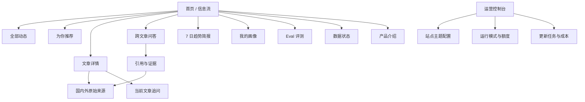
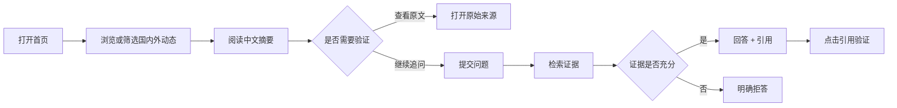
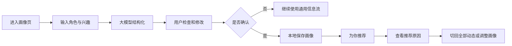
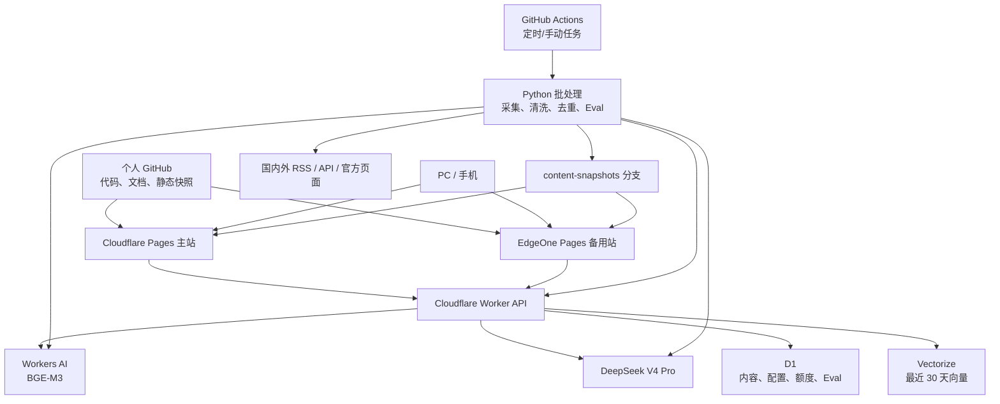

# NewsEviday 产品需求文档（PRD）

> **有证据的 AI 产品与技术情报**
> 每天看见信息背后的证据。

| 文档项 | 内容 |
|---|---|
| 产品名称 | NewsEviday |
| 名称含义 | News + Evidence + Day |
| 文档版本 | v1.1 |
| 文档状态 | 已完成 PRD 评审，待视觉与技术实施 |
| 更新日期 | 2026-07-31 |
| 目标岗位 | 产品经理 / AI 产品经理作品集 |
| 产品形态 | 响应式 Web 网站 |
| 核心版周期 | 预计 4–5 周，按阶段门控 |
| 月度预算 | 正常不超过 35 元，硬上限 50 元 |

---

## 0. 产品介绍

### 0.1 产品是什么

NewsEviday 是一个面向 AI 产品经理、数据产品经理和 AI 从业者的个人情报网站。它持续整理国内外 AI 产品、基础模型、Agent、数据智能、开发工具和 GitHub 开源项目，将分散的信息转化为中文结构化摘要、可追溯证据、兴趣推荐和趋势判断。

产品帮助用户完成一条完整链路：

> 发现国内外动态 → 跨语言理解 → 根据兴趣筛选 → 继续追问 → 查看原始证据 → 形成趋势判断

NewsEviday 会重点追踪海外官方博客、产品发布页、GitHub、arXiv 和技术社区。海外内容保留原始标题、发布时间、原文链接和必要证据片段，同时生成中文标题、结构化摘要和术语解释，降低语言门槛，缩短海外信息传到国内后的时间差。

网站也覆盖国内模型厂商、数据平台、开源社区和技术产品，使用户可以在同一页面比较国内外产品方向、能力更新和行业趋势。

### 0.2 主要功能

| 功能 | 用户价值 |
|---|---|
| 海内外每日情报 | 聚合国内外 AI、数据和开源技术动态 |
| 跨语言结构化摘要 | 将海外原始信息整理为中文关键事实和产品影响 |
| 主题配置 | 由站点所有者调整近期重点关注方向 |
| 可选个人画像 | 用户用简单描述生成可编辑的结构化兴趣画像 |
| 个性化信息流 | 根据兴趣调整内容顺序，并解释推荐原因 |
| 证据型 RAG 问答 | 对当前文章或最近 30 天内容追问，回答附原始来源 |
| 7 日趋势简报 | 从单条动态中归纳持续变化、弱信号和待观察方向 |
| RAG Eval | 公开检索质量、引用覆盖、延迟和失败案例 |
| 产品介绍页 | 从产品和技术两个角度展示定位、能力、架构、RAG 与评测 |
| 运行模式与预算控制 | 可暂停更新和 AI，保留网站与往期内容 |
| 主备站部署 | Cloudflare 主站，EdgeOne 备用静态访问入口 |

### 0.3 产品亮点

#### 亮点一：整理国内外信息，降低跨语言信息差

- 同时覆盖国内与海外官方来源。
- 海外内容默认生成中文标题、摘要和术语解释。
- 保留原始英文标题、原文链接和发布时间，方便用户复核。
- 建立中英文术语映射，例如 Semantic Layer / 语义层、Lakehouse / 湖仓。
- 在面试运行模式下，每天自动更新；必要时可手动立即更新。
- 用“来源发布时间—入库时间”衡量信息时效，目标是在 24 小时内完成收录。

#### 亮点二：信息方向可调整

站点所有者可以随时修改重点主题，例如：

- 数据中台
- Data Agent
- 统一语义层
- 智能数据湖
- 湖仓一体
- 数据治理
- 元数据管理
- 企业级 AI

每日整理会按照主题权重选择内容，同时保留一定比例的重大通用动态。

#### 亮点三：个人画像可选、透明、可控制

用户可以用一句话描述自己的角色和关注方向。大模型将输入整理为结构化画像，用户确认后才生效。画像只调整已有内容的排序，不为每个用户单独抓取和生成内容。

不填写画像时，网站正常展示通用信息流。

#### 亮点四：回答能够回到证据

RAG 负责从最近 30 天内容中检索依据，DeepSeek 负责组织答案。每个主要事实关联来源；证据不足时系统明确拒答。

#### 亮点五：AI 质量和成本公开可控

网站展示检索指标、回答指标、延迟和失败案例。运营控制台可以设置每日更新、单 IP 次数、全站额度和月度预算，也可以一键进入低成本归档模式。

---

## 1. 背景与问题

### 1.1 用户问题

AI、数据智能和开源技术变化快，信息分散在：

- 海外厂商官方博客和产品更新页；
- 国内模型与云厂商发布渠道；
- GitHub Trending、Release 和项目文档；
- arXiv 论文；
- 技术社区和行业媒体。

目标用户面临五个问题：

1. 海外一手信息以英文为主，理解和整理成本高。
2. 国内二次传播存在时间差，标题和结论可能丢失上下文。
3. 用户关注方向差异大，通用资讯流噪声高。
4. 普通摘要难以核对，AI 问答也可能生成没有证据的结论。
5. 个人作品长期运行需要 API，持续更新可能产生不必要成本。

### 1.2 产品机会

NewsEviday 将信息聚合、跨语言处理、可解释推荐、证据型问答、趋势简报和评测组合成一个可演示的闭环。

该项目在简历中主要证明：

- 用户问题与产品定位能力；
- 国内外内容策略和信息架构能力；
- 用户画像与推荐策略设计能力；
- RAG、Eval、Trace 和降级机制理解；
- 成本、安全、部署和运营能力；
- MVP 范围控制能力。

---

## 2. 产品目标与边界

### 2.1 MVP 目标

1. 面试运行模式下，每天整理 20–30 条国内外有效情报。
2. 海外内容全部提供中文结构化摘要，并保留原始证据。
3. 用户可以配置站点重点方向，也可以自愿创建个人画像。
4. 用户在 3 分钟内完成“发现—理解—追问—验证”。
5. RAG 正常回答必须附来源，证据不足时拒答。
6. 公开一套可复现的 RAG 黄金测试集和 Eval 结果。
7. PC、平板和手机均可完成主要任务。
8. 网站暂停更新和 AI 后仍可浏览往期数据。
9. 正常面试运行成本不超过 35 元/月，硬上限 50 元。
10. 项目可从当前设备完整迁移到个人设备。

### 2.2 非目标

MVP 不实现：

- 全网实时搜索；
- 用户注册和账号体系；
- 多设备自动同步；
- 为每个用户单独采集和生成内容；
- 根据长期行为自动学习画像；
- 协同过滤和推荐模型训练；
- 每人一份独立趋势简报；
- 微信、邮件和 App 主动推送；
- 原生 App；
- 复杂 Agent 自主规划；
- GraphRAG 和知识图谱；
- 在线 rerank；
- 付费、订阅和商业化；
- 付费墙、登录内容及高风险页面抓取。

说明：PRD 中的“推荐”指网站内个性化信息流，不包含消息通知。

---

## 3. 目标用户与 JTBD

### 3.1 用户 A：AI / 数据产品经理

特征：

- 每天有 10–20 分钟了解行业变化；
- 关注产品能力、用户价值和落地案例；
- 需要跟踪国内外信息，但不希望逐篇阅读英文原文；
- 可能在某段时间重点研究数据中台、Data Agent 或语义层。

JTBD：

> 当 AI 与数据产品快速变化时，我想及时看到与当前工作相关的国内外动态，并检查原始依据，以便形成可用于产品方案、竞品研究和面试表达的判断。

### 3.2 用户 B：技术产品与数据从业者

特征：

- 关注开源项目、模型能力、数据平台和开发工具；
- 希望发现相关项目，但不需要传统大众科技新闻；
- 需要中文概括，也希望保留技术术语和原始链接。

JTBD：

> 当我研究一个技术方向时，我想快速获得相关产品、项目和论文的更新，并比较它们之间的联系。

### 3.3 用户 C：招聘方或面试官

特征：

- 通过公开网站判断候选人的 AI 产品能力；
- 通常只有 5–10 分钟体验；
- 关注产品逻辑、边界、数据、评测、成本和异常处理。

JTBD：

> 当我评估候选人时，我想快速看懂项目解决什么问题、为什么这样设计，以及 AI 能力是否可验证。

---

## 4. 产品原则

1. **原始来源优先**：所有结论尽可能回到官方页面、仓库或论文。
2. **海外内容中文可读**：降低语言成本，同时保留原文和关键术语。
3. **推荐可解释**：告诉用户为什么推荐，允许切回全部动态。
4. **画像由用户控制**：用户确认后生效，可编辑、导出和清除。
5. **证据不足则拒答**：避免模型用常识补齐语料中没有的事实。
6. **静态浏览优先**：动态能力暂停时，网站和历史数据仍可访问。
7. **成本先设上限**：所有高成本功能具备配额、缓存和开关。
8. **MVP 保持单一后端**：备用站优先解决静态访问，不复制整套 RAG。
9. **确定性能力优先使用代码**：抓取、清洗、去重、基础筛选、排序和指标计算优先由 Python 完成。
10. **AI 只处理语义任务**：翻译、摘要、画像增强、问答和趋势归纳使用模型，并保留可关闭路径。

---

## 5. 成功指标

### 5.1 北极星指标

**每周完成的有效情报闭环数**

一次有效闭环满足以下任一条件：

- 用户打开详情后点击原始来源；
- 用户获得 RAG 回答后点击至少一个引用；
- 用户查看趋势简报后打开相关来源。

### 5.2 内容与跨语言指标

| 指标 | MVP 目标 |
|---|---:|
| 面试模式每日新增 | 20–30 条 |
| 来源采集成功率 | ≥ 95% |
| 重复条目率 | ≤ 5% |
| 海外来源占比 | 默认 60%，可在 50%–80% 调整 |
| 国内来源占比 | 默认 40%，可在 20%–50% 调整 |
| 海外条目中文摘要覆盖率 | 100% |
| 原始标题与原文链接覆盖率 | 100% |
| 来源发布到入库 p50 | ≤ 12 小时 |
| 来源发布到入库 p95 | ≤ 24 小时 |
| 术语一致性抽检 | ≥ 95% |
| 去重 Precision | ≥ 0.95 |
| 去重 Recall | ≥ 0.90 |
| 去重边界样本人工复核率 | ≤ 10% |

### 5.3 推荐指标

| 指标 | MVP 目标 |
|---|---:|
| 画像生成成功率 | ≥ 95% |
| 画像确认完成率 | 上线后建立基线 |
| 推荐内容点击率 | 高于“全部动态”基线 |
| 推荐原因覆盖率 | 100% |
| 用户切回全部动态 | 始终可用 |
| 画像清除成功率 | 100% |

### 5.4 RAG 指标

| 指标 | 发布目标 |
|---|---:|
| Recall@5 | ≥ 0.75 |
| Hit@5 | ≥ 0.85 |
| MRR | ≥ 0.55 |
| NDCG@10 | ≥ 0.65 |
| 引用覆盖率 | ≥ 95% |
| Faithfulness | ≥ 0.85 |
| 无答案识别准确率 | ≥ 80% |
| 检索 p95 | ≤ 4 秒 |
| RAG 首字 p50 | ≤ 3.5 秒，不含极端跨境网络波动 |

### 5.5 技术与成本指标

| 指标 | 目标 |
|---|---:|
| 静态页面可用率 | ≥ 99%，以平台统计为准 |
| Lighthouse Accessibility | ≥ 90 |
| Lighthouse Performance | 桌面 ≥ 85，移动 ≥ 75 |
| 面试模式月度成本 | 正常 ≤ 35 元 |
| 月度硬上限 | 50 元 |
| 归档模式模型费用 | 接近 0 元 |

以上均为目标值，不能在项目介绍中写成已经实现的结果。

---

## 6. 产品范围与优先级

### 6.1 MoSCoW

| 优先级 | 功能 |
|---|---|
| Must | Python 海内外采集、清洗、分层去重、基础筛选和静态快照 |
| Must | DeepSeek 中文结构化摘要、跨语言表达和必要的模糊分类 |
| Must | 原始标题、来源语言、发布时间、原文链接和证据片段 |
| Must | 站点主题配置与内容比例控制 |
| Must | 通用信息流、个人画像、兴趣排序和推荐原因 |
| Must | 文章详情、当前文章问答、最近 30 天跨文章问答 |
| Must | 流式回答、引用、拒答和 RAG Trace |
| Must | 7 日趋势简报、Eval 页面、数据状态页 |
| Must | 归档/预热/面试模式、独立开关和预算控制 |
| Must | Cloudflare 主站、EdgeOne 备用静态站 |
| Must | 产品介绍页，展示产品思路、亮点、技术架构、RAG 和评测 |
| Must | 响应式布局与跨设备迁移文档 |
| Must | YAML 配置文件和 GitHub Actions 手动工作流，供所有者调整主题、额度与运行模式 |
| Should | 搜索、来源筛选、国内/海外筛选、时间筛选 |
| Should | 中英文标题切换、术语提示、画像导入导出 |
| Should | 可视化 `/admin` 运营控制台 |
| Could | RSS 输出、PWA、浏览器本地收藏、深色模式 |
| Won't | 账号、云同步、行为学习、主动推送、个性化简报、复杂推荐模型 |

### 6.2 一级内容分类

1. AI Products
2. Models
3. Agents
4. Data Intelligence
5. Developer Tools
6. Open Source

Data Intelligence 包含数据中台、Data Agent、语义层、数据湖仓、数据治理、元数据和数据开发平台。

---

## 7. 信息架构



### 7.1 页面与路由

| 路由 | 页面 | 核心内容 |
|---|---|---|
| `/` | 首页 | 全部动态、为你推荐、分类和筛选 |
| `/article/:id` | 文章详情 | 中文摘要、原始信息、证据和文章追问 |
| `/ask` | 情报问答 | 最近 30 天跨文章 RAG |
| `/brief` | 7 日趋势简报 | 趋势、信号、来源和观察清单 |
| `/profile` | 我的画像 | 输入、AI 增强、确认、编辑、导入导出 |
| `/eval` | Eval | 指标、测试集、版本和失败案例 |
| `/status` | 数据状态 | 更新时间、来源状态、AI 状态 |
| `/product` | 产品介绍 | 产品思路、亮点、架构、AI、RAG、Eval 和 GitHub |
| `/admin` | 运营控制台（增强版） | 主题、运行模式、配额、任务和费用 |

---

## 8. 海内外内容策略

### 8.1 来源分层

| 级别 | 来源类型 | 使用方式 |
|---|---|---|
| S1 | 官方博客、产品页、Release、公开 API、GitHub 仓库、论文 | 优先收录，可进入 RAG |
| S2 | 可信行业媒体和技术社区 | 用于发现信号，重要结论需回到 S1 |
| S3 | 社交平台和未验证转载 | MVP 不自动进入 RAG，只保留未来扩展 |

### 8.2 首批候选来源

实际接入前逐一确认 RSS、API、robots 和使用条件。

海外候选：

- OpenAI、Anthropic、Google DeepMind、Microsoft、Meta AI 官方更新；
- GitHub Trending、GitHub Release；
- Hugging Face；
- arXiv；
- Databricks、Snowflake、dbt Labs；
- DataHub、OpenMetadata、Airbyte、Dagster；
- Cloudflare、Vercel；
- Apache Iceberg、Apache Paimon、Trino、Flink 等开源项目。

国内候选：

- DeepSeek、通义千问、ModelScope；
- 百度、腾讯混元、智谱、月之暗面、火山引擎等官方更新；
- 阿里云 DataWorks、MaxCompute；
- StarRocks、PingCAP、SelectDB 等数据与开源项目；
- 国内可信 AI 和数据技术媒体，用于发现线索。

### 8.3 默认内容比例

| 维度 | 默认比例 | 可配置范围 |
|---|---:|---:|
| 海外来源 | 60% | 50%–80% |
| 国内来源 | 40% | 20%–50% |
| 站点核心兴趣 | 70% | 50%–80% |
| 相邻主题 | 20% | 10%–30% |
| 重大通用动态 | 10% | 10%–20% |

比例是目标区间。当天没有足够高质量内容时，不用低质量信息凑数。

### 8.4 跨语言处理

海外内容进入以下流程：

1. 识别原始语言；
2. 保留原始标题和原始链接；
3. 生成中文标题；
4. 提取关键事实；
5. 说明产品或技术影响；
6. 标记核心实体和术语；
7. 使用术语表统一中英文表达；
8. 保留必要短证据片段；
9. 展示 AI 生成时间和模型版本。

页面默认展示中文信息，同时提供：

- 查看原始标题；
- 查看原文；
- 查看原始证据片段；
- 查看术语原文。

### 8.5 内容合规边界

- 不完整转载原文。
- 只展示必要短摘录、结构化摘要和跳转链接。
- 遵守来源 robots、API 和授权规则。
- 付费或登录内容不采集正文。
- 来源删除或明确要求移除时，从公开页面和 RAG 语料中删除。
- AI 摘要明确标记，以原始来源为准。

---

## 9. 内容整理与排序

### 9.1 每日整理流程

```mermaid
flowchart LR
    Sources["国内外来源"] --> PythonFetch["Python 异步采集与正文提取"]
    PythonFetch --> Normalize["URL、语言、时间、实体标准化"]
    Normalize --> ExactDedup["URL 与内容哈希去重"]
    ExactDedup --> NearDedup["RapidFuzz + TF-IDF 近重复"]
    NearDedup --> SemanticCheck["BGE-M3 复核跨语言临界样本"]
    SemanticCheck --> RuleFilter["关键词、来源和主题规则初筛"]
    RuleFilter --> Candidates["约 30–40 条候选"]
    Candidates --> AIProcess["DeepSeek 翻译、摘要、模糊分类"]
    AIProcess --> SiteScore["站点主题评分"]
    SiteScore --> Mix["核心 / 相邻 / 通用配额"]
    Mix --> Publish["发布 20–30 条"]
    Publish --> Snapshot["静态快照"]
    Publish --> RAG["分块与向量化"]
```



### 9.2 站点主题配置

运营者可配置：

- 核心主题；
- 主题权重；
- 中英文关键词；
- 排除主题；
- 重点来源；
- 国内/海外比例；
- 核心/相邻/通用比例；
- 每日目标数量。

示例：

```json
{
  "primary_topics": [
    {"topic": "Data Agent", "weight": 0.30},
    {"topic": "统一语义层", "weight": 0.25},
    {"topic": "智能数据湖", "weight": 0.20},
    {"topic": "数据中台", "weight": 0.15}
  ],
  "related_topics": ["元数据管理", "数据治理", "RAG"],
  "excluded_topics": ["游戏", "消费电子"],
  "source_mix": {
    "overseas": 0.60,
    "domestic": 0.40
  }
}
```

修改后从下一次更新生效，不自动重写历史内容。

### 9.3 内容选择分数

```text
站点选择分数 =
主题匹配 35%
+ 新鲜度 20%
+ 来源可靠度 15%
+ 影响力 15%
+ 新颖度 15%
- 排除项惩罚
```

评分用于排序和配额选择，不对用户展示虚假的精确分数。

### 9.4 Python 与 AI 分工

采用“Python 批处理 + 托管 Embedding + DeepSeek 生成”的混合方案。

| 任务 | 实现 | 是否调用生成模型 |
|---|---|---|
| RSS/API 采集 | Python `httpx` / `feedparser` | 否 |
| HTML 正文提取 | Python `trafilatura` + 来源规则 fallback | 否 |
| URL、时间、语言、实体标准化 | Python | 否 |
| 精确重复 | canonical URL + SHA-256 | 否 |
| 同语言近重复 | RapidFuzz + TF-IDF 字符 n-gram | 否 |
| 跨语言临界重复 | BGE-M3 余弦相似度 | 否 |
| 主题与来源初筛 | Python 关键词、权重、黑白名单 | 否 |
| 中文标题、摘要、影响说明 | DeepSeek V4 Pro | 是 |
| 模糊分类与标签 | 与摘要合并为一次 DeepSeek 调用 | 是 |
| RAG embedding | BGE-M3 | 否 |
| RAG 回答、画像、简报 | DeepSeek V4 Pro | 是 |
| Eval 指标与报表 | Python | 否，LLM Judge 除外 |

性能原则：

- 每日原始候选控制在 100 条以内；
- 网络采集使用异步 I/O，并对单来源设置并发上限；
- 近重复比较先按语言、日期、来源和实体进行 blocking；
- TF-IDF 使用稀疏矩阵；
- BGE 只复核临界或跨语言样本；
- DeepSeek 只处理 Python 初筛后的 30–40 条内容；
- Python 仅承担离线批任务，在线问答继续由 Cloudflare Worker 提供。

不在 GitHub Actions 中下载和常驻本地 BGE-M3，以免增加模型下载、冷启动、内存和缓存风险。

### 9.5 分层去重与事件合并

去重顺序：

1. URL 级：移除 tracking 参数，统一协议、域名大小写、尾斜杠和 canonical URL。
2. 内容级：对规范化标题与正文摘要计算 SHA-256。
3. 近重复：RapidFuzz 标题相似度和 TF-IDF 字符 3–5 gram 余弦相似度。
4. 语义级：对临界样本调用 BGE-M3，识别中英文报道是否属于同一事件。
5. 事件合并：保留一个主条目，其他来源作为来源组展示。

阈值不预先写成固定通用值。开发阶段建立 100 对去重标注集：

- 40 对确定重复；
- 40 对确定非重复；
- 20 对跨语言或边界样本。

去重发布门槛：

| 指标 | 目标 |
|---|---:|
| Precision | ≥ 0.95 |
| Recall | ≥ 0.90 |
| 人工复核率 | ≤ 10% |
| 发布后重复条目率 | ≤ 5% |

---

## 10. 可选个人画像与推荐

### 10.1 设计目标

- 用户可以快速表达自己是谁、在做什么、想关注什么。
- 大模型将自然语言整理为可编辑的结构化画像。
- 画像可选，不影响通用功能。
- 不建设账号体系和长期行为推荐。
- 推荐可以解释、撤销和清除。

### 10.2 输入字段

| 字段 | 必填 | 示例 |
|---|---|---|
| 当前角色 | 否 | 数据产品经理 |
| 工作或学习方向 | 否 | 数据中台、Data Agent |
| 最近关注的问题 | 否 | 语义层如何提高 Data Agent 准确率 |
| 希望少看的内容 | 否 | 消费硬件、游戏 |
| 自由描述 | 否 | 我在做企业数据平台，希望关注相关开源产品 |

至少填写一项后才允许调用语义增强。

页面提示：

> 请勿输入公司机密、客户信息、账号、密码和未公开项目数据。

### 10.3 画像结构

```json
{
  "schema_version": "1.0",
  "role": "数据产品经理",
  "goals": [
    "了解企业级数据智能产品",
    "跟踪 Data Agent 技术进展"
  ],
  "primary_interests": [
    {"topic": "Data Agent", "weight": 0.30},
    {"topic": "统一语义层", "weight": 0.25},
    {"topic": "智能数据湖", "weight": 0.20}
  ],
  "related_interests": ["元数据管理", "数据治理", "RAG"],
  "keywords": ["Semantic Layer", "Lakehouse", "Data Catalog"],
  "excluded_topics": ["游戏", "消费电子"]
}
```

### 10.4 生成流程

1. 用户输入简单信息；
2. DeepSeek 按固定 JSON Schema 整理；
3. 服务端校验枚举、长度和权重；
4. 页面展示画像预览；
5. 用户编辑、删除或补充；
6. 用户确认后保存在浏览器；
7. 首页出现“为你推荐”视图。

模型不得推断用户没有表达的公司、级别、收入、身份和敏感属性。

### 10.5 推荐策略

MVP 使用标签加权，不训练推荐模型。

```text
个人推荐分数 =
核心兴趣匹配 40%
+ 相关兴趣匹配 20%
+ 关键词匹配 15%
+ 内容重要度 10%
+ 新鲜度 10%
+ 来源偏好 5%
- 排除主题惩罚
```

个性化只调整已发布内容的顺序。默认不隐藏其他内容。

每张推荐卡展示一个主要原因：

- 因为你关注 Data Agent；
- 与“统一语义层”相关；
- 适合数据产品经理；
- 来自你关注的开源项目。

### 10.6 画像数据规则

- 默认保存在浏览器 `localStorage`。
- 不需要登录。
- 不支持云端同步。
- 原始输入不写入服务器业务日志。
- 用户可以编辑、导出、导入和一键清除。
- 导出格式为版本化 JSON。
- AI 暂停时，用户仍可手动选择兴趣标签并使用本地推荐。
- EdgeOne 备用站可以使用本地画像对静态快照排序。

### 10.7 验收标准

- [ ] 用户不创建画像时可以使用全部核心功能。
- [ ] 画像生成前有敏感信息提示。
- [ ] AI 输出必须通过 JSON Schema 校验。
- [ ] 用户确认前画像不生效。
- [ ] 用户可以修改主题和权重。
- [ ] 用户可以切换“为你推荐”和“全部动态”。
- [ ] 推荐卡显示推荐原因。
- [ ] 清除画像后立即恢复通用排序。
- [ ] 画像导出后可以在另一台设备导入。
- [ ] AI 关闭时仍可使用手动兴趣标签。

---

## 11. 功能需求

### F-01 首页与每日信息流

每张信息卡包含：

- 中文标题；
- 原始标题，可展开；
- 来源名称和国内/海外标识；
- 来源语言；
- 一级分类；
- 中文摘要，80–140 字；
- “为什么值得看”；
- 2–4 个主题标签；
- 原始发布时间；
- 入库时间；
- 推荐原因，可选；
- 详情和原文入口。

首页支持：

- 为你推荐 / 全部动态；
- 一级分类；
- 国内 / 海外；
- 来源；
- 时间范围；
- 关键词搜索；
- 加载更多。

验收标准：

- [ ] 每条内容都有原始来源、发布时间和来源语言。
- [ ] 海外内容全部具有中文摘要。
- [ ] 筛选状态通过 URL 参数保存。
- [ ] 空结果、加载、失败和历史快照状态独立展示。
- [ ] 无限滚动不作为首版方案。
- [ ] 手机端可以单手完成筛选和打开详情。

### F-02 文章详情与跨语言阅读

详情结构：

1. 发生了什么；
2. 关键事实；
3. 为什么重要；
4. 对哪些角色或产品有影响；
5. 原始证据与来源；
6. 相关内容；
7. 当前文章追问。

验收标准：

- [ ] 中文标题与原始标题均可查看。
- [ ] 关键事实至少关联一个来源编号。
- [ ] 海外术语可以查看原文。
- [ ] 原文在新标签页打开。
- [ ] 显示摘要生成时间和模型版本。
- [ ] 显示“AI 生成，请以原始来源为准”。
- [ ] 不展示完整转载内容。

### F-03 当前文章问答

- 用户针对当前文章提出单轮问题。
- 只使用当前文章及关联来源。
- 问题最多 300 字符。
- 提供 3 个示例问题。
- 回答流式输出。
- 事实句使用 `[1]`、`[2]` 引用。
- 证据不足时拒答。
- MVP 不保留多轮记忆。

验收标准：

- [ ] 无引用的生成结果不得作为正常回答展示。
- [ ] 点击引用定位证据并可打开原文。
- [ ] 用户取消时中断服务端请求。
- [ ] 超时、限流、拒答和正常结果使用不同状态。
- [ ] 相同问题、范围和语料版本缓存 24 小时。

### F-04 最近 30 天跨文章 RAG

流程：

1. 输入校验；
2. Turnstile 和额度判断；
3. BGE-M3 生成问题向量；
4. Vectorize 检索 Top 8；
5. 去重后选择最多 5 个上下文；
6. 判断证据阈值；
7. DeepSeek V4 Pro 生成引用式回答；
8. 流式返回回答和来源；
9. 记录匿名 Trace。

边界：

- 只检索最近 30 天；
- 默认单轮；
- 不临时搜索全网；
- 不在线 rerank；
- 不回答高风险决策问题；
- 不保存原始问题正文和原始 IP。

验收标准：

- [ ] 页面显示检索时间范围和语料更新时间。
- [ ] 来源展示标题、日期、语言、证据片段和链接。
- [ ] 相似度不足时拒答。
- [ ] 单 IP 和全站额度可以在运营台修改。
- [ ] `RAG_ENABLED=false` 后立即停止新生成。

### F-05 7 日趋势简报

简报包含：

- 3–5 个主要趋势；
- 国内外信号对比；
- 变化依据；
- 对 AI / 数据产品经理的影响；
- 相关来源；
- 下一步观察问题；
- 证据不足或单一信号区域。

规则：

- 面试模式每天生成一次；
- 默认覆盖最近 7 天；
- 用户不能直接重复生成；
- 每个趋势至少关联两个来源；
- 单一来源标记为“单一信号”；
- 有效内容不足 10 条时保留上一版；
- 最多 1,200 个中文字；
- MVP 只生成站点公共简报，不按个人画像单独生成。

验收标准：

- [ ] 展示覆盖时间、生成时间、来源数和模型版本。
- [ ] 趋势包含国内外来源时标明对比关系。
- [ ] 每个趋势有可点击证据。
- [ ] 生成失败不覆盖上一版。

### F-06 Eval 评测页

页面展示：

- 检索策略；
- 语料范围；
- 分块策略；
- 黄金测试集；
- Recall@5、Hit@5、MRR、NDCG@10；
- 引用覆盖率、Faithfulness、无答案识别准确率；
- 检索和生成延迟；
- Eval 时间、代码版本和模型版本；
- 3–5 个失败案例。

首版黄金测试集 30 题：

| 类型 | 数量 |
|---|---:|
| 单一事实定位 | 7 |
| 多来源归纳 | 7 |
| 国内外对比 | 5 |
| 时间变化 | 4 |
| 兴趣主题筛选 | 3 |
| 无答案/越界 | 4 |

发布门槛：

- Recall@5 < 0.75：不切换新检索配置；
- 引用覆盖率 < 90%：关闭跨文章问答；
- 无答案问题出现严重编造：阻止发布；
- p95 比上一版本恶化超过 30%：保留旧策略。

### F-07 数据状态页

展示：

- 当前运行模式；
- 最近成功更新时间；
- 数据是否为历史快照；
- 今日新增数量；
- 国内/海外数量；
- 各来源成功、延迟或失败；
- 最近简报时间；
- RAG 是否开启；
- 语料覆盖时间；
- 已知问题。

不展示：

- 内部地址；
- 完整错误栈；
- 密钥名称和值；
- 用户输入；
- 原始 IP。

### F-08 运营配置与控制

核心版先提供以下低成本控制方式：

- `config/site-profile.yaml`：主题、权重、关键词、来源和内容比例；
- `config/sources.yaml`：来源、类型、语言、区域和启停状态；
- `config/runtime.default.yaml`：默认运行模式和额度；
- GitHub Actions `workflow_dispatch`：选择归档/预热/面试模式、立即更新和生成简报；
- Cloudflare Secret：保存密钥，不进入配置文件。

增强版再提供可视化 `/admin`，用于：

- 修改站点主题和比例；
- 切换运行模式和 AI 开关；
- 修改单 IP、全站次数和并发；
- 手动运行更新与简报；
- 查看 Token、费用和来源错误。

验收标准：

- [ ] 不开发 `/admin` 时，所有核心设置仍可通过配置文件和手动工作流完成。
- [ ] 配置文件通过 Schema 校验后才能执行任务。
- [ ] 手动工作流显示模式、目标数量和预计 AI 调用量。
- [ ] 高成本操作需要确认。
- [ ] 所有任务具有幂等键，避免重复执行。
- [ ] 配置或管理操作失败不影响公开静态页面。

### F-09 产品介绍页

路由为 `/product`，导航名称为“产品介绍”。该页面同时服务普通用户和面试官。

页面目标：

- 让普通用户在 2 分钟内理解产品能解决什么问题；
- 让面试官在 5 分钟内理解产品设计、技术架构和关键取舍；
- 将产品能力、技术实现和真实边界放在同一页面。

页面结构：

1. 首屏：名称、定位、核心价值和“体验信息流”入口；
2. 用户问题：国内外信息分散、跨语言成本和可信度问题；
3. 产品闭环：发现、理解、推荐、追问、验证和趋势；
4. 核心能力：海内外情报、跨语言摘要、画像推荐、RAG、简报；
5. 证据演示：一条海外信息如何保留原文、中文摘要、证据和问答；
6. 产品取舍：为什么画像可选、为什么保留通用流、为什么支持归档模式；
7. 整体架构：Python 批处理、Cloudflare、D1、Vectorize、Workers AI 和 DeepSeek；
8. AI 能力：哪些使用模型，哪些使用 Python 和规则；
9. RAG：检索、上下文、生成、引用、拒答和 Trace；
10. 评测体系：去重、检索、回答、简报和性能指标；
11. 成本与安全：额度、开关、缓存、隐私和主备站；
12. 项目资料：GitHub、PRD、评审报告、实施进度和演示视频。

交互：

- 产品视角 / 技术视角快速定位；
- 架构图支持点击模块查看简短说明；
- Eval 指标只展示已实际运行的结果，未运行时显示目标值；
- 支持直接跳转到真实信息流、问答、Eval 和 GitHub。

验收标准：

- [ ] 页面顶部不展示虚构指标和虚构客户。
- [ ] 产品介绍、技术架构、RAG 和评测均有独立内容区。
- [ ] 用户能区分目标指标与实际结果。
- [ ] 页面明确说明 Python、Embedding 和生成模型的能力边界。
- [ ] 页面明确标注 newnews 为参考案例，且不声称复制其代码或结果。
- [ ] 页面在 PC 和手机端均能完成主要浏览。
- [ ] 首屏核心价值和主 CTA 在初始视口内。
- [ ] 页面提供信息流、Eval、GitHub 和 PRD 入口。

---

## 12. 运行模式与暂停机制

### 12.1 三种模式

| 能力 | 归档模式 | 预热模式 | 面试模式 |
|---|---|---|---|
| 自动采集 | 关闭 | 关闭 | 每日一次 |
| 手动采集 | 可用 | 可用 | 可用 |
| RAG | 关闭 | 可设置低额度 | 开启 |
| 趋势简报 | 关闭 | 手动 | 每日一次 |
| 画像 AI 增强 | 关闭，可手动选标签 | 可选 | 开启 |
| 本地推荐 | 可用 | 可用 | 可用 |
| 静态历史数据 | 可用 | 可用 | 可用 |
| 预计模型成本 | 接近 0 元 | 少量 | 约 30–35 元/月 |

默认运行模式为归档模式。

### 12.2 独立开关

- `CONTENT_UPDATE_ENABLED`
- `RAG_ENABLED`
- `BRIEF_ENABLED`
- `PROFILE_AI_ENABLED`
- `AI_ENABLED`

`AI_ENABLED=false` 的优先级最高。

### 12.3 暂停后的表现

- 网站继续访问；
- 首页、详情、简报、Eval 和关于页面使用最后快照；
- 显示最后更新时间；
- 超过 7 天显示“历史快照”；
- RAG 保留入口但不可提交；
- 显示“AI 问答处于节能暂停状态”；
- 展示 2–3 个缓存问答案例；
- 本地画像和排序继续工作；
- 不调用 DeepSeek、Embedding 和动态生成接口。

### 12.4 恢复规则

- 切换面试模式后，从下一次定时任务开始更新；
- 支持“立即更新一次”；
- 默认最多补齐最近 7 天；
- 超过 7 天的历史不自动补抓；
- 恢复前显示预计新增条目和费用区间；
- 任务失败时保留旧快照。

---

## 13. 核心用户流程

### 13.1 通用浏览与验证



### 13.2 画像与推荐



### 13.3 异常与降级

| 异常 | 产品表现 |
|---|---|
| DeepSeek 超时 | 提示生成繁忙，不扣除成功次数 |
| 画像 JSON 不合法 | 自动重试一次，仍失败则进入手动标签模式 |
| 未找到 RAG 证据 | 拒答并展示最接近来源 |
| 全站额度用完 | 浏览功能保留，提示次日恢复 |
| 数据任务失败 | 展示上一版快照和过期提示 |
| Cloudflare API 不可用 | EdgeOne 站点继续只读浏览 |
| 预算达到硬阈值 | 自动进入归档模式 |

---

## 14. RAG 与 Eval 技术方案

### 14.1 首版检索

| 参数 | 建议 |
|---|---|
| Embedding | Cloudflare Workers AI `@cf/baai/bge-m3` |
| 向量维度 | 1024，建索引前以实际 API 返回复核 |
| 分块大小 | 450–700 tokens |
| 重叠 | 约 80 tokens |
| 文章量 | 约 30 条/天 |
| 平均分块 | 约 4 个/文章 |
| 语料窗口 | 30 天 |
| 预计向量数 | 约 3,600 |
| 初始召回 | Top 8 |
| 注入上下文 | 去重后最多 5 条，每篇文章最多 2 个 chunk |
| rerank | MVP 不启用，只做离线对比 |
| 生产默认 | chunk-level dense retrieval |
| fallback | article-level dense retrieval |

### 14.2 RAG Trace

记录：

- `trace_id`
- `query_hash`
- 检索策略版本
- 语料版本
- 候选 chunk ID 与相似度
- 注入上下文 ID
- 是否拒答
- fallback reason
- embedding、retrieval、TTFT 和 total latency
- input/output tokens
- 错误类别

不记录：

- 原始 IP；
- 用户问题正文；
- 完整 Prompt；
- 密钥；
- 可能含隐私的请求头。

### 14.3 Eval 方法

- 检索指标使用人工标注的相关文档 ID。
- 引用覆盖率使用规则检查事实句与引用。
- Faithfulness 使用 LLM Judge 初评，30 题全部人工抽查。
- 变更嵌入、分块、阈值或 Prompt 后手动回归。
- 线上用户请求不进入公开测试集。
- 每次结果关联 Git commit、模型版本和语料版本。

### 14.4 参考案例复用与改进

参考案例：[huiq777/newnews](https://github.com/huiq777/newnews)

复用范围：

- chunk-level dense retrieval 作为生产基线；
- article-level dense retrieval 作为 fallback；
- retriever input、ranked candidates、injected context、fallback reason 分层 Trace；
- Recall、MRR、NDCG、Hit、p50 和 p95 联合判断；
- corpus health、质量、延迟和 rollback gate；
- hybrid、rerank 和 Agentic RAG 先保持 eval-only；
- Q&A、文章分析和趋势简报分别评测。

NewsEviday 的改进：

- 黄金测试集增加中英文和跨语言问题；
- 增加国内外对比和时间变化问题；
- 增加产品名、版本号、缩写和相似项目 hard negative；
- 每篇文章最多注入 2 个 chunk，增加来源多样性；
- 增加冲突证据标记；
- 增加去重质量与数据新鲜度评测；
- 摘要翻译、趋势简报和 Q&A 使用独立质量门槛。

许可边界：

- 评审时未在参考仓库根目录发现明确 LICENSE；
- 只复用公开架构思想、指标定义和评测方法；
- 不直接复制代码、Prompt、migration、页面和素材；
- NewsEviday 独立实现，并在产品介绍页披露参考关系。

### 14.5 分层评测体系

| 评测面 | 核心指标 | 发布动作 |
|---|---|---|
| 数据健康 | 来源成功率、新鲜度、正文提取率、embedding 覆盖 | 未通过则不运行正式 Eval |
| 去重 | Precision、Recall、人工复核率、线上重复率 | 未通过则保留边界样本人工复核 |
| 检索 | Recall@5、Hit@5、MRR、NDCG@10、p50/p95 | 决定默认 retriever |
| 回答 | 引用覆盖、Faithfulness、Answer Relevancy、拒答准确率 | 决定是否开放 RAG |
| 摘要翻译 | 事实完整度、术语一致性、来源一致性 | 不通过则回退原文摘录 |
| 趋势简报 | 来源覆盖、跨来源支持、时间窗口一致性、人工可用性 | 不通过则保留上一版 |
| 产品体验 | 首字时间、总耗时、错误率、引用点击 | 决定限额与降级 |

Corpus health gate 至少检查：

- 语料覆盖窗口是否完整；
- 来源新鲜度是否达标；
- 黄金证据对应 chunk 是否存在；
- BGE embedding 覆盖率是否达到 99%；
- Eval 配置、语料和模型版本是否可追溯。

---

## 15. 响应式与视觉设计

### 15.1 视觉方向

关键词：

- 国际科技编辑部；
- 中文信息阅读友好；
- 证据卡片；
- 高信息密度；
- 克制的科技感；
- 国内外来源清晰区分；
- 弱化传统聊天机器人外观。

建议用深墨色文字、浅暖灰背景和低饱和蓝绿色品牌色。避免大面积霓虹渐变、AI 星球、复杂玻璃拟态和模板化仪表盘。

### 15.2 响应式规则

| 设备 | 宽度 | 布局 |
|---|---:|---|
| 手机 | `< 768px` | 单列、底部导航、筛选抽屉 |
| 平板 | `768–1199px` | 折叠侧栏 + 主内容 |
| PC | `≥ 1200px` | 左导航 + 中央信息流 + 右趋势栏 |

关键要求：

- 触控目标至少 44 × 44 px；
- 正文建议不小于 16 px；
- 无非预期横向滚动；
- 鼠标悬停有触屏替代；
- Eval 图表在手机端转为纵向指标卡；
- 中英文长标题正确换行；
- 推荐原因和来源标识不抢占标题层级。

### 15.3 视觉生成流程

PRD 完成后：

1. 使用 Image 2 生成三套 PC 首页方向；
2. 比较品牌感、信息层级、开发成本和移动适配；
3. 选定方向；
4. 生成手机首页、文章详情和问答页；
5. 提取 Design Tokens；
6. 使用真实 Vue 组件实现；
7. 对四个视口验收。

目标视口：

- 1440 × 900
- 1024 × 768
- 390 × 844
- 360 × 800

---

## 16. 技术架构

### 16.1 总体架构



### 16.2 技术选型

| 层 | 选型 | 说明 |
|---|---|---|
| 前端 | Vue 3 + Vite + TypeScript | 响应式、组件化、易迁移 |
| 路由 | Vue Router | 支持可分享页面 |
| 状态 | Pinia | 管理筛选、运行状态和临时交互 |
| 样式 | CSS Variables + 原生 CSS/轻量工具类 | 减少模板感 |
| 离线批处理 | Python 3.12 | 采集、清洗、去重、静态快照和 Eval |
| Python 网络与解析 | `httpx`、`feedparser`、`trafilatura` | 异步采集和正文提取 |
| Python 匹配 | `rapidfuzz`、`scikit-learn` | 近重复与 TF-IDF |
| 主站 | Cloudflare Pages | GitHub 自动部署 |
| 备用站 | EdgeOne Pages | 提供第二访问入口 |
| API | Cloudflare Workers | 密钥、限流、流式输出和统一错误 |
| 数据 | Cloudflare D1 | 内容、配置、额度和 Eval |
| 向量 | Cloudflare Vectorize | RAG 检索 |
| Embedding | Workers AI BGE-M3 | 中英文语义向量 |
| 生成 | DeepSeek V4 Pro | 摘要、画像增强、问答和简报 |
| 调度 | GitHub Actions | 运行 Python，配置版本化，支持手动运行 |
| 测试 | Vitest + Playwright | 逻辑、页面和响应式流程 |
| Python 测试 | Pytest | 采集器、去重、指标和快照 |

### 16.3 备用站能力边界

两个站点部署相同前端和最新静态快照。

EdgeOne 备用站可以：

- 浏览首页和往期内容；
- 使用本地画像排序；
- 查看详情、趋势简报、Eval 和关于页面；
- 显示动态 API 状态。

EdgeOne 备用站仍依赖 Cloudflare Worker 完成：

- 画像 AI 增强；
- RAG 问答；
- 管理操作；
- 动态状态查询。

Cloudflare API 不可用时，备用站自动进入只读模式。

### 16.4 中国大陆访问边界

MVP 使用平台默认域名，不买域名、不备案。

- Cloudflare 全球网络在中国大陆可能出现延迟和可靠性差异。
- EdgeOne 备用站需要真实网络测试。
- 无备案条件下不承诺运营级可用性。
- 上线前至少使用移动、联通/电信中的两个网络和手机蜂窝网络测试。
- 简历同时准备主站、备用站、录屏和截图。

### 16.5 批处理与快照发布

每日或手动工作流：

1. 读取 `config/sources.yaml`、`config/site-profile.yaml` 和运行模式；
2. `AI_ENABLED=false` 或 `CONTENT_UPDATE_ENABLED=false` 时直接结束，不产生模型调用；
3. Python 采集、清洗、分层去重和规则初筛；
4. 对筛选后的候选调用 DeepSeek 和 BGE；
5. 通过签名内部接口写入 D1 与 Vectorize；
6. 生成经过脱敏的 `feed.json`、详情 JSON、`brief.json`、`status.json` 和 Eval 摘要；
7. 将快照写入独立 `content-snapshots` 分支；
8. 主站和备用站从该分支构建；
9. 任一步失败都不覆盖上一版成功快照。

定时工作流只监听 schedule 和 `workflow_dispatch`，快照分支 push 不再次触发采集，避免递归运行。

---

## 17. 数据与接口设计

### 17.1 核心数据对象

| 对象 | 核心字段 |
|---|---|
| Article | id、中文/原始标题、语言、区域、摘要、分类、标签、时间 |
| Source | id、名称、URL、类型、可靠度、国家/地区 |
| Evidence | article_id、source_id、短片段、位置、语言 |
| Chunk | id、article_id、文本、语言、向量版本 |
| PipelineRun | run_id、模式、阶段、输入数、输出数、状态、耗时 |
| DedupDecision | pair_id、规则分数、语义分数、决策、策略版本 |
| ContentVersion | article_id、内容哈希、摘要版本、模型版本 |
| Brief | version、覆盖时间、内容、来源、模型版本 |
| SiteProfile | 主题、权重、关键词、比例、版本 |
| EvalRun | 指标、策略版本、语料版本、commit |
| RuntimeConfig | 模式、开关、额度、预算 |
| UsageDaily | 日期、请求、tokens、费用估算 |

访客个人画像不作为服务器持久化对象。

### 17.2 主要接口

| 方法 | 路径 | 用途 |
|---|---|---|
| GET | `/api/status` | 运行和数据状态 |
| POST | `/api/profile/enhance` | 画像语义增强 |
| POST | `/api/ask` | 跨文章问答 |
| POST | `/api/article/:id/ask` | 当前文章问答 |
| GET | `/api/eval/latest` | 最新 Eval |
| POST | `/api/admin/login` | 管理登录 |
| GET/PUT | `/api/admin/settings` | 读取和修改设置 |
| POST | `/api/admin/jobs/update` | 手动更新 |
| POST | `/api/admin/jobs/brief` | 手动生成简报 |
| POST | `/api/internal/daily` | 签名定时任务 |

公开信息流和详情优先读取静态 JSON，减少 API 依赖。

---

## 18. 安全与隐私

### 18.1 风险控制

| 风险 | 控制 |
|---|---|
| DeepSeek Key 泄漏 | 仅保存于 Cloudflare/GitHub Secret |
| API 被刷 | Turnstile、单 IP/全站额度、并发和超时 |
| 管理台暴露 | 密码哈希、安全 Cookie、登录限流、30 分钟过期 |
| CORS 滥用 | 只允许主站、备用站和本地开发域 |
| Prompt Injection | 系统规则与来源内容分层，来源作为不可信数据 |
| XSS | Markdown 白名单，清理原始 HTML |
| 恶意输入 | 长度、Schema、枚举和 ID 校验 |
| 画像隐私 | 默认本地保存，不记录原始输入 |
| 第三方模型处理 | 画像提交前明确告知输入会发送至 DeepSeek，并要求用户确认 |
| 错误泄漏 | 统一错误码，生产不返回错误栈 |
| 依赖漏洞 | 锁文件、Dependabot、secret scanning |
| 成本失控 | 总开关、配额、缓存、软硬预算 |
| 内部任务重放 | 签名、时间戳、nonce 和幂等键 |

### 18.2 管理会话

- 管理密码以哈希形式配置；
- 会话 Cookie 使用 `HttpOnly`、`Secure`、`SameSite=Strict`；
- 5 次连续失败后暂时锁定；
- 30 分钟无操作退出；
- 高成本操作二次确认；
- GitHub Actions 手动工作流作为备用操作入口。

### 18.3 HTTP 安全头

- `Content-Security-Policy`
- `X-Content-Type-Options: nosniff`
- `Referrer-Policy: strict-origin-when-cross-origin`
- `Permissions-Policy`
- `frame-ancestors 'none'`

### 18.4 数据保留

| 数据 | 保留 |
|---|---|
| 公开静态内容 | 最近 30 天 + 当前快照 |
| D1 文章元数据 | 90 天，之后可归档 JSON |
| Vectorize 分块 | 滚动 30 天 |
| RAG 匿名 Trace | 30 天 |
| 用户问题正文 | 不保存 |
| 原始 IP | 不保存；仅生成当日不可逆哈希 |
| 个人画像 | 浏览器本地，用户控制 |
| Eval 结果 | 版本化长期保留 |

---

## 19. 限流与成本

### 19.1 默认额度

| 配置 | 默认值 |
|---|---:|
| 单 IP 每日成功生成 | 3 次 |
| 全站每日成功问答 | 30 次 |
| 全站并发生成 | 3 个 |
| 问题长度 | 300 字符 |
| 回答缓存 | 24 小时 |
| 月度软预算 | 35 元 |
| 月度硬预算 | 45 元 |

所有数值可以在运营控制台修改。

### 19.2 月度用量假设

| 项目 | 假设 |
|---|---:|
| 每日文章 | 30 条 |
| 摘要输入 | 约 1.8M tokens/月 |
| 摘要输出 | 约 0.225M tokens/月 |
| 趋势简报输入 | 约 0.27M tokens/月 |
| 趋势简报输出 | 约 0.03M tokens/月 |
| RAG 上限 | 900 次/月 |
| RAG 输入 | 约 3.6M tokens/月 |
| RAG 输出 | 约 0.54M tokens/月 |
| 画像增强 | 100 次/月以内，影响很小 |

按 2026-07-31 DeepSeek V4 Pro 官方价格估算，基础模型费用约 23 元/月。加入画像、失败重试、Eval 和波动后，面试模式按 30–35 元/月控制。

该估算作为上限场景。Python 会在调用 DeepSeek 前完成去重、规则筛选和候选压缩，原始来源数量增加时，不允许模型调用量按相同比例直接增长。

### 19.3 预算策略

- 达到 35 元：全站问答降为 10 次/天。
- 达到 45 元：关闭在线生成并进入归档模式。
- 账户充值不超过单月预算。
- Eval 手动运行，运行前展示 Token 估算。
- 内容、画像、问答和简报使用哈希缓存。
- 费用按日写入 D1。

### 19.4 免费基础设施判断

| 服务 | MVP 预计使用 |
|---|---|
| Workers | 远低于免费请求上限 |
| D1 | 小型内容、配置和 Eval 数据 |
| Workers AI | BGE-M3 嵌入量较小 |
| Vectorize | 约 3,600 × 1024 = 3.69M 存储维度 |
| Pages | 小型作品集静态流量 |
| EdgeOne Pages | 备用静态站，以平台当前政策为准 |

---

## 20. 产品分析事件

### 20.1 事件

| 事件 | 属性 |
|---|---|
| `feed_view` | 视图、日期、设备、国内/海外 |
| `filter_apply` | 分类、来源、区域、时间 |
| `article_open` | article_id、入口、是否推荐 |
| `source_click` | article_id、source_id、语言 |
| `profile_start` | 入口 |
| `profile_enhance_success` | 兴趣数量，不含正文 |
| `profile_confirm` | 主题数量 |
| `profile_clear` | 无额外属性 |
| `ask_submit` | scope、长度，不含正文 |
| `ask_success` | trace_id、缓存、引用数、延迟 |
| `ask_no_evidence` | trace_id、候选数 |
| `citation_click` | trace_id、source_id |
| `brief_view` | brief_version |
| `eval_view` | eval_version |

### 20.2 关键漏斗

通用闭环：

`首页 → 文章详情 → 原文/问答 → 引用点击`

画像闭环：

`画像入口 → 完成输入 → AI 增强 → 用户确认 → 推荐内容点击`

MVP 流量较小，数据用于建立基线和发现问题，不进行统计显著性 A/B 测试。

---

## 21. 可迁移性

### 21.1 账户

必须使用个人账号和个人邮箱：

- GitHub；
- Cloudflare；
- EdgeOne；
- DeepSeek；
- 其他部署和监控服务。

不得使用公司组织、公司邮箱、公司云账号、公司 Key 和公司内部数据。

### 21.2 仓库内容

必须包含：

- `README.md`
- `.env.example`
- `.gitignore`
- Node 版本文件
- 锁文件
- Cloudflare 配置
- D1 migrations
- Vectorize 初始化脚本
- 示例数据
- Eval 测试集
- GitHub Actions
- `prd/NewsEviday-PRD.md`
- `prd/CHANGELOG.md`
- `docs/SETUP.md`
- `docs/DEPLOYMENT.md`
- `docs/MIGRATION.md`
- `docs/SECURITY.md`

不得包含：

- 本机绝对路径；
- API Key、Cookie 和 Token；
- 公司文件、代码和数据；
- 只能在当前电脑运行的脚本。

### 21.3 迁移验收

1. 在第二台设备克隆个人仓库；
2. 安装指定 Node 版本；
3. 根据 `.env.example` 配置；
4. 一条命令启动本地开发；
5. 一条命令运行测试；
6. 根据文档重新绑定主备站；
7. 从 JSON/SQL 恢复数据；
8. 导入本地个人画像；
9. 撤销旧设备凭据。

---

## 22. 实施计划

详细计划和实时进度统一记录在 `docs/项目实施计划与进度跟踪.md`。

### 22.1 核心版

| 阶段 | 目标 | 产物 |
|---|---|---|
| P0 需求与架构 | 完成 PRD 评审与 Python/AI 分工 | PRD v1.1、评审报告 |
| P1 视觉 | 确定产品和产品介绍页方向 | 三套视觉稿、Tokens |
| P2 工程骨架 | 建立 Vue、Worker、Python 和测试结构 | 可迁移仓库 |
| P3 静态产品 | 完成信息流、详情和产品介绍页 | 响应式前端 |
| P4 内容管道 | 接入 6-8 个来源和 Python 分层去重 | 可重复每日快照 |
| P5 AI 与画像 | 摘要、画像增强和本地推荐 | 个性化信息流 |
| P6 RAG 与 Eval | chunk dense、引用、拒答和 30 题回归 | 可公开 Eval |
| P7 部署 | 模式、额度、主备站和安全 | 可访问网站 |
| P8 包装 | README、录屏、复盘和简历表述 | 完整作品集 |

### 22.2 增强版

- 可视化 `/admin`；
- 扩展来源；
- hybrid/rerank 离线对比；
- 趋势简报独立 Eval；
- 更完整的数据分析。

若核心版进度延期，先暂缓 `/admin`、更多来源和复杂离线策略，保留配置文件与手动工作流。

---

## 23. MVP 上线验收

### 23.1 内容与跨语言

- [ ] 国内和海外均有真实来源。
- [ ] Python 采集、清洗和去重可以在不调用 DeepSeek 时单独运行。
- [ ] 去重标注集达到 Precision/Recall 门槛。
- [ ] 海外来源比例达到配置目标区间。
- [ ] 海外条目具有中文标题和结构化摘要。
- [ ] 每条内容保留原始标题、语言、时间和链接。
- [ ] 术语表覆盖首批核心方向。
- [ ] 相同事件不会重复占据信息流。
- [ ] 暂停后旧快照继续访问。

### 23.2 主题与画像

- [ ] 运营者可以修改站点主题和权重。
- [ ] 下一次整理按照新配置生效。
- [ ] 用户可以跳过画像。
- [ ] AI 可以输出合法结构化画像。
- [ ] 用户确认前画像不生效。
- [ ] 用户可以编辑、清除、导入和导出。
- [ ] 推荐卡显示原因。
- [ ] “全部动态”始终可访问。
- [ ] 归档模式仍可进行本地排序。

### 23.3 RAG 与 Eval

- [ ] 30 题黄金测试集人工复核。
- [ ] corpus health gate 通过后才生成正式指标。
- [ ] 检索指标达到发布门槛。
- [ ] 正常回答全部包含引用。
- [ ] 无答案问题不生成确定性事实。
- [ ] Eval 显示版本、时间和失败案例。
- [ ] RAG 关闭后无新模型调用。
- [ ] Q&A、摘要和趋势简报指标不会互相借用。

### 23.4 产品介绍页

- [ ] 产品和技术两个视角内容完整。
- [ ] 展示海内外情报、画像推荐、RAG、Eval 和运行模式。
- [ ] 目标指标与实际结果明确区分。
- [ ] 参考案例与独立实现边界明确。
- [ ] PC 和手机端均可阅读。

### 23.5 响应式

- [ ] 1440 × 900 通过。
- [ ] 1024 × 768 通过。
- [ ] 390 × 844 通过。
- [ ] 360 × 800 通过。
- [ ] 手机端无横向滚动。
- [ ] 长英文标题和术语正确换行。
- [ ] 键盘、鼠标和触屏均可完成核心流程。

### 23.6 部署、成本与安全

- [ ] GitHub push 触发 Cloudflare 部署。
- [ ] 同一版本部署至 EdgeOne。
- [ ] 两个链接完成大陆网络实测。
- [ ] 备用站可浏览最后快照。
- [ ] 前端不含 DeepSeek Key。
- [ ] Turnstile、额度、并发和总开关生效。
- [ ] 软硬预算自动降级。
- [ ] CSP 等安全头生效。
- [ ] 日志不保存原始 IP、问题和画像正文。

### 23.7 迁移

- [ ] 第二台设备可根据文档启动。
- [ ] 配置和 migration 已版本化。
- [ ] 数据恢复演练一次。
- [ ] 公司设备不存在唯一文件和唯一密钥。

---

## 24. 主要风险

| 风险 | 影响 | 应对 |
|---|---|---|
| 无备案默认域名在大陆不稳定 | 简历链接可能打不开 | 主备站、实测、录屏和截图 |
| 海外页面结构变化 | 情报更新失败 | 优先 RSS/API，采集器按来源隔离 |
| Python 去重阈值不合理 | 合并错误或重复残留 | 100 对标注集、边界人工复核和版本化阈值 |
| 海外翻译偏差 | 用户误解原意 | 原始标题、术语、证据和原文入口 |
| 国内外比例机械执行 | 低质量内容凑数 | 比例作为目标区间，质量优先 |
| 画像输入公司敏感信息 | 隐私风险 | 明确提示、本地保存、不记原文 |
| 画像增强产生错误推断 | 推荐失真 | Schema 限制、用户确认、可编辑 |
| 推荐造成信息茧房 | 用户错过重大动态 | 保留相邻与通用内容，随时切全部 |
| RAG 证据不足 | 回答编造 | 阈值、拒答、引用门槛、Eval |
| Vectorize 容量不足 | 无法长期保留语料 | 只保留 30 天向量 |
| 匿名接口被刷 | 成本超限 | Turnstile、额度、缓存和熔断 |
| 暂停后内容显得过时 | 面试体验下降 | 历史快照标识、预热模式、立即更新 |
| MVP 范围膨胀 | 无法按期上线 | 不做账号、行为学习和个性化生成 |
| 参考仓库无明确许可证 | 代码复用风险 | 只复用设计思想和通用方法，独立实现 |
| 公司设备合规 | 项目无法带走 | 个人账号、公开数据、迁移验收 |

---

## 25. 关键决策记录

| 决策 | 结论 | 原因 |
|---|---|---|
| 产品名称 | NewsEviday | 简历场景下功能识别更直接 |
| 海内外内容 | 默认海外 60%、国内 40% | 突出跨语言信息价值，同时保留国内对照 |
| 主题策略 | 站点主题 + 个人画像两层 | 兼顾采集方向和访客体验 |
| 画像存储 | 浏览器本地 | 不建设账号，降低隐私和开发成本 |
| 推荐算法 | 标签权重 | 可解释、低成本、适合 MVP |
| 内容处理 | Python 确定性管道优先 | 降低模型费用，提高可测试性 |
| 语义去重 | 规则/TF-IDF 初筛 + BGE 临界复核 | 兼顾成本、跨语言效果和性能 |
| 运营配置 | 核心版 YAML + GitHub Actions | 降低后台开发和认证成本 |
| 产品介绍 | 独立 `/product` 页面 | 同时展示产品能力和技术深度 |
| 案例复用 | 复用方法，不复制代码 | newnews 未见明确 LICENSE |
| RAG 语料 | 最近 30 天 | 符合情报定位并控制免费容量 |
| 趋势简报 | 公共 7 日简报 | 避免每用户生成带来的成本 |
| 默认运行 | 归档模式 | 长期接近零模型费用 |
| 主备部署 | Cloudflare + EdgeOne | 提供两个公开入口 |
| 备用站 | 静态只读优先 | 不维护第二套 RAG 后端 |

---

## 26. 外部依赖依据

以下资料需在正式开发和上线前复核：

- [Cloudflare Pages Git integration](https://developers.cloudflare.com/pages/get-started/git-integration/)
- [Cloudflare Workers pricing](https://developers.cloudflare.com/workers/platform/pricing/)
- [Cloudflare D1 pricing](https://developers.cloudflare.com/d1/platform/pricing/)
- [Cloudflare Vectorize pricing](https://developers.cloudflare.com/vectorize/platform/pricing/)
- [Cloudflare Workers AI pricing](https://developers.cloudflare.com/workers-ai/platform/pricing/)
- [Cloudflare BGE-M3](https://developers.cloudflare.com/workers-ai/models/bge-m3/)
- [Cloudflare Turnstile](https://developers.cloudflare.com/turnstile/plans/)
- [Cloudflare Secrets](https://developers.cloudflare.com/workers/configuration/secrets/)
- [Cloudflare China Network](https://developers.cloudflare.com/china-network/)
- [EdgeOne Pages](https://edgeone.cloud.tencent.com/pages/)
- [EdgeOne 中国大陆加速与备案说明](https://cloud.tencent.com/document/product/1552/104964)
- [DeepSeek V4 Pro pricing](https://api-docs.deepseek.com/quick_start/pricing)
- [Vue Quick Start](https://vuejs.org/guide/quick-start.html)
- [newnews 参考案例](https://github.com/huiq777/newnews)
- [本项目 PRD 评审报告](./PRD评审报告-v1.0.md)

---

## 27. 下一步

1. 根据[视觉方向设计草稿](../design/视觉方向设计草稿.md)使用 Image 2 生成三套首页视觉方向；
2. 选择视觉方向并生成手机关键页与产品介绍页；
3. 固定 Design Tokens 和页面组件清单；
4. 建立 Vue、Cloudflare Worker 和 Python 项目骨架；
5. 使用示例数据完成信息流、详情和产品介绍页；
6. 接入 Python 内容管道、画像、RAG 和 Eval；
7. 按[项目实施计划与进度跟踪](../docs/项目实施计划与进度跟踪.md)更新状态。
